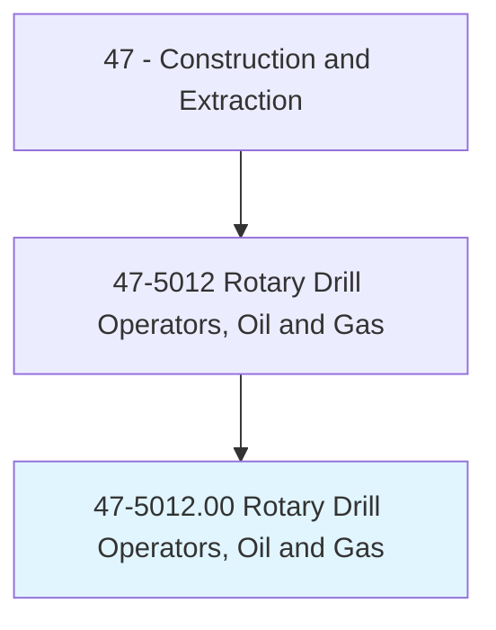
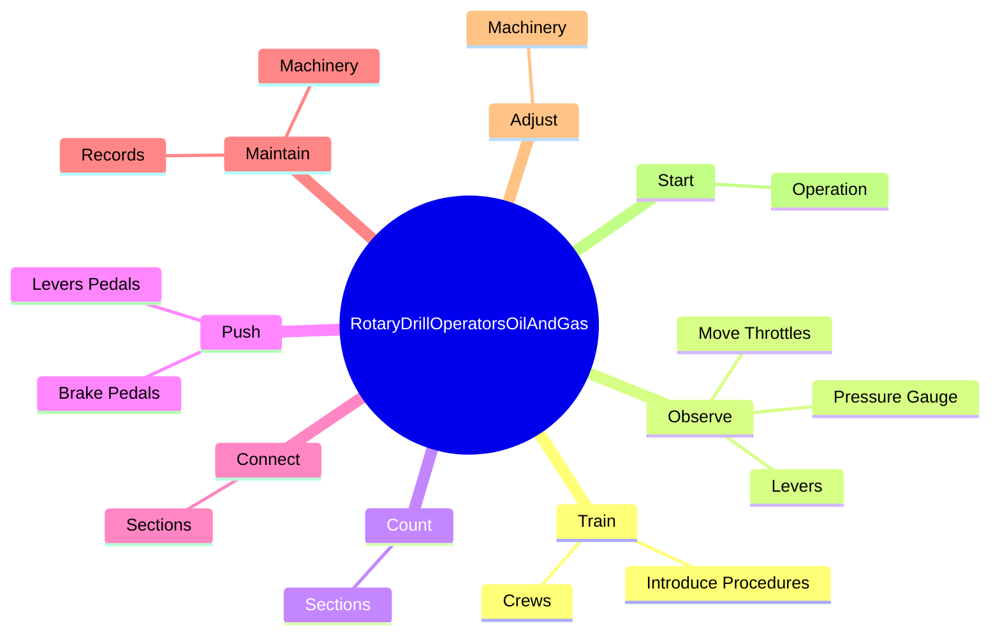
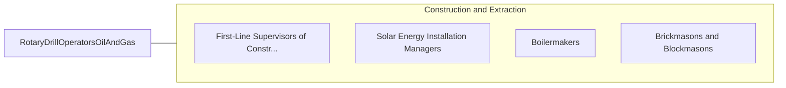

# Rotary Drill Operators, Oil and Gas

> Set up or operate a variety of drills to remove underground oil and gas, or remove core samples for testing during oil and gas exploration.

## Overview

Rotary Drill Operators, Oil and Gas is classified under Construction and Extraction (SOC 47). Set up or operate a variety of drills to remove underground oil and gas, or remove core samples for testing during oil and gas exploration.

## Classification Hierarchy

## Key Statistics

| Metric | Value |
|--------|-------|
| SOC Code | 47-5012.00 |
| Category | [Construction and Extraction](/occupations/Construction/index) |
| Task Count | 103 |
| Source | O*NET |

## Core Tasks

### train.Crews

Rotary Drill Operators, Oil and Gas train crews as part of their core responsibilities.

**Actions:**
- `train.Crews.to.make.DrillWorkSafe`
- `train.Crews.to.Effective`
- `train.IntroduceProcedures.to.make.DrillWorkSafe`
- `train.IntroduceProcedures.to.Effective`

### observe.PressureGauge

Rotary Drill Operators, Oil and Gas observe pressure gauge as part of their core responsibilities.

**Actions:**
- `observe.PressureGauge.to.control.SpeedOfRotaryTables`
- `observe.PressureGauge.to.ToRegulatePressureOfToolsAtBottomsOfBoreholes`
- `observe.MoveThrottles.to.control.SpeedOfRotaryTables`
- `observe.MoveThrottles.to.ToRegulatePressureOfToolsAtBottomsOfBoreholes`

### count.Sections

Rotary Drill Operators, Oil and Gas count sections as part of their core responsibilities.

**Actions:**
- `count.Sections.of.DrillRod.to.determine.DepthsOfBoreholes`

## Skills & Competencies

### Technical Skills
- **Construction Methods** - Advanced
- **Blueprint Reading** - Advanced
- **Safety Compliance** - Advanced

### Soft Skills
- **Communication** - Essential
- **Problem Solving** - Essential
- **Critical Thinking** - Important
- **Teamwork** - Important
- **Adaptability** - Important

## Related Occupations

## Industries

This occupation is found across multiple industries. See [Industries](/industries) for sector-specific employment data.

## Career Progression

---

*Source: O*NET 47-5012.00 - ONETOccupation*
