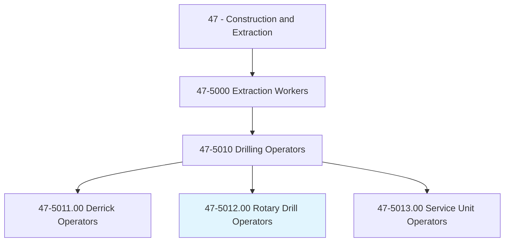
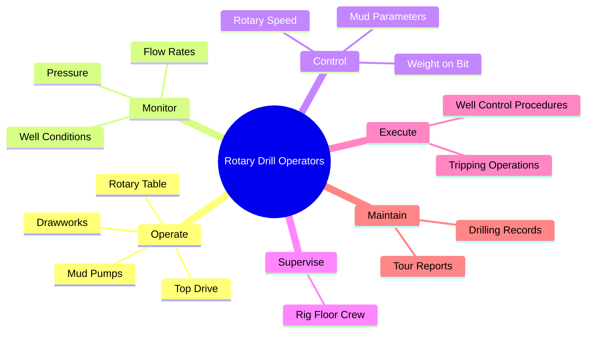
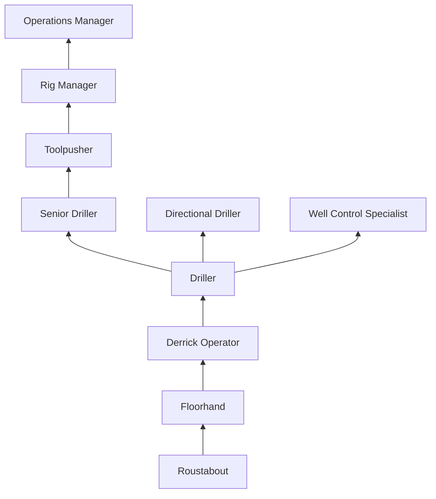
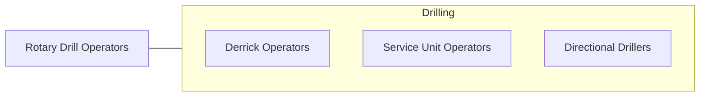

# Rotary Drill Operators, Oil and Gas

> Set up or operate a variety of drills to remove underground oil and gas, or core samples. Includes top-drive operators.

## Overview

Rotary Drill Operators (commonly called drillers) are the senior operational position on an oil and gas drilling rig, responsible for controlling the drilling process from the driller's console on the rig floor. They operate the drawworks, rotary table or top drive, mud pumps, and other rig systems to advance the drill bit through rock formations to reach hydrocarbon reservoirs. The driller makes real-time decisions about weight on bit, rotary speed, mud flow rate, and drilling parameters that directly affect well performance, safety, and cost.

The driller's most critical responsibility is well control -- maintaining the balance between formation pressure and wellbore pressure to prevent blowouts. They continuously monitor pit levels, flow rates, standpipe pressure, and other indicators that signal formation pressure changes. When a kick (unexpected influx of formation fluids) is detected, the driller must immediately shut in the well by activating the blowout preventer (BOP), a life-critical procedure that must be executed within seconds.

Modern drilling operations increasingly use automated drilling systems, wired drill pipe for real-time downhole data, and managed pressure drilling techniques. However, the driller remains the human decision-maker responsible for safe operations, crew supervision, and equipment management. Drillers typically advance through the rig crew positions (roustabout, floorhand, derrick operator) before earning the driller's chair.

## Classification Hierarchy

## Key Statistics

| Metric | Value |
|--------|-------|
| SOC Code | 47-5012.00 |
| Job Zone | 2 (Some Preparation) |
| Category | [Construction and Extraction](/occupations/Construction/index) |
| Task Count | 95 |
| Median Salary | $57,200 / year |
| Employment | ~18,000 |
| Job Outlook | -3% (Decline) |
| Physical Demands | Heavy |
| Source | O*NET |

## Core Tasks

### operate.DrawworksAndTopDrive

Drillers control the primary drilling equipment from the driller's console.

**Actions:**
- `operate.Drawworks.to.control.DrillString`
- `operate.TopDrive.to.rotate.DrillPipe`
- `monitor.WellConditions.for.KickDetection`

## Skills & Competencies

### Technical Skills
- **Drilling Operations** - Expert
- **Well Control** - Expert
- **Rig Equipment** - Expert
- **Drilling Fluid Management** - Advanced
- **Directional Drilling Awareness** - Advanced
- **Crew Supervision** - Advanced

### Soft Skills
- **Decision Making Under Pressure** - Critical
- **Leadership** - Critical
- **Safety Consciousness** - Critical
- **Communication** - Essential
- **Concentration** - Critical

## Education & Certifications

| Requirement | Details |
|-------------|---------|
| Typical Education | High school diploma or equivalent |
| Experience | 3-5 years rig experience (floor to driller progression) |
| Well Control Training | Mandatory |

### Certifications
- **IADC WellSharp Driller** - Well control certification
- **SafeLand/SafeGulf** - Safety orientation
- **H2S Alive** - Hydrogen sulfide awareness
- **First Aid/CPR** - Required
- **Rig Pass** - IADC safety training

## Career Progression

## Specializations

- **Conventional Drilling** - Vertical well drilling
- **Directional/Horizontal** - Deviated and horizontal wells
- **Offshore Drilling** - Jack-up, semi-sub, drillship
- **Managed Pressure Drilling** - Advanced pressure control
- **Automated Drilling** - Cyber drilling systems

## Tools & Equipment

- Driller's console (automated and manual)
- Drawworks, top drives, rotary tables
- Blowout preventers (BOP)
- Mud logging and monitoring systems
- Trip tanks and flow meters
- Communication systems

## Safety Considerations

- **Blowouts** - Well control failure; BOP testing and drills mandatory
- **H2S Exposure** - Hydrogen sulfide; detection and evacuation systems
- **Caught-In Hazards** - Rotating equipment; machine guarding
- **Falls** - Rig floor and equipment heights
- **Fatigue** - 12-hour shifts; alertness management
- **Noise** - Rig operations; hearing protection

## Related Occupations

## Industries

- Oil and Gas Drilling - Primary Employment
- Oil and Gas Extraction - High Employment

## Departments

- Drilling Operations
- Rig Crew
- Safety

---

*Source: O*NET 47-5012.00 - ONETOccupation*
