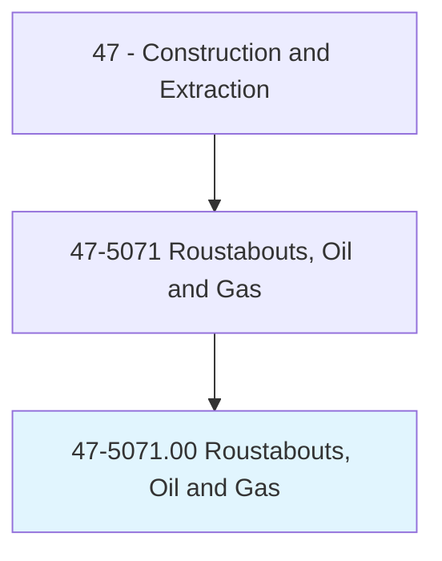
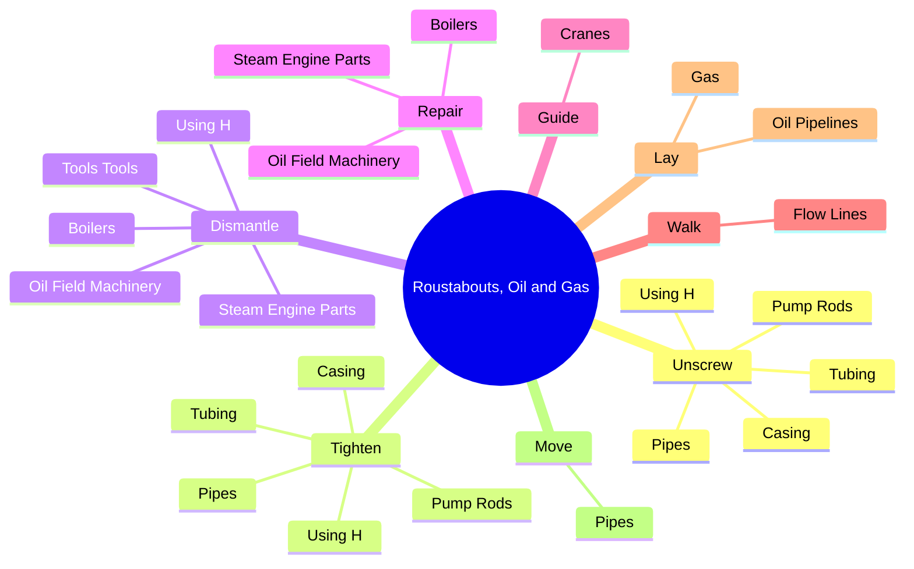
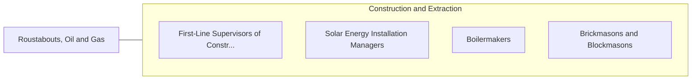

# Roustabouts, Oil and Gas

> Assemble or repair oil field equipment using hand and power tools. Perform other tasks as needed.

## Overview

Roustabouts, Oil and Gas is an occupation within the Construction and Extraction category. Assemble or repair oil field equipment using hand and power tools. 

## Classification Hierarchy

## Key Statistics

| Metric | Value |
|--------|-------|
| SOC Code | 47-5071.00 |
| Category | [Construction and Extraction](/occupations/Construction) |
| Task Count | 53 |
| Source | O*NET |

## Core Tasks

### unscrew.Pipes

Roustabouts, Oil and Gas unscrew pipes as part of their core responsibilities.

**Actions:**
- `unscrew.Pipes`
- `unscrew.Casing`
- `unscrew.Tubing`
- `unscrew.PumpRods`

### tighten.Pipes

Roustabouts, Oil and Gas tighten pipes as part of their core responsibilities.

**Actions:**
- `tighten.Pipes`
- `tighten.Casing`
- `tighten.Tubing`
- `tighten.PumpRods`

### dismantle.OilFieldMachinery

Roustabouts, Oil and Gas dismantle oil field machinery as part of their core responsibilities.

**Actions:**
- `dismantle.OilFieldMachinery`
- `dismantle.Boilers`
- `dismantle.SteamEngineParts`
- `dismantle.UsingH`

## Skills & Competencies

### Technical Skills
- **Construction Methods** - Advanced
- **Blueprint Reading** - Advanced
- **Safety Compliance** - Advanced

### Soft Skills
- **Communication** - Essential
- **Problem Solving** - Essential
- **Critical Thinking** - Important
- **Teamwork** - Important
- **Adaptability** - Important

## Related Occupations

## Industries

This occupation is found across multiple industries. See [Industries](/industries) for sector-specific employment data.

## Career Progression

---

*Source: O*NET 47-5071.00 - ONETOccupation*
