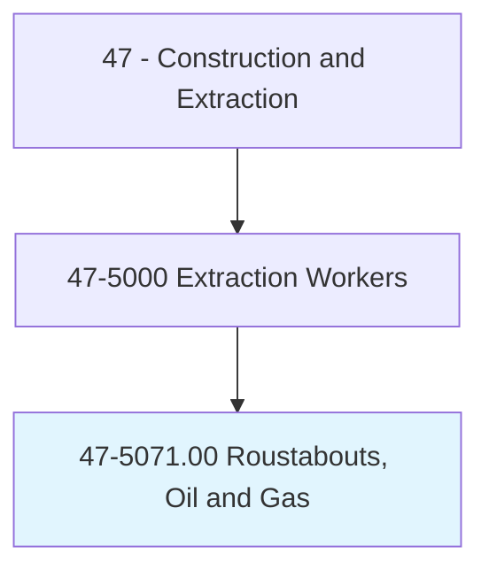
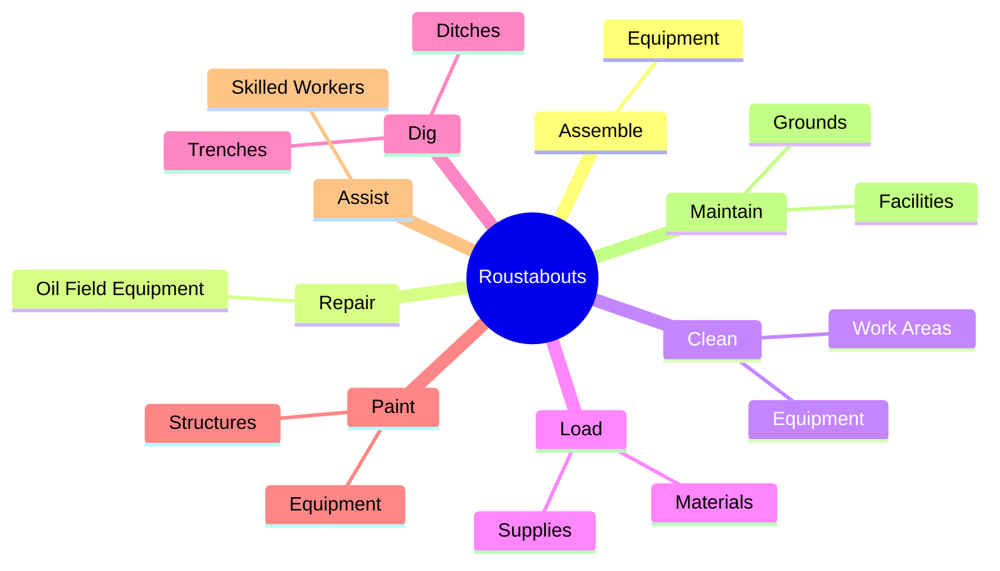
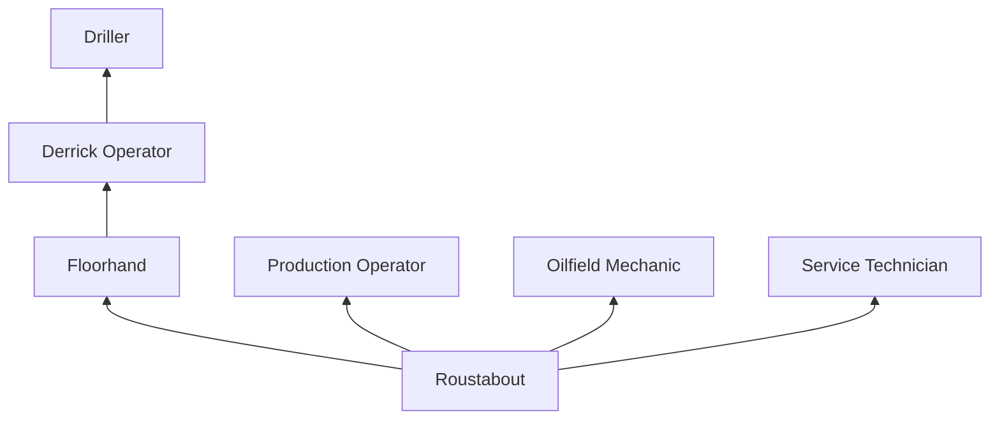
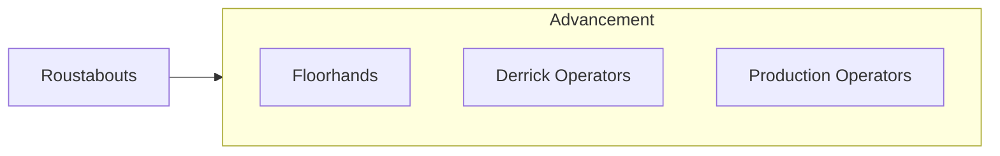

# Roustabouts, Oil and Gas

> Assemble or repair oil field equipment using hand and power tools. Perform other tasks as needed.

## Overview

Roustabouts are entry-level workers on oil and gas drilling rigs and production facilities who perform a wide range of manual labor and maintenance tasks. They are the general laborers of the oilfield, responsible for cleaning and maintaining equipment, loading and unloading supplies, digging ditches, painting, performing basic repairs, and assisting higher-skilled workers with their duties. The roustabout position serves as the starting point for careers in drilling, production, and oilfield services.

The work is physically demanding and often performed in harsh environments including remote land locations, offshore platforms, and extreme weather conditions. Roustabouts work 12-hour shifts on rotational schedules (typically 14 days on, 14 days off for offshore or 7/7 for land operations). Despite the entry-level nature of the position, the work carries significant hazards common to oil and gas operations including heavy equipment, high-pressure systems, and hazardous chemicals.

Motivated roustabouts who demonstrate reliability, mechanical aptitude, and safety consciousness advance relatively quickly into higher positions. The oil and gas industry values experienced field workers, and the roustabout position builds fundamental knowledge of rig operations, equipment, and safety protocols that support career advancement through the drilling crew or into production, maintenance, or specialty service roles.

## Classification Hierarchy

## Key Statistics

| Metric | Value |
|--------|-------|
| SOC Code | 47-5071.00 |
| Job Zone | 1 (Little or No Preparation) |
| Category | [Construction and Extraction](/occupations/Construction/index) |
| Task Count | 68 |
| Median Salary | $40,700 / year |
| Employment | ~60,000 |
| Job Outlook | -2% (Decline) |
| Physical Demands | Very Heavy |
| Source | O*NET |

## Core Tasks

### assemble.Equipment

Roustabouts assemble and disassemble oilfield equipment.

**Actions:**
- `assemble.Equipment.using.HandTools`
- `repair.OilFieldEquipment.using.PowerTools`
- `clean.Equipment.and.WorkAreas`

## Skills & Competencies

### Technical Skills
- **Basic Equipment Knowledge** - Developing
- **Hand and Power Tool Use** - Developing
- **Material Handling** - Advanced
- **Basic Maintenance** - Developing
- **Safety Procedures** - Developing

### Soft Skills
- **Physical Stamina** - Critical
- **Reliability** - Critical
- **Willingness to Learn** - Critical
- **Teamwork** - Essential
- **Adaptability** - Essential

## Education & Certifications

| Requirement | Details |
|-------------|---------|
| Typical Education | No formal requirements |
| Safety Training | SafeLand/SafeGulf orientation |
| On-the-Job Training | Ongoing |

### Certifications
- **SafeLand/SafeGulf** - Safety orientation (required)
- **H2S Alive** - Hydrogen sulfide awareness
- **First Aid/CPR** - Required
- **OSHA 10-Hour General Industry** - Safety certification
- **CDL (beneficial)** - For vehicle operation

## Career Progression

## Safety Considerations

- **Heavy Lifting** - Frequent manual material handling
- **Struck-By Hazards** - Equipment and overhead loads
- **H2S Exposure** - Hydrogen sulfide gas
- **Chemical Exposure** - Drilling fluids and production chemicals
- **Slips, Trips, Falls** - Wet and uneven surfaces
- **Fatigue** - 12-hour shifts in demanding conditions
- **Weather Exposure** - Extreme heat, cold, wind

## Related Occupations

## Industries

- Oil and Gas Extraction - Primary Employment
- Drilling Services - High Employment
- Support Activities for O&G - High Employment

## Departments

- Rig Crew
- Production Operations
- [Maintenance](/departments/Operations)

---

*Source: O*NET 47-5071.00 - ONETOccupation*
