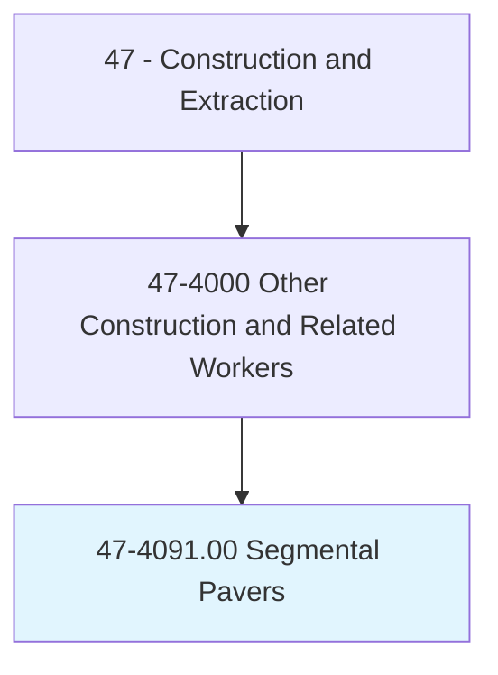
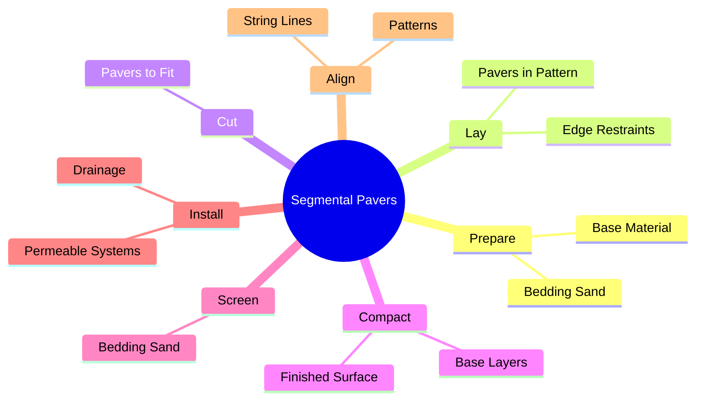
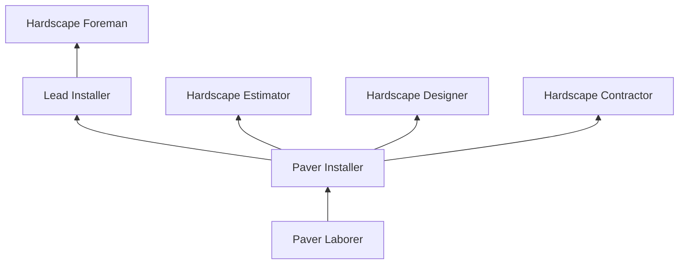

# Segmental Pavers

> Lay out, cut, and place segmental paving units. Includes installers of bedding and restraining materials for segmental paving.

## Overview

Segmental Pavers install interlocking concrete pavers, permeable pavers, and natural stone pavers for driveways, walkways, patios, plazas, streetscapes, and commercial hardscape projects. The trade involves base preparation, bedding sand installation, paver laying in specific patterns, edge restraint installation, and joint sand compaction. Unlike poured concrete, segmental paving creates flexible, modular surfaces that can accommodate ground movement, be easily repaired, and provide aesthetic versatility through pattern and color combinations.

The trade has grown significantly with increasing demand for permeable paving systems that manage stormwater runoff, reduce flooding, and meet environmental regulations. Permeable interlocking concrete pavements (PICP) allow water to infiltrate through the surface into underlying aggregate reservoirs, reducing the need for traditional stormwater infrastructure. Installers of these systems must understand hydrology, soil infiltration rates, and aggregate specifications.

Segmental paving requires precision in base preparation, as the structural performance and longevity of the pavement depends entirely on a properly compacted, well-drained aggregate foundation. Pavers are laid on a screeded bedding layer and must be placed within tight tolerances for line, grade, and joint width. The work combines outdoor construction labor with detailed craftsmanship, particularly for complex patterns, curves, and radius work.

## Classification Hierarchy

## Key Statistics

| Metric | Value |
|--------|-------|
| SOC Code | 47-4091.00 |
| Job Zone | 2 (Some Preparation) |
| Category | [Construction and Extraction](/occupations/Construction/index) |
| Task Count | 65 |
| Median Salary | $40,500 / year |
| Employment | ~5,000 |
| Job Outlook | 3% (Slower than average) |
| Physical Demands | Heavy |
| Source | O*NET |

## Core Tasks

### lay.PaversInPattern

Pavers install interlocking units in specified patterns and alignments.

**Actions:**
- `lay.Pavers.in.HerringbonePattern`
- `lay.Pavers.in.RunningBondPattern`
- `install.EdgeRestraints.for.Containment`

## Skills & Competencies

### Technical Skills
- **Paver Installation** - Expert
- **Base Preparation and Compaction** - Expert
- **Permeable Pavement Systems** - Advanced
- **Cutting and Fitting** - Expert
- **Grade and Drainage** - Advanced
- **Equipment Operation (Compactors, Saws)** - Advanced

### Soft Skills
- **Attention to Detail** - Critical
- **Physical Stamina** - Critical
- **Artistic Eye** - Important (pattern work)
- **Customer Service** - Essential (residential)
- **Problem Solving** - Essential

## Education & Certifications

| Requirement | Details |
|-------------|---------|
| Typical Education | High school diploma or equivalent |
| On-the-Job Training | 6-12 months |

### Certifications
- **ICPI Certified Installer** - Interlocking Concrete Pavement Institute
- **ICPI Permeable Interlocking Pavement Specialist** - PICP certification
- **OSHA 10-Hour Construction** - Safety certification
- **First Aid/CPR** - Recommended

## Career Progression

## Specializations

- **Residential Hardscape** - Driveways, patios, walkways
- **Commercial Hardscape** - Plazas, streetscapes, parking areas
- **Permeable Pavements** - Stormwater management systems
- **Natural Stone Paving** - Flagstone, bluestone, granite setts
- **Vehicular Applications** - Heavy-duty paver systems for traffic

## Tools & Equipment

- Plate compactors (forward and reversible)
- Paver saws (masonry and diamond blade)
- Screeding equipment
- String lines and levels
- Rubber mallets
- Paver extractors and pullers
- Mechanical paver installers (for large projects)

## Safety Considerations

- **Back and Knee Injuries** - Repetitive bending and kneeling; ergonomic awareness
- **Vibration** - Compactor operation; hand-arm vibration
- **Dust** - Cutting pavers; respiratory protection and wet cutting
- **Heavy Lifting** - Paver bundles and base materials
- **Noise** - Compactors and saws; hearing protection
- **Sun Exposure** - Outdoor work; sun protection

## Related Occupations

## Industries

- [Hardscape Contractors](/industries/SpecialtyTrade) - Primary Employment
- [Landscape Construction](/industries/LandscapeServices) - High Employment
- [Residential Construction](/industries/ResidentialConstruction) - High Employment

## Departments

- [Hardscape Division](/departments/Hardscape)
- [Field Operations](/departments/FieldOperations)
- [Estimating](/departments/Estimating)

---

*Source: O*NET 47-4091.00 - ONETOccupation*
