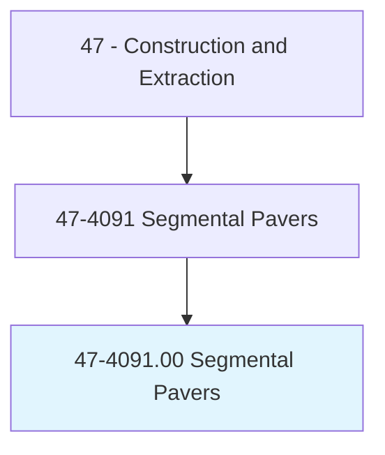
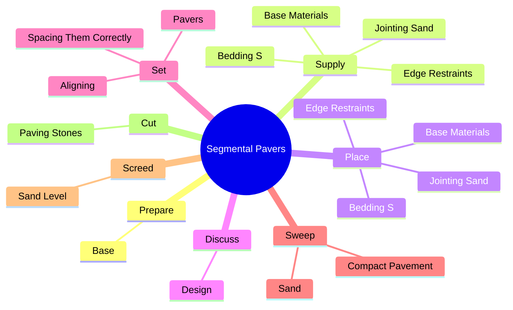
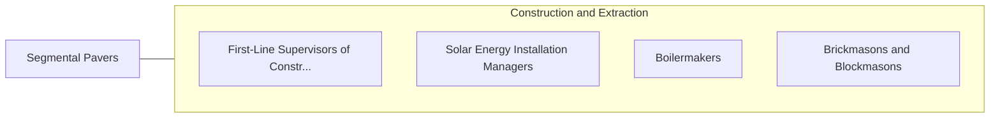

# Segmental Pavers

> Lay out, cut, and place segmental paving units. Includes installers of bedding and restraining materials for the paving units.

## Overview

Segmental Pavers is an occupation within the Construction and Extraction category. Lay out, cut, and place segmental paving units. 

## Classification Hierarchy

## Key Statistics

| Metric | Value |
|--------|-------|
| SOC Code | 47-4091.00 |
| Category | [Construction and Extraction](/occupations/Construction/index) |
| Task Count | 40 |
| Source | O*NET |

## Core Tasks

### prepare.Base

Segmental Pavers prepare base as part of their core responsibilities.

**Actions:**
- `prepare.Base.for.Installation.by.RemovingUnstableMaterials`
- `prepare.Base.for.UnsuitableMaterials`
- `prepare.Base.for.Compacting`
- `prepare.Base.for.GradingSoil`

### supply.BaseMaterials

Segmental Pavers supply base materials as part of their core responsibilities.

**Actions:**
- `supply.BaseMaterials`
- `supply.EdgeRestraints`
- `supply.BeddingS`
- `supply.JointingSand`

### place.BaseMaterials

Segmental Pavers place base materials as part of their core responsibilities.

**Actions:**
- `place.BaseMaterials`
- `place.EdgeRestraints`
- `place.BeddingS`
- `place.JointingSand`

## Skills & Competencies

### Technical Skills
- **Construction Methods** - Advanced
- **Blueprint Reading** - Advanced
- **Safety Compliance** - Advanced

### Soft Skills
- **Communication** - Essential
- **Problem Solving** - Essential
- **Critical Thinking** - Important
- **Teamwork** - Important
- **Adaptability** - Important

## Related Occupations

## Industries

This occupation is found across multiple industries. See [Industries](/industries) for sector-specific employment data.

## Career Progression

---

*Source: O*NET 47-4091.00 - ONETOccupation*
