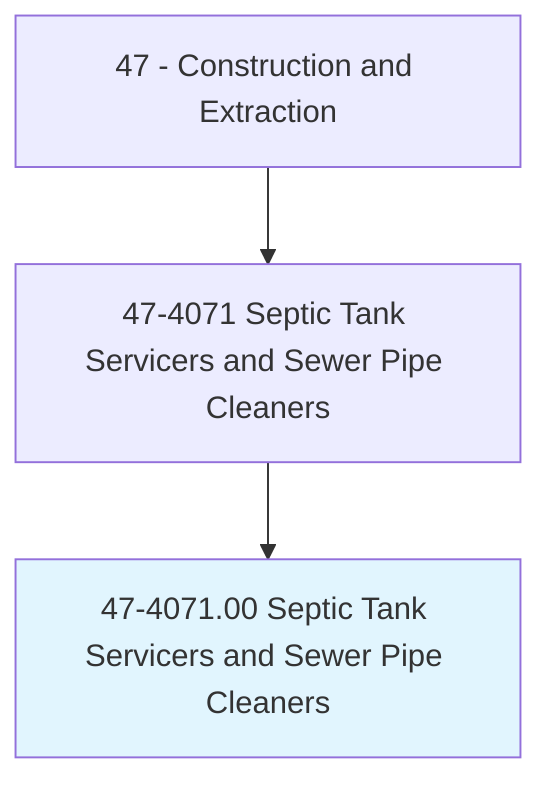
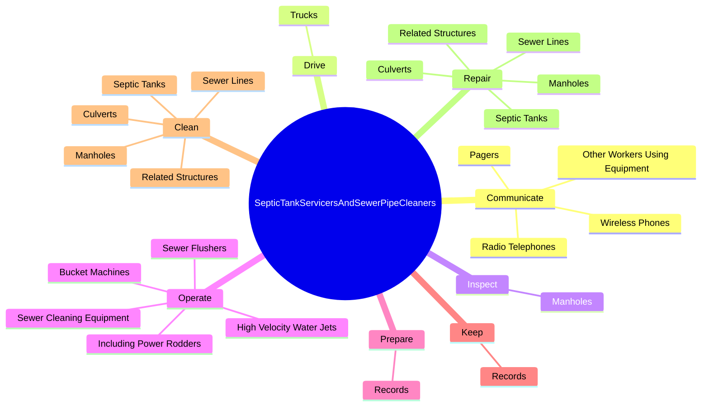
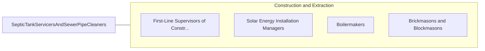

# Septic Tank Servicers and Sewer Pipe Cleaners

> Clean and repair septic tanks, sewer lines, or drains. May patch walls and partitions of tank, replace damaged drain tile, or repair breaks in underground piping.

## Overview

Septic Tank Servicers and Sewer Pipe Cleaners is an occupation within the Construction and Extraction category. Clean and repair septic tanks, sewer lines, or drains. 

## Classification Hierarchy

## Key Statistics

| Metric | Value |
|--------|-------|
| SOC Code | 47-4071.00 |
| Category | [Construction and Extraction](/occupations/Construction) |
| Task Count | 95 |
| Source | O*NET |

## Core Tasks

### communicate.OtherWorkersUsingEquipment

Septic Tank Servicers and Sewer Pipe Cleaners communicate other workers using equipment as part of their core responsibilities.

**Actions:**
- `communicate.OtherWorkersUsingEquipment`
- `communicate.WirelessPhones`
- `communicate.Pagers`
- `communicate.RadioTelephones`

### drive.Trucks

Septic Tank Servicers and Sewer Pipe Cleaners drive trucks as part of their core responsibilities.

**Actions:**
- `drive.Trucks.to.transport.Crews`
- `drive.Trucks.to.Materials`
- `drive.Trucks.to.Equipment`

### inspect.Manholes

Septic Tank Servicers and Sewer Pipe Cleaners inspect manholes as part of their core responsibilities.

**Actions:**
- `inspect.Manholes.to.locate.SewerLineStoppages`

## Skills & Competencies

### Technical Skills
- **Construction Methods** - Advanced
- **Blueprint Reading** - Advanced
- **Safety Compliance** - Advanced

### Soft Skills
- **Communication** - Essential
- **Problem Solving** - Essential
- **Critical Thinking** - Important
- **Teamwork** - Important
- **Adaptability** - Important

## Related Occupations

## Industries

This occupation is found across multiple industries. See [Industries](/industries) for sector-specific employment data.

## Career Progression

---

*Source: O*NET 47-4071.00 - ONETOccupation*
