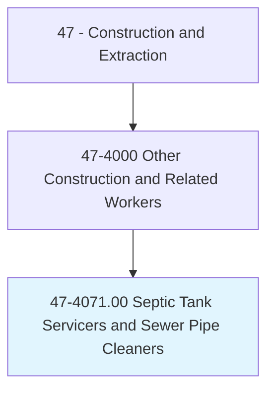
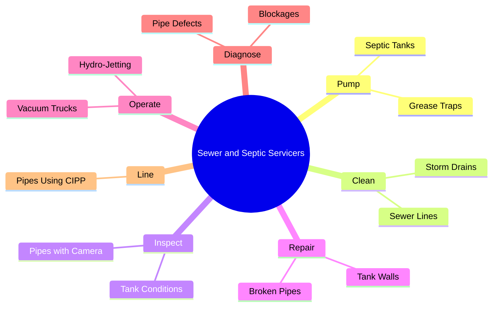
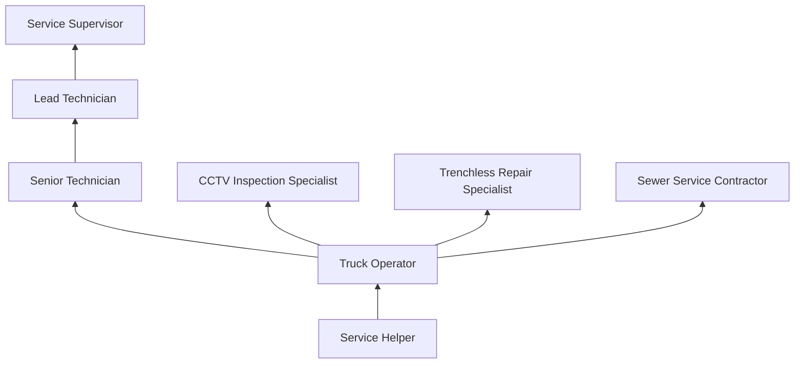
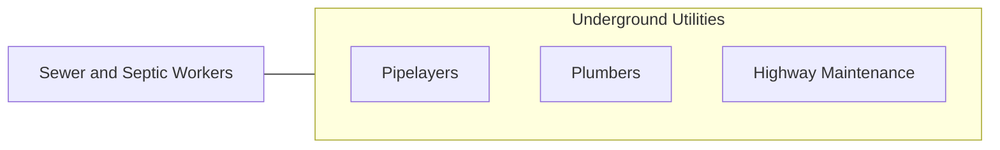

# Septic Tank Servicers and Sewer Pipe Cleaners

> Clean and repair septic tanks, sewer lines, or drains. May patch walls and partitions of tank, replace damaged drain tile, or repair breaks in underground piping.

## Overview

Septic Tank Servicers and Sewer Pipe Cleaners maintain, repair, and clean underground wastewater systems including septic tanks, sewer mains, lateral connections, storm drains, and grease traps. They operate vacuum trucks, hydro-jetting equipment, pipe cameras, and mechanical cleaning tools to keep wastewater flowing and identify problems before they become emergencies. This essential sanitation trade protects public health and the environment by ensuring proper wastewater collection and disposal.

The work includes routine septic tank pumping, sewer line cleaning to remove roots and debris, video inspection of underground pipes, pipe repair and lining, and emergency response to sewer backups and overflows. Modern sewer maintenance has been transformed by CCTV pipe inspection technology, which allows workers to identify defects, blockages, and structural problems without excavation. Trenchless repair methods including cured-in-place pipe (CIPP) lining and pipe bursting have reduced the need for disruptive open-cut repairs.

The trade requires working with biological hazards (raw sewage), confined spaces (manholes and tanks), and heavy equipment in varied environments. Workers must follow strict safety protocols for pathogen exposure, atmospheric hazards in confined spaces, and traffic management when working in streets. Despite the nature of the work, the occupation provides steady employment and strong demand, as wastewater systems require continuous maintenance regardless of economic conditions.

## Classification Hierarchy

## Key Statistics

| Metric | Value |
|--------|-------|
| SOC Code | 47-4071.00 |
| Job Zone | 2 (Some Preparation) |
| Category | [Construction and Extraction](/occupations/Construction/index) |
| Task Count | 78 |
| Median Salary | $43,800 / year |
| Employment | ~30,000 |
| Job Outlook | 6% (Faster than average) |
| Physical Demands | Heavy |
| Source | O*NET |

## Core Tasks

### clean.SewerLines

Workers clean sewer and drain lines using various methods.

**Actions:**
- `clean.SewerLines.using.HydroJetting`
- `clean.SewerLines.using.MechanicalSnakes`
- `pump.SepticTanks.using.VacuumTruck`

## Skills & Competencies

### Technical Skills
- **Sewer Cleaning Equipment** - Expert
- **CCTV Pipe Inspection** - Advanced
- **Vacuum Truck Operation** - Expert
- **Trenchless Repair** - Advanced
- **CDL Driving** - Required
- **Confined Space Entry** - Advanced

### Soft Skills
- **Safety Consciousness** - Critical
- **Physical Stamina** - Critical
- **Problem Solving** - Essential
- **Customer Service** - Essential
- **Reliability** - Critical

## Education & Certifications

| Requirement | Details |
|-------------|---------|
| Typical Education | High school diploma or equivalent |
| CDL | Class A or B required |
| On-the-Job Training | 6-12 months |

### Certifications
- **CDL Class A/B** - With tanker endorsement
- **Confined Space Entry** - OSHA certification
- **NASSCO PACP/MACP** - Pipe and manhole assessment
- **OSHA 10-Hour Construction** - Safety certification
- **Hepatitis B Vaccination** - Recommended for sewage exposure
- **First Aid/CPR** - Required

## Career Progression

## Specializations

- **Septic Tank Services** - Pumping, inspection, repair
- **Municipal Sewer Maintenance** - Main line cleaning and inspection
- **CCTV Inspection** - Video survey and assessment
- **Trenchless Rehabilitation** - CIPP lining and pipe bursting
- **Grease Trap Services** - Restaurant and commercial

## Tools & Equipment

- Vacuum/pump trucks
- Hydro-jetting equipment (high-pressure water)
- CCTV pipe inspection cameras
- Mechanical drain cleaning machines
- Confined space entry equipment (harness, tripod, gas detector)
- PPE (Tyvek suits, gloves, face shields, respirators)

## Safety Considerations

- **Biological Hazards** - Raw sewage pathogens; PPE and vaccination
- **Confined Space** - Manholes and tanks; atmospheric monitoring mandatory
- **H2S and Methane** - Sewer gas exposure; continuous gas monitoring
- **Traffic Hazards** - Working in streets; traffic control
- **Chemical Exposure** - Drain cleaning chemicals
- **Drowning** - Working near liquid waste; rescue equipment

## Related Occupations

## Industries

- Sewer and Septic Services - Primary Employment
- [Municipal Water/Sewer Utilities](/industries/PublicAdministration) - Primary Employment
- Plumbing Contractors - Moderate Employment

## Departments

- Sewer Services
- Field Operations
- Inspection Division

---

*Source: O*NET 47-4071.00 - ONETOccupation*
