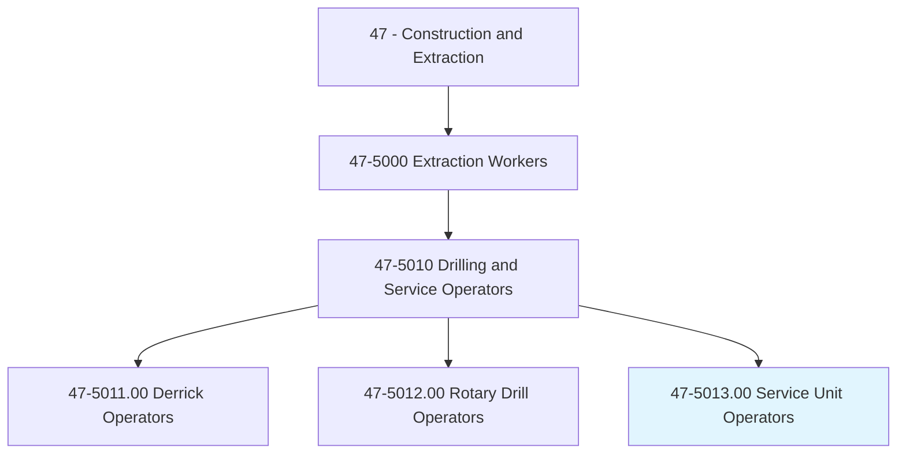
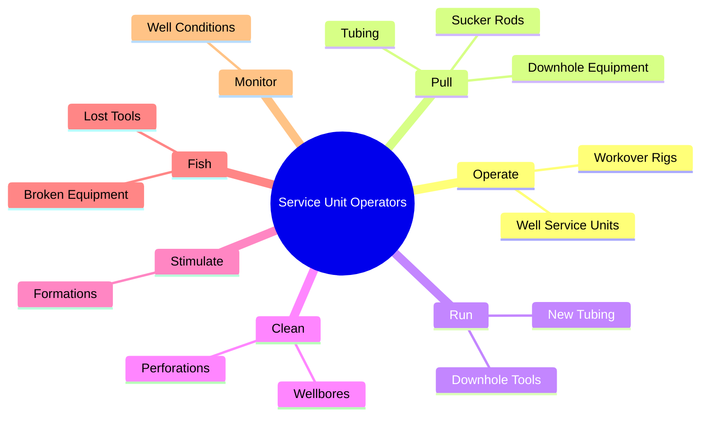
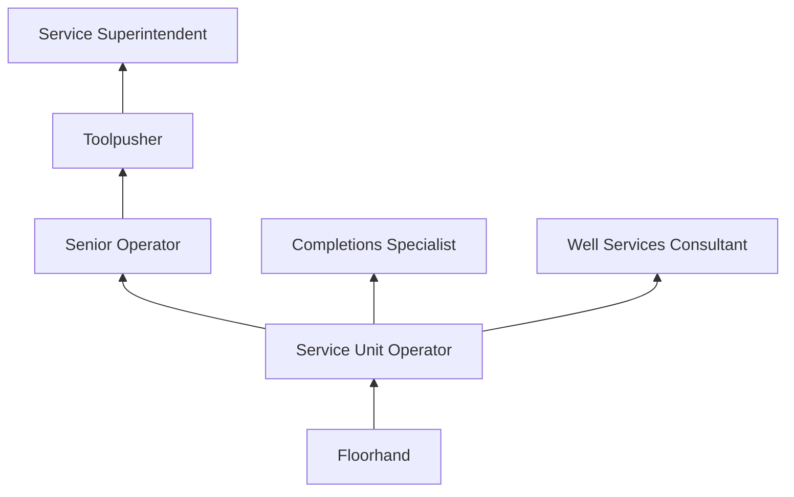
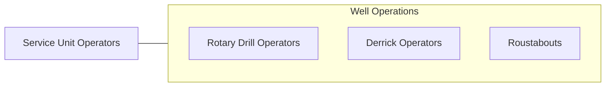

# Service Unit Operators, Oil and Gas

> Operate equipment to increase oil flow from producing wells or to remove stuck pipe, casing, tools, or other obstructions from drilling wells.

## Overview

Service Unit Operators in oil and gas operate workover and well servicing rigs to maintain, repair, and enhance production from existing wells. While drilling rigs create new wells, service units perform the ongoing work needed to keep wells producing efficiently. This includes pulling and replacing downhole equipment (pumps, tubing, rods), cleaning out sand and scale deposits, stimulating formations with acid or fracturing treatments, and fishing out lost tools or broken equipment from the wellbore.

Workover rigs are smaller than drilling rigs but operate on similar principles, using a mast, drawworks, and hoisting system to run pipe and tools in and out of the well. Operators must understand well completion designs, artificial lift systems (rod pumps, ESP, gas lift), and downhole conditions. The work requires knowledge of well control procedures, as workovers involve entering pressurized wells where formation fluids can flow uncontrollably if not properly managed.

Service unit operations are essential to maintaining oil and gas production. Most producing wells require periodic servicing throughout their productive life, which can span decades. The work is performed at well sites across producing regions, often in remote locations. Operators work rotating shifts and must be prepared for emergency well interventions on short notice.

## Classification Hierarchy

## Key Statistics

| Metric | Value |
|--------|-------|
| SOC Code | 47-5013.00 |
| Job Zone | 2 (Some Preparation) |
| Category | [Construction and Extraction](/occupations/Construction/index) |
| Task Count | 85 |
| Median Salary | $48,900 / year |
| Employment | ~20,000 |
| Job Outlook | -3% (Decline) |
| Physical Demands | Heavy |
| Source | O*NET |

## Core Tasks

### operate.WorkoverRigs

Service Unit Operators control workover equipment for well maintenance.

**Actions:**
- `operate.WorkoverRigs.to.service.ExistingWells`
- `pull.Tubing.and.DownholeEquipment`
- `run.NewEquipment.into.Wellbore`

## Skills & Competencies

### Technical Skills
- **Workover Rig Operation** - Expert
- **Well Completion Knowledge** - Advanced
- **Artificial Lift Systems** - Advanced
- **Well Control** - Advanced
- **Fishing Operations** - Advanced
- **Equipment Maintenance** - Advanced

### Soft Skills
- **Problem Solving** - Critical
- **Mechanical Aptitude** - Critical
- **Safety Consciousness** - Critical
- **Communication** - Essential
- **Physical Stamina** - Critical

## Education & Certifications

| Requirement | Details |
|-------------|---------|
| Typical Education | High school diploma or equivalent |
| Experience | 1-3 years oilfield experience |
| Well Control Training | Required |

### Certifications
- **IADC WellSharp** - Well control certification
- **SafeLand/SafeGulf** - Safety orientation
- **H2S Alive** - Hydrogen sulfide awareness
- **First Aid/CPR** - Required
- **CDL Class A/B** - For equipment transport

## Career Progression

## Safety Considerations

- **Well Control** - Pressurized well intervention; BOP and well control procedures
- **H2S Exposure** - Sour gas wells; detection and evacuation systems
- **Caught-In Hazards** - Rotating equipment and pipe handling
- **Falls** - Working at mast heights
- **Struck-By** - Pipe and equipment handling
- **Fatigue** - Extended operations; shift management

## Related Occupations

## Industries

- Well Servicing Companies - Primary Employment
- Oil and Gas Extraction - High Employment

## Departments

- Well Services
- Workover Operations
- Safety

---

*Source: O*NET 47-5013.00 - ONETOccupation*
