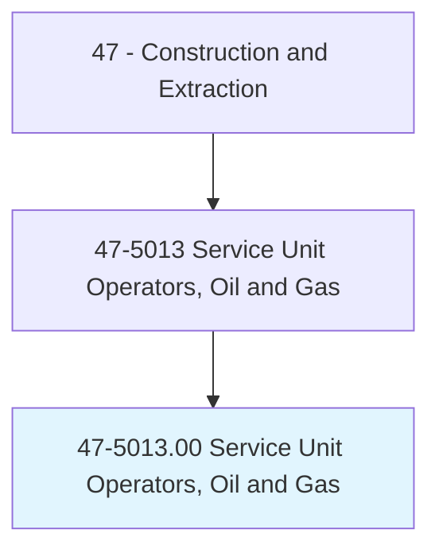
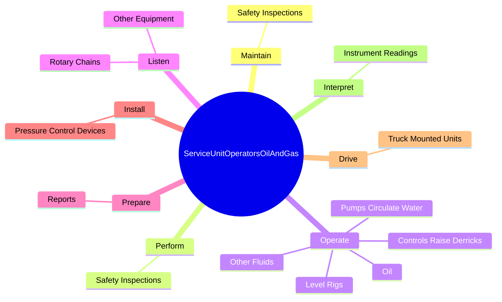
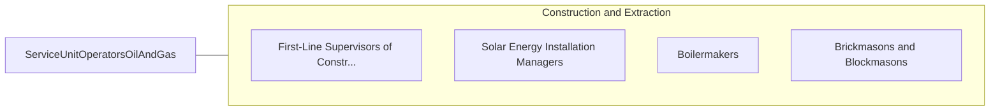

# Service Unit Operators, Oil and Gas

> Operate equipment to increase oil flow from producing wells or to remove stuck pipe, casing, tools, or other obstructions from drilling wells. Includes fishing-tool technicians.

## Overview

Service Unit Operators, Oil and Gas is an occupation within the Construction and Extraction category. Operate equipment to increase oil flow from producing wells or to remove stuck pipe, casing, tools, or other obstructions from drilling wells. 

## Classification Hierarchy

## Key Statistics

| Metric | Value |
|--------|-------|
| SOC Code | 47-5013.00 |
| Category | [Construction and Extraction](/occupations/Construction/index) |
| Task Count | 68 |
| Source | O*NET |

## Core Tasks

### maintain.SafetyInspections

Service Unit Operators, Oil and Gas maintain safety inspections as part of their core responsibilities.

**Actions:**
- `maintain.SafetyInspections.on.Equipment`
- `maintain.SafetyInspections.on.Tools`

### perform.SafetyInspections

Service Unit Operators, Oil and Gas perform safety inspections as part of their core responsibilities.

**Actions:**
- `perform.SafetyInspections.on.Equipment`
- `perform.SafetyInspections.on.Tools`

### operate.ControlsRaiseDerricks

Service Unit Operators, Oil and Gas operate controls raise derricks as part of their core responsibilities.

**Actions:**
- `operate.ControlsRaiseDerricks`
- `operate.LevelRigs`
- `operate.PumpsCirculateWater.to.remove.SandMaterialsObstructingFreeFlowOfOil`
- `operate.PumpsCirculateWater.to.OtherMaterialsObstructingFreeFlowOfOil`

## Skills & Competencies

### Technical Skills
- **Construction Methods** - Advanced
- **Blueprint Reading** - Advanced
- **Safety Compliance** - Advanced

### Soft Skills
- **Communication** - Essential
- **Problem Solving** - Essential
- **Critical Thinking** - Important
- **Teamwork** - Important
- **Adaptability** - Important

## Related Occupations

## Industries

This occupation is found across multiple industries. See [Industries](/industries) for sector-specific employment data.

## Career Progression

---

*Source: O*NET 47-5013.00 - ONETOccupation*
