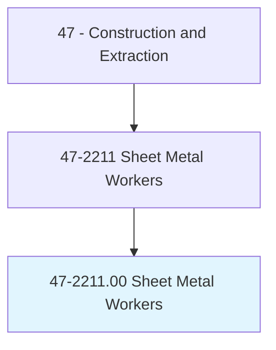
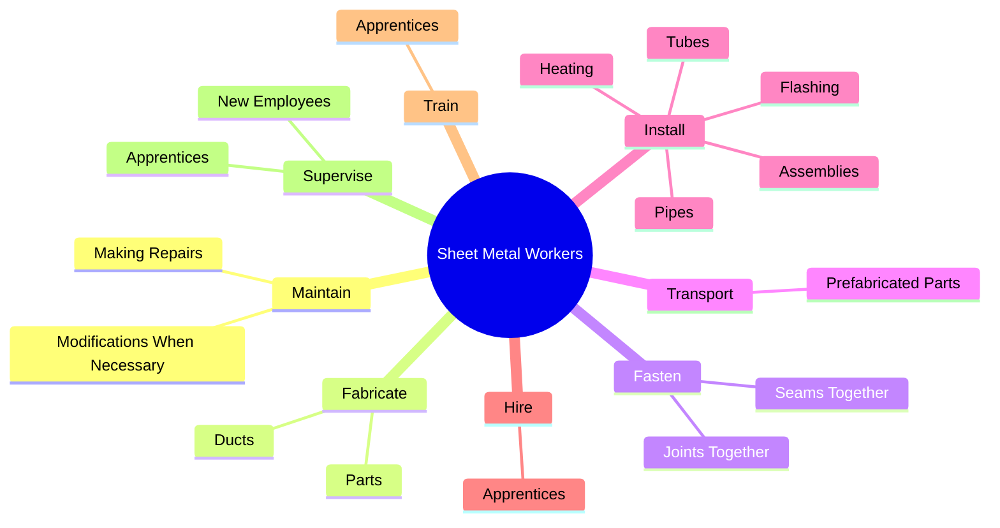
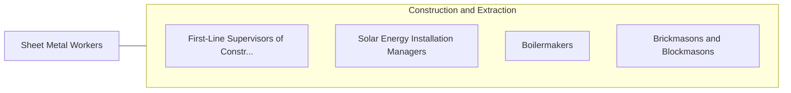

# Sheet Metal Workers

> Fabricate, assemble, install, and repair sheet metal products and equipment, such as ducts, control boxes, drainpipes, and furnace casings. Work may involve any of the following: setting up and operating fabricating machines to cut, bend, and straighten sheet metal; shaping metal over anvils, blocks, or forms using hammer; operating soldering and welding equipment to join sheet metal parts; or inspecting, assembling, and smoothing seams and joints of burred surfaces. Includes sheet metal duct installers who install prefabricated sheet metal ducts used for heating, air conditioning, or other purposes.

## Overview

Sheet Metal Workers is an occupation within the Construction and Extraction category. Fabricate, assemble, install, and repair sheet metal products and equipment, such as ducts, control boxes, drainpipes, and furnace casings. Work may involve any of the following: setting up and operating fabricating machines to cut, bend, and straighten sheet metal; shaping metal over anvils, blocks, or forms using hammer; operating soldering and welding equipment to join sheet metal parts; or inspecting, assembling, and smoothing seams and joints of burred surfaces.

## Classification Hierarchy

## Key Statistics

| Metric | Value |
|--------|-------|
| SOC Code | 47-2211.00 |
| Category | [Construction and Extraction](/occupations/Construction/index) |
| Task Count | 185 |
| Source | O*NET |

## Core Tasks

### maintain.MakingRepairs

Sheet Metal Workers maintain making repairs as part of their core responsibilities.

**Actions:**
- `maintain.MakingRepairs`
- `maintain.ModificationsWhenNecessary`

### fabricate.Ducts

Sheet Metal Workers fabricate ducts as part of their core responsibilities.

**Actions:**
- `fabricate.Ducts.for.HighEfficiencyHeating`
- `fabricate.Ducts.for.Ventilating`
- `fabricate.Ducts.for.AirConditioningHvac`
- `fabricate.Parts.at.ConstructionSites`

### fasten.SeamsTogether

Sheet Metal Workers fasten seams together as part of their core responsibilities.

**Actions:**
- `fasten.SeamsTogether.with.Welds`
- `fasten.SeamsTogether.with.Bolts`
- `fasten.SeamsTogether.with.Cement`
- `fasten.SeamsTogether.with.Rivets`

## Skills & Competencies

### Technical Skills
- **Construction Methods** - Advanced
- **Blueprint Reading** - Advanced
- **Safety Compliance** - Advanced

### Soft Skills
- **Communication** - Essential
- **Problem Solving** - Essential
- **Critical Thinking** - Important
- **Teamwork** - Important
- **Adaptability** - Important

## Related Occupations

## Industries

This occupation is found across multiple industries. See [Industries](/industries) for sector-specific employment data.

## Career Progression

---

*Source: O*NET 47-2211.00 - ONETOccupation*
