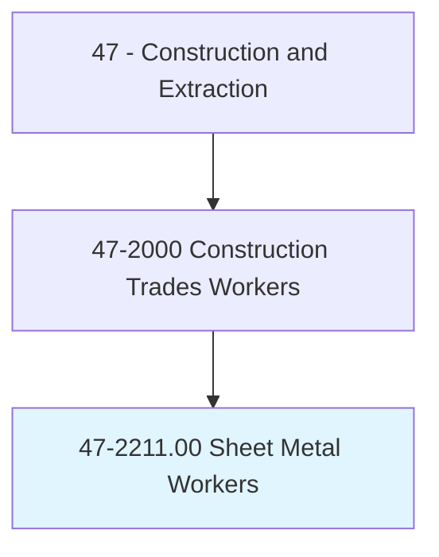
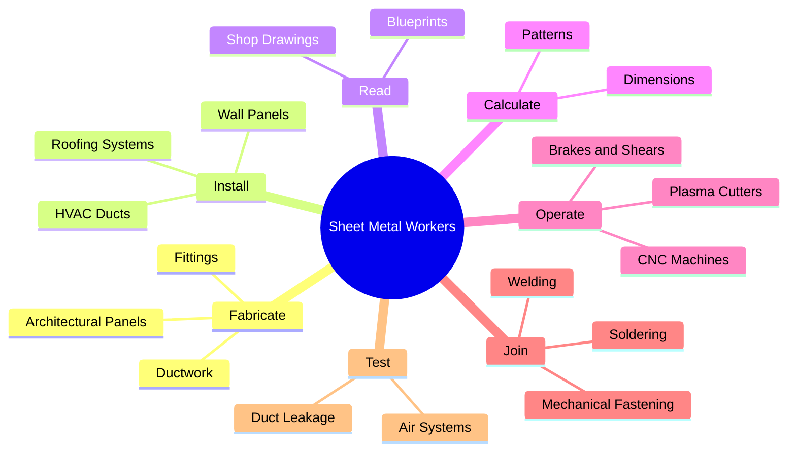
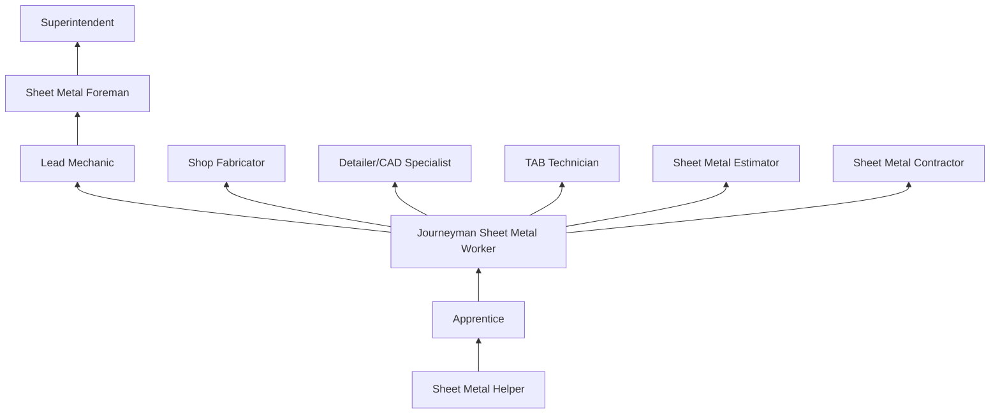
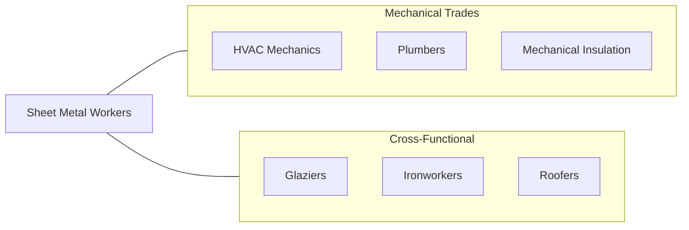

# Sheet Metal Workers

> Fabricate, assemble, install, and repair sheet metal products and equipment, such as ducts, control boxes, drainpipes, and furnace casings. Work may involve any of the following: setting up and operating fabricating machines to cut, bend, and straighten sheet metal; shaping metal over anvils, blocks, or forms using hammer; operating soldering and welding equipment to join sheet metal parts; or inspecting, assembling, and smoothing seams and joints of burred surfaces.

## Overview

Sheet Metal Workers fabricate, install, and maintain products made from thin metal sheets including HVAC ductwork, architectural panels, roofing systems, kitchen equipment, industrial enclosures, and specialty items. The trade combines precision metal fabrication skills with field installation expertise, making sheet metal workers among the most versatile construction trade workers. They read blueprints, calculate dimensions, cut and shape metal using specialized machinery, and install finished products on construction sites.

HVAC ductwork fabrication and installation constitutes the largest segment of sheet metal work, as every commercial building requires ductwork for heating, ventilation, and air conditioning. Architectural sheet metal (metal roofing, wall panels, flashing, gutters, and decorative elements) represents another major specialty. Industrial sheet metal workers fabricate custom enclosures, tanks, hoppers, and equipment housings for manufacturing and processing facilities.

The trade requires strong mathematical skills for layout calculations, pattern development, and material optimization. Sheet metal workers must understand metallurgy (steel, aluminum, copper, stainless steel), metal joining techniques (soldering, brazing, welding, mechanical fastening), and air handling principles for HVAC systems. The apprenticeship is comprehensive, typically lasting 4-5 years with extensive classroom and hands-on training through the Sheet Metal Workers International Association (SMWIA).

## Classification Hierarchy

## Key Statistics

| Metric | Value |
|--------|-------|
| SOC Code | 47-2211.00 |
| Job Zone | 3 (Medium Preparation) |
| Category | [Construction and Extraction](/occupations/Construction/index) |
| Task Count | 142 |
| Median Salary | $53,600 / year |
| Employment | ~140,000 |
| Job Outlook | 4% (As fast as average) |
| Physical Demands | Heavy |
| Source | O*NET |

## Core Tasks

### fabricate.Ductwork

Sheet metal workers fabricate HVAC ductwork from flat metal sheets.

**Actions:**
- `fabricate.Ductwork.using.Brakes.and.Shears`
- `fabricate.Fittings.using.PatternDevelopment`
- `fabricate.ArchitecturalPanels.to.Specifications`

### install.HVACDucts

Workers install fabricated ductwork in building mechanical systems.

**Actions:**
- `install.HVACDucts.per.MechanicalDrawings`
- `install.RoofingSystems.per.ArchitecturalSpecifications`
- `install.WallPanels.on.BuildingExteriors`

## Skills & Competencies

### Technical Skills
- **Metal Fabrication** - Expert
- **Blueprint and Shop Drawing Reading** - Expert
- **Pattern Development** - Expert
- **HVAC Systems Knowledge** - Advanced
- **Welding (MIG, TIG, Spot)** - Advanced
- **CNC Machine Operation** - Advanced
- **Mathematics (Geometry, Trigonometry)** - Advanced
- **Air Balancing** - Intermediate

### Trade-Specific Skills
- **Duct Fabrication** - Rectangular, round, and oval
- **Architectural Sheet Metal** - Roofing, panels, flashing
- **Industrial Fabrication** - Enclosures, hoods, tanks
- **Plasma and Laser Cutting** - CNC and manual
- **Soldering and Brazing** - Copper and stainless

### Soft Skills
- **Precision** - Critical
- **Mathematical Ability** - Critical
- **Problem Solving** - Essential
- **Physical Stamina** - Essential
- **Teamwork** - Essential

## Education & Certifications

| Requirement | Details |
|-------------|---------|
| Typical Education | High school diploma with math |
| Apprenticeship | 4-5 year SMWIA apprenticeship |
| On-the-Job Training | 8,000-10,000 hours |
| Classroom Training | 200+ hours/year |

### Certifications
- **SMWIA Journeyman Card** - Union credential
- **OSHA 10/30-Hour Construction** - Safety certification
- **Welding Certification (AWS)** - For welded fabrication
- **EPA 608 Certification** - For refrigerant handling
- **NEBB TAB Certification** - Testing, adjusting, and balancing
- **Scaffold User Certification** - Elevated work
- **First Aid/CPR** - Required

## Career Progression

## Specializations

- **HVAC Ductwork** - Fabrication and installation
- **Architectural Sheet Metal** - Roofing, panels, ornamental
- **Industrial Sheet Metal** - Custom fabrication
- **Testing and Balancing** - HVAC system commissioning
- **Welding Specialty** - Stainless, aluminum fabrication

## Tools & Equipment

### Shop Equipment
- Press brakes and shears
- Plasma/laser cutting tables (CNC)
- Lock formers and Pittsburgh machines
- Slip rolls and beading machines
- Spot welders

### Field Tools
- Hand seamers and snips (aviation)
- Drills and rivet guns
- Levels and measuring tools
- Duct sealant and tape
- Welding equipment (portable)

## Safety Considerations

- **Sharp Metal Edges** - Cut-resistant gloves; careful material handling
- **Noise** - Shop fabrication; hearing protection
- **Eye Hazards** - Welding, cutting, grinding; proper eye protection
- **Falls** - Field installation at heights; fall protection
- **Chemical Exposure** - Solvents, sealants, welding fumes
- **Repetitive Motion** - Fabrication tasks; ergonomic awareness

## Related Occupations

## Industries

- Sheet Metal Contractors - Primary Employment
- HVAC Contractors - Primary Employment
- Roofing and Architectural Metal - High Employment
- [Industrial Fabrication](/industries/Manufacturing) - Moderate Employment

## Departments

- Sheet Metal Shop
- Field Operations
- Detailing and CAD
- Estimating

---

*Source: O*NET 47-2211.00 - ONETOccupation*
