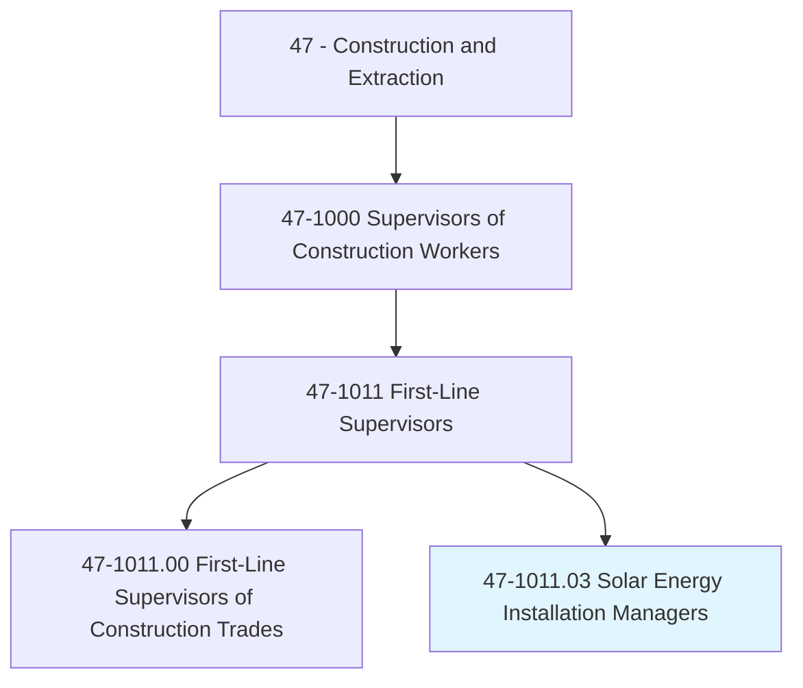
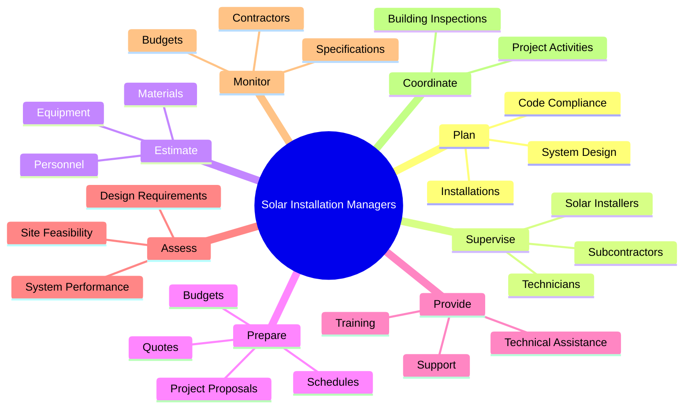
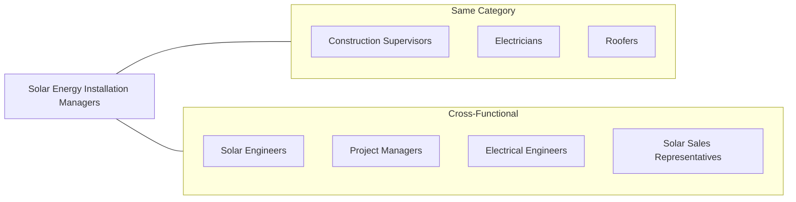
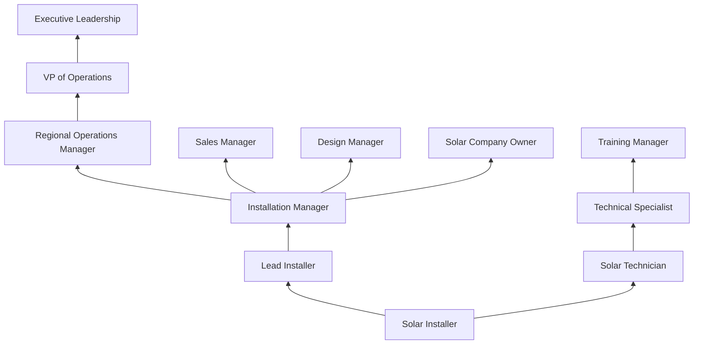

# Solar Energy Installation Managers

> Direct work crews installing residential or commercial solar photovoltaic or thermal systems.

## Overview

Solar Energy Installation Managers are specialized supervisors who lead teams installing solar energy systems on residential and commercial properties. As the renewable energy sector rapidly expands, these professionals play a crucial role in the clean energy transition. They combine traditional construction supervision skills with specialized knowledge of photovoltaic (PV) and solar thermal technologies. Their responsibilities span the entire installation process, from initial site assessment through system startup, ensuring installations meet electrical codes, safety standards, and performance specifications.

## Classification Hierarchy

## Key Statistics

| Metric | Value |
|--------|-------|
| SOC Code | 47-1011.03 |
| Job Zone | 4 (Considerable Preparation) |
| Category | [Construction](/occupations/Construction/index) |
| Parent Occupation | [Construction Supervisors](./ConstructionSupervisors.mdx) |
| Core Tasks | 20+ |
| Green Economy | High Growth |
| Source | O*NET |

## Core Tasks

### plan.Installations

Solar Energy Installation Managers plan and coordinate solar system installations to ensure conformance to electrical and building codes.

**Actions:**
- `plan.Installations.of.PhotovoltaicPv` - Design PV system layouts and mounting configurations
- `plan.Installations.of.SolarThermalSystems.to.ensure.ConformanceToCodes` - Plan thermal collector installations
- `coordinate.Installations.of.PhotovoltaicPv` - Synchronize multi-day installation schedules
- `coordinate.Installations.of.SolarThermalSystems` - Manage thermal system component delivery

### supervise.SolarInstallers

Managers oversee installation crews to ensure safety compliance and quality workmanship.

**Actions:**
- `supervise.SolarInstallers.for.SolarInstallationProjects.to.ensure.ComplianceWithSafetyStandards` - Monitor rooftop and ground-mount installation safety
- `supervise.Technicians.for.SolarInstallationProjects` - Oversee electrical connection work
- `supervise.Subcontractors.for.SolarInstallationProjects` - Manage electricians, roofers, and other trades

### estimate.Materials

Managers calculate all resources needed for residential and commercial solar projects.

**Actions:**
- `estimate.Materials.for.ResidentialSolarInstallationProjects` - Calculate panels, inverters, and mounting hardware for homes
- `estimate.Materials.for.CommercialSolarInstallationProjects` - Size commercial-scale system components
- `estimate.Equipment.for.ResidentialSolarInstallationProjects` - Determine tools and lift equipment needs
- `estimate.PersonnelNeeded.for.CommercialSolarInstallationProjects` - Plan crew sizes for large installations

### prepare.SolarInstallationProjectProposals

Managers develop comprehensive project documentation for customers and internal use.

**Actions:**
- `prepare.SolarInstallationProjectProposals` - Create detailed installation plans and timelines
- `prepare.Quotes` - Develop accurate cost estimates for customers
- `prepare.Budgets` - Build internal project budgets
- `prepare.Schedules` - Create installation timelines and milestones

### provide.TechnicalAssistance

Managers support installation teams with specialized knowledge across solar technologies.

**Actions:**
- `provide.TechnicalAssistance.to.Installers` - Guide crews through complex installations
- `provide.TechnicalAssistance.to.Technicians` - Support electrical and system integration work
- `provide.TechnicalAssistance.to.SolarElectricSystems` - Troubleshoot PV system issues
- `provide.TechnicalAssistance.to.SolarThermalSystems` - Address thermal collector and storage problems
- `provide.TechnicalAssistance.to.ElectricalSystems` - Support grid interconnection and wiring

### assess.PotentialSolarInstallationSites

Managers evaluate locations to determine installation feasibility and optimal design.

**Actions:**
- `assess.PotentialSolarInstallationSites.to.determine.Feasibility` - Evaluate roof condition, shading, and orientation
- `assess.PotentialSolarInstallationSites.to.design.Requirements` - Determine structural and electrical requirements
- `assess.SystemPerformance.at.System` - Monitor overall system output
- `assess.Functionality.at.ComponentLevels` - Diagnose panel and inverter performance

### monitor.Work

Managers track contractor performance to ensure projects meet specifications.

**Actions:**
- `monitor.Work.of.Contractors.to.ensure.ProjectsConformToPlans` - Verify installation matches design
- `monitor.Work.of.Subcontractors` - Track electrical and roofing subcontractor progress
- `monitor.Work.of.Specifications` - Ensure components meet project specifications
- `monitor.Work.of.Budgets` - Control project costs

## Skills & Competencies

### Technical Skills
- **Solar PV Systems** - Expert
- **Solar Thermal Systems** - Advanced
- **Electrical Systems** - Advanced
- **Building Codes (NEC, IBC)** - Expert
- **System Design Software** - Advanced
- **Project Management** - Advanced
- **Cost Estimation** - Advanced

### Soft Skills
- **Leadership** - Critical
- **Communication** - Critical
- **Problem Solving** - Essential
- **Customer Service** - Essential
- **Time Management** - Essential
- **Safety Awareness** - Critical

## Related Occupations

## Industry Variations

### Residential Solar
- Single-family home installations
- Rooftop PV systems (5-15 kW)
- Direct customer interaction
- Rapid installation timelines (1-3 days)
- Permit coordination with local jurisdictions

### Commercial Solar
- Business and industrial installations
- Larger systems (50 kW - 1 MW+)
- Complex roof structures and ground mounts
- Extended project timelines
- Multiple stakeholder coordination

### Utility-Scale Solar
- Large solar farms (10 MW+)
- Ground-mounted tracking systems
- Heavy construction equipment coordination
- Environmental compliance requirements
- Utility interconnection management

### Solar + Storage
- Battery storage integration
- Hybrid system design
- Advanced inverter technologies
- Grid services and backup power
- Increased technical complexity

## Industries

- Specialty Trade Contractors - High Employment
- Electric Power Generation - High Employment
- [Construction](/industries/Construction/index) - Moderate Employment
- [Wholesale Trade](/industries/Wholesale/index) - Moderate Employment
- [Professional Services](/industries/Scientific) - Moderate Employment

## Career Progression

## Education & Training

| Requirement | Details |
|-------------|---------|
| Typical Education | High school diploma; associate's or bachelor's degree in related field preferred |
| Work Experience | 3-5 years in solar installation or electrical work |
| On-the-Job Training | 1-2 years supervisory and technical training |
| Certifications | NABCEP PV Installation Professional, OSHA 30-hour, Electrician license (preferred) |

## Certifications

- **NABCEP PV Installation Professional** - Industry standard certification
- **NABCEP Solar Heating Installer** - For thermal systems
- **OSHA 30-Hour Construction** - Safety certification
- **State Electrical License** - Required in some jurisdictions
- **CPR/First Aid** - Safety requirement

## Departments

This occupation typically works in:
- Installation Operations
- Project Management
- Field Services
- Quality Assurance

## Green Economy Impact

Solar Energy Installation Managers are at the forefront of the clean energy transition:

- **Growth Rate**: Solar installation is one of the fastest-growing occupations
- **Climate Impact**: Each installation reduces carbon emissions
- **Energy Independence**: Contributing to distributed energy generation
- **Economic Development**: Creating local jobs in communities nationwide

---

*Source: O*NET 47-1011.03 - ONETOccupation*
