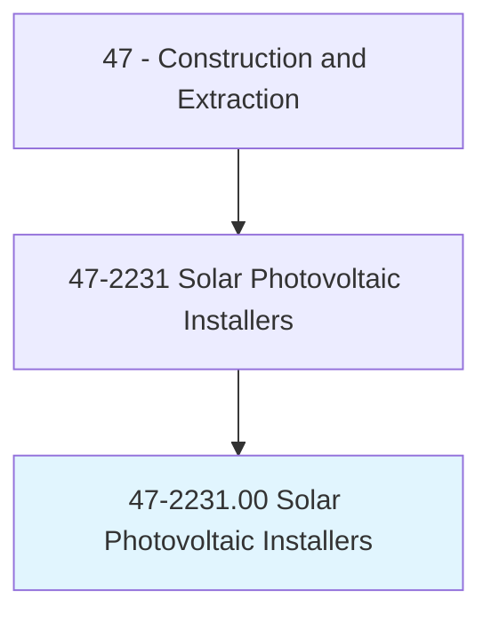
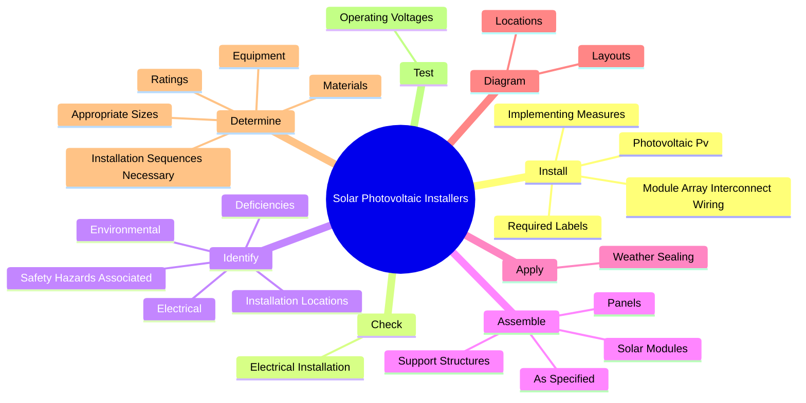
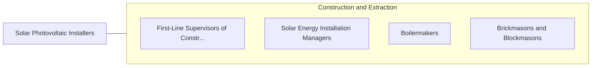

# Solar Photovoltaic Installers

> Assemble, install, or maintain solar photovoltaic (PV) systems on roofs or other structures in compliance with site assessment and schematics. May include measuring, cutting, assembling, and bolting structural framing and solar modules. May perform minor electrical work such as current checks.

## Overview

Solar Photovoltaic Installers is an occupation within the Construction and Extraction category. Assemble, install, or maintain solar photovoltaic (PV) systems on roofs or other structures in compliance with site assessment and schematics. May include measuring, cutting, assembling, and bolting structural framing and solar modules.

## Classification Hierarchy

## Key Statistics

| Metric | Value |
|--------|-------|
| SOC Code | 47-2231.00 |
| Category | [Construction and Extraction](/occupations/Construction/index) |
| Task Count | 123 |
| Source | O*NET |

## Core Tasks

### install.PhotovoltaicPv

Solar Photovoltaic Installers install photovoltaic pv as part of their core responsibilities.

**Actions:**
- `install.PhotovoltaicPv`
- `install.ModuleArrayInterconnectWiring.to.disable.ArraysDuringInstallation`
- `install.ImplementingMeasures.to.disable.ArraysDuringInstallation`
- `install.RequiredLabels.on.SolarSystemComponents`

### check.ElectricalInstallation

Solar Photovoltaic Installers check electrical installation as part of their core responsibilities.

**Actions:**
- `check.ElectricalInstallation.for.ProperWiring`
- `check.ElectricalInstallation.for.Polarity`
- `check.ElectricalInstallation.for.Grounding`
- `check.ElectricalInstallation.for.Integrity.of.Terminations`

### identify.Electrical

Solar Photovoltaic Installers identify electrical as part of their core responsibilities.

**Actions:**
- `identify.Electrical.with.PhotovoltaicPv`
- `identify.Environmental.with.PhotovoltaicPv`
- `identify.SafetyHazardsAssociated.with.PhotovoltaicPv`
- `identify.InstallationLocations.with.ProperOrientation`

## Skills & Competencies

### Technical Skills
- **Construction Methods** - Advanced
- **Blueprint Reading** - Advanced
- **Safety Compliance** - Advanced

### Soft Skills
- **Communication** - Essential
- **Problem Solving** - Essential
- **Critical Thinking** - Important
- **Teamwork** - Important
- **Adaptability** - Important

## Related Occupations

## Industries

This occupation is found across multiple industries. See [Industries](/industries) for sector-specific employment data.

## Career Progression

---

*Source: O*NET 47-2231.00 - ONETOccupation*
