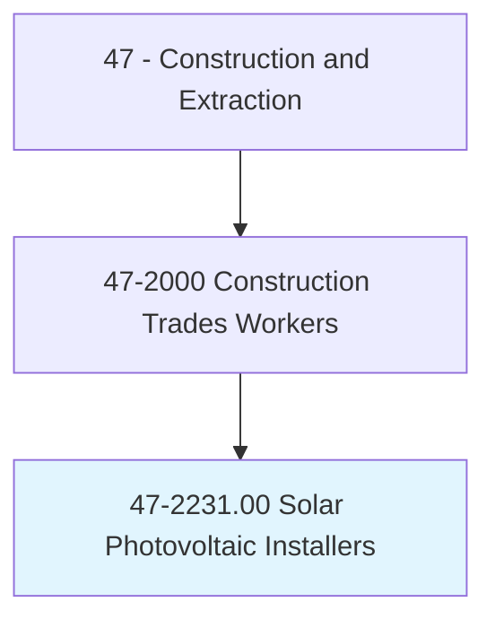
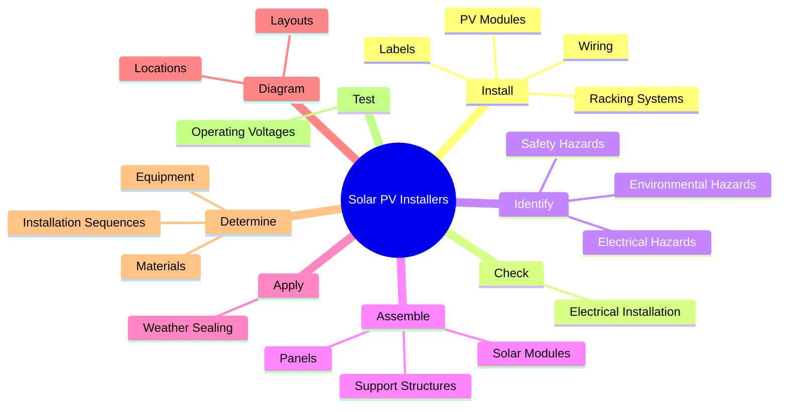
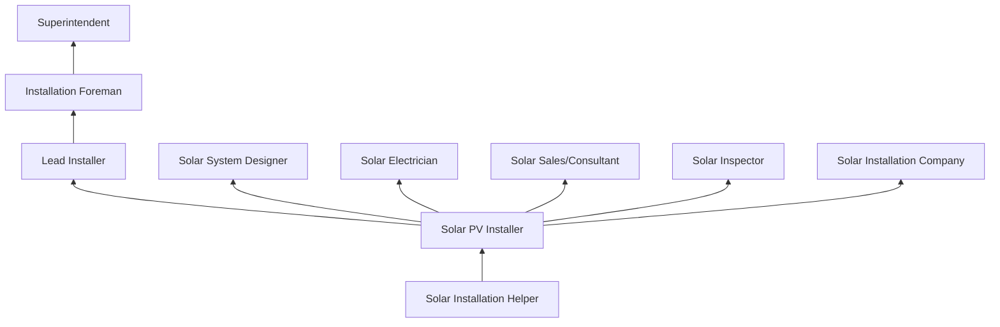
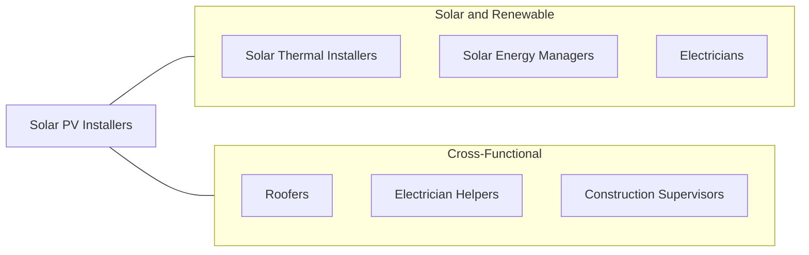

# Solar Photovoltaic Installers

> Assemble, install, or maintain solar photovoltaic (PV) systems on roofs or other structures in compliance with site assessment and schematics. May include measuring, cutting, assembling, and bolting structural framing and solar modules. May perform minor electrical work such as current checks.

## Overview

Solar Photovoltaic Installers assemble, mount, and maintain solar panel systems on residential, commercial, and utility-scale installations. This is one of the fastest-growing construction occupations, driven by declining solar equipment costs, government incentives, climate policy, and increasing demand for renewable energy. Installers work on rooftops, ground-mount systems, carport structures, and building-integrated photovoltaic (BIPV) systems.

The work combines construction skills (roof work, structural mounting, waterproofing) with electrical knowledge (DC circuits, inverter systems, grid interconnection). Installers must assess roof structural capacity, determine optimal panel orientation and tilt, install racking systems, mount and wire solar modules, and connect the system to inverters and the electrical grid. They work with both string inverter and microinverter architectures, battery storage systems, and monitoring equipment.

Safety is a primary concern, as the work involves rooftop activity (fall hazards), electrical work (shock and arc flash), and exposure to DC voltage that cannot be easily de-energized while panels are exposed to light. Installers must understand the National Electrical Code (NEC) Article 690 for solar electric systems, local building codes, and utility interconnection requirements. The occupation provides a career path that combines environmental impact with skilled trade employment.

## Classification Hierarchy

## Key Statistics

| Metric | Value |
|--------|-------|
| SOC Code | 47-2231.00 |
| Job Zone | 3 (Medium Preparation) |
| Category | [Construction and Extraction](/occupations/Construction/index) |
| Task Count | 123 |
| Median Salary | $47,700 / year |
| Employment | ~35,000 |
| Job Outlook | 22% (Much faster than average) |
| Physical Demands | Heavy |
| Source | O*NET |

## Core Tasks

### install.PVModules

Solar installers mount photovoltaic modules on racking systems.

**Actions:**
- `install.PhotovoltaicPv`
- `install.ModuleArrayInterconnectWiring.to.disable.ArraysDuringInstallation`
- `install.ImplementingMeasures.to.disable.ArraysDuringInstallation`
- `install.RequiredLabels.on.SolarSystemComponents`

### check.ElectricalInstallation

Installers verify electrical systems for proper wiring and safety.

**Actions:**
- `check.ElectricalInstallation.for.ProperWiring`
- `check.ElectricalInstallation.for.Polarity`
- `check.ElectricalInstallation.for.Grounding`
- `check.ElectricalInstallation.for.Integrity.of.Terminations`

## Skills & Competencies

### Technical Skills
- **Solar Module Installation** - Expert
- **Racking and Mounting Systems** - Expert
- **DC Electrical Systems** - Advanced
- **NEC Article 690** - Advanced
- **Roof Work and Waterproofing** - Advanced
- **Blueprint and Schematic Reading** - Advanced
- **System Commissioning** - Advanced
- **Battery Storage Systems** - Intermediate

### Trade-Specific Skills
- **Residential Rooftop Solar** - Composition, tile, and flat roof mounting
- **Commercial Rooftop** - Ballasted and attached systems
- **Ground-Mount Systems** - Driven pile and ground screw foundations
- **Microinverter vs. String Inverter** - System architecture selection
- **Rapid Shutdown Compliance** - NEC 2017+ requirements
- **Energy Storage** - Battery system integration

### Soft Skills
- **Safety Consciousness** - Critical
- **Attention to Detail** - Critical
- **Physical Stamina** - Essential
- **Customer Service** - Essential (residential)
- **Teamwork** - Essential

## Education & Certifications

| Requirement | Details |
|-------------|---------|
| Typical Education | High school diploma or equivalent |
| Training Programs | Solar installer certificate programs (40-100 hours) |
| On-the-Job Training | 6-12 months |
| Electrical License | Required in some jurisdictions for electrical connections |

### Certifications
- **NABCEP PV Installation Professional** - Gold standard industry certification
- **NABCEP PV Associate** - Entry-level certification
- **OSHA 10-Hour Construction** - Safety certification
- **Fall Protection Certification** - Required for roof work
- **Electrical License (if applicable)** - For final electrical connections
- **First Aid/CPR** - Required

## Career Progression

## Specializations

- **Residential Rooftop** - Single-family and multi-family solar
- **Commercial Rooftop** - Flat and low-slope commercial installations
- **Ground-Mount** - Utility and community solar farms
- **Battery Storage** - Energy storage system integration
- **O&M** - Operations and maintenance of existing systems

## Tools & Equipment

### Installation Tools
- Impact drivers and drills
- Torque wrenches
- Conduit bending tools
- Wire strippers and crimpers
- Stud finders and roof jacks
- Racking assembly tools (manufacturer-specific)

### Electrical Tools
- Multimeters and clamp meters
- Insulation resistance testers (megger)
- Solar irradiance meters
- String sizing calculators
- Labeling tools (NEC-compliant)

### Safety Equipment
- Fall protection harness and anchors
- Roof brackets and toe boards
- Hard hat and safety glasses
- Insulated gloves and tools
- Arc flash PPE (for panel work)

## Safety Considerations

- **Falls from Roofs** - Leading hazard; 100% tie-off required
- **Electrical Shock** - DC voltage present whenever modules are illuminated
- **Arc Flash** - Inverter and panel connections
- **Heat Illness** - Rooftop work in summer; hydration and shade breaks
- **Heavy Lifting** - Solar panels (40-60 lbs each); proper handling
- **Roof Penetrations** - Waterproofing integrity; proper flashing
- **UV Exposure** - Outdoor work; sun protection

## Related Occupations

## Industries

- Solar Installation Companies - Primary Employment
- Electrical Contractors - High Employment
- Residential Construction - Moderate Employment
- [Utility-Scale Solar](/industries/Utilities) - Growing Employment

## Departments

- Solar Installation
- Field Operations
- Design and Engineering
- Service and Maintenance

---

*Source: O*NET 47-2231.00 - ONETOccupation*
