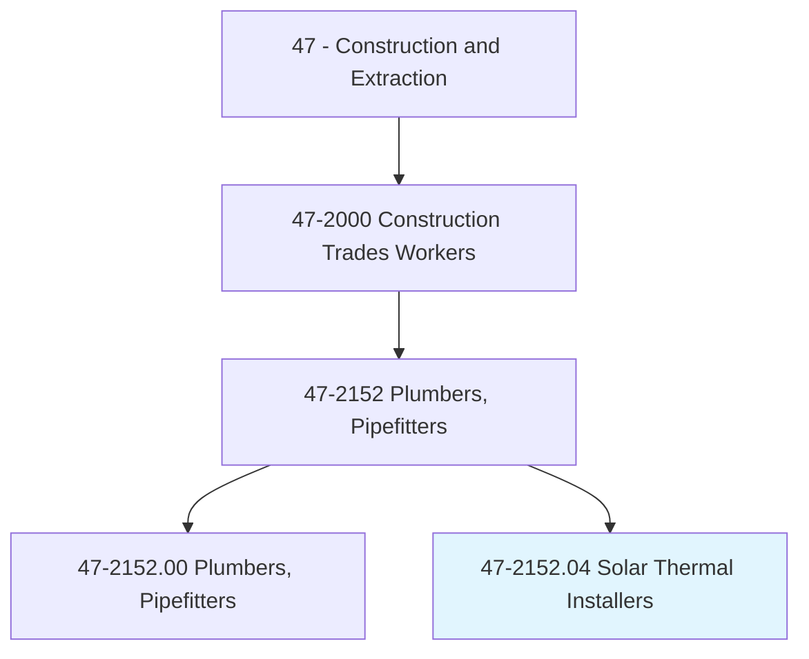
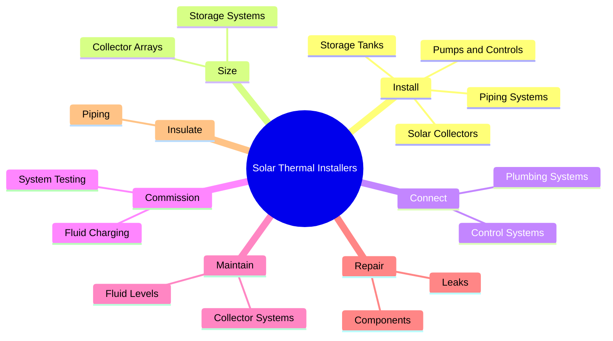
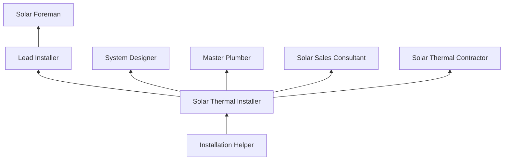
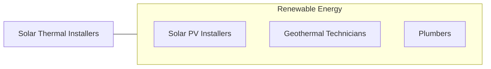

# Solar Thermal Installers and Technicians

> Install or repair solar energy systems designed to collect, store, and circulate solar-heated water for residential, commercial, or industrial use.

## Overview

Solar Thermal Installers and Technicians install, maintain, and repair systems that collect solar energy to heat water or other fluids for residential, commercial, and industrial applications. Unlike photovoltaic systems that generate electricity, solar thermal systems use collectors (flat plate or evacuated tube) to absorb solar radiation and transfer the heat to a working fluid that heats domestic water, swimming pools, or provides space heating through hydronic systems.

The trade combines plumbing, HVAC, and roofing skills with specialized knowledge of solar thermal engineering. Installers must size collector arrays based on climate data and hot water demand, install collectors on roofs or ground mounts, run piping circuits with proper insulation and freeze protection, install storage tanks and heat exchangers, and commission the system with correct fluid charge and control settings. Systems may use glycol-based antifreeze in closed loops or use drainback designs for freeze protection.

While the solar thermal market has faced competition from increasingly affordable photovoltaic systems and heat pump water heaters, it remains relevant for high hot water demand applications (hotels, laundromats, multi-family housing, industrial process heat) and for integrated systems that combine solar thermal with radiant heating. The skills are also transferable to geothermal heat pump installation and hydronic heating systems.

## Classification Hierarchy

## Key Statistics

| Metric | Value |
|--------|-------|
| SOC Code | 47-2152.04 |
| Job Zone | 3 (Medium Preparation) |
| Category | [Construction and Extraction](/occupations/Construction/index) |
| Task Count | 95 |
| Median Salary | $50,200 / year |
| Employment | ~5,000 |
| Job Outlook | 6% (Faster than average) |
| Physical Demands | Heavy |
| Source | O*NET |

## Core Tasks

### install.SolarCollectors

Technicians install solar thermal collectors on roofs or ground mounts.

**Actions:**
- `install.SolarCollectors.on.Rooftops`
- `install.StorageTanks.in.MechanicalRooms`
- `install.PipingSystems.between.CollectorsAndTanks`

## Skills & Competencies

### Technical Skills
- **Solar Thermal System Design** - Advanced
- **Plumbing and Piping** - Expert
- **Hydronic Systems** - Advanced
- **Roofing and Mounting** - Advanced
- **Electrical Controls** - Intermediate
- **System Commissioning** - Advanced
- **Blueprint Reading** - Advanced

### Trade-Specific Skills
- **Flat Plate and Evacuated Tube Collectors** - System types
- **Glycol Systems** - Closed-loop antifreeze circuits
- **Drainback Systems** - Passive freeze protection
- **Pool Heating** - Unglazed collector systems
- **Process Heat** - Industrial solar thermal

### Soft Skills
- **Problem Solving** - Essential
- **Mechanical Aptitude** - Critical
- **Safety Consciousness** - Critical
- **Customer Service** - Essential
- **Attention to Detail** - Critical

## Education & Certifications

| Requirement | Details |
|-------------|---------|
| Typical Education | High school diploma + trade training |
| Plumbing License | Required for plumbing connections |
| Specialty Training | Solar thermal system courses |

### Certifications
- **NABCEP Solar Heating Installer** - Industry certification
- **Plumbing License** - State journeyman or master
- **OSHA 10-Hour Construction** - Safety certification
- **Fall Protection Certification** - Roof work
- **First Aid/CPR** - Required

## Career Progression

## Specializations

- **Residential Solar Hot Water** - Single and multi-family
- **Commercial Solar Thermal** - Hotels, hospitals, multi-family
- **Pool and Spa Heating** - Recreational facilities
- **Industrial Process Heat** - Manufacturing and food processing
- **Combined Systems** - Solar thermal + heat pump hybrid

## Tools & Equipment

- Plumbing tools (wrenches, cutters, soldering)
- Solar collector mounting hardware
- Pressure testing equipment
- Glycol fill and flush pumps
- Insulation tools
- Multimeters and temperature sensors
- Roofing safety equipment (harness, anchors)

## Safety Considerations

- **Falls from Roofs** - Collector installation; fall protection required
- **Burns** - Solar collectors can reach 400F+; hot fluid systems
- **Glycol Chemical Exposure** - Antifreeze handling; skin protection
- **Heavy Lifting** - Collectors and storage tanks
- **Pressurized Systems** - Scalding risk from pressurized hot water

## Related Occupations

## Industries

- [Solar Installation Companies](/industries/SpecialtyTrade) - Primary Employment
- [Plumbing and HVAC Contractors](/industries/MechanicalContractors) - High Employment
- [Renewable Energy Services](/industries/RenewableEnergy) - Growing Employment

## Departments

- [Solar Division](/departments/Solar)
- [Plumbing Division](/departments/Plumbing)
- [Service Division](/departments/Service)

---

*Source: O*NET 47-2152.04 - ONETOccupation*
