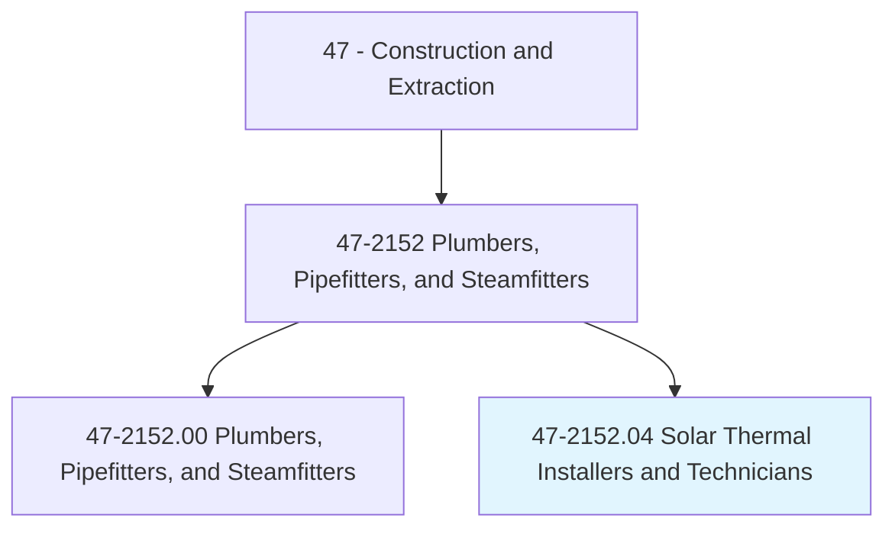
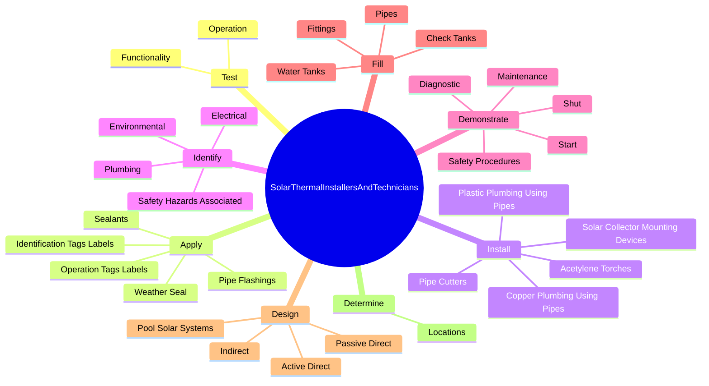
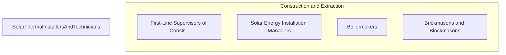

# Solar Thermal Installers and Technicians

> Install or repair solar energy systems designed to collect, store, and circulate solar-heated water for residential, commercial or industrial use.

## Overview

Solar Thermal Installers and Technicians is classified under Construction and Extraction (SOC 47). Install or repair solar energy systems designed to collect, store, and circulate solar-heated water for residential, commercial or industrial use.

## Classification Hierarchy

## Key Statistics

| Metric | Value |
|--------|-------|
| SOC Code | 47-2152.04 |
| Category | [Construction and Extraction](/occupations/Construction/index) |
| Task Count | 113 |
| Source | O*NET |

## Core Tasks

### test.Operation

Solar Thermal Installers and Technicians test operation as part of their core responsibilities.

**Actions:**
- `test.Operation.of.Mechanical`
- `test.Operation.of.Plumbing`
- `test.Operation.of.Electrical`
- `test.Operation.of.ControlSystems`

### apply.WeatherSeal

Solar Thermal Installers and Technicians apply weather seal as part of their core responsibilities.

**Actions:**
- `apply.WeatherSeal.to.RoofPenetrationsDevices`
- `apply.WeatherSeal.to.StructuralDevices`
- `apply.PipeFlashings.to.RoofPenetrationsDevices`
- `apply.PipeFlashings.to.StructuralDevices`

### install.SolarCollectorMountingDevices

Solar Thermal Installers and Technicians install solar collector mounting devices as part of their core responsibilities.

**Actions:**
- `install.SolarCollectorMountingDevices.on.Tile`
- `install.SolarCollectorMountingDevices.on.Asphalt`
- `install.SolarCollectorMountingDevices.on.Shingle`
- `install.SolarCollectorMountingDevices.on.BuiltUpGravelRoofs`

## Skills & Competencies

### Technical Skills
- **Construction Methods** - Advanced
- **Blueprint Reading** - Advanced
- **Safety Compliance** - Advanced

### Soft Skills
- **Communication** - Essential
- **Problem Solving** - Essential
- **Critical Thinking** - Important
- **Teamwork** - Important
- **Adaptability** - Important

## Related Occupations

## Industries

This occupation is found across multiple industries. See [Industries](/industries) for sector-specific employment data.

## Career Progression

---

*Source: O*NET 47-2152.04 - ONETOccupation*
