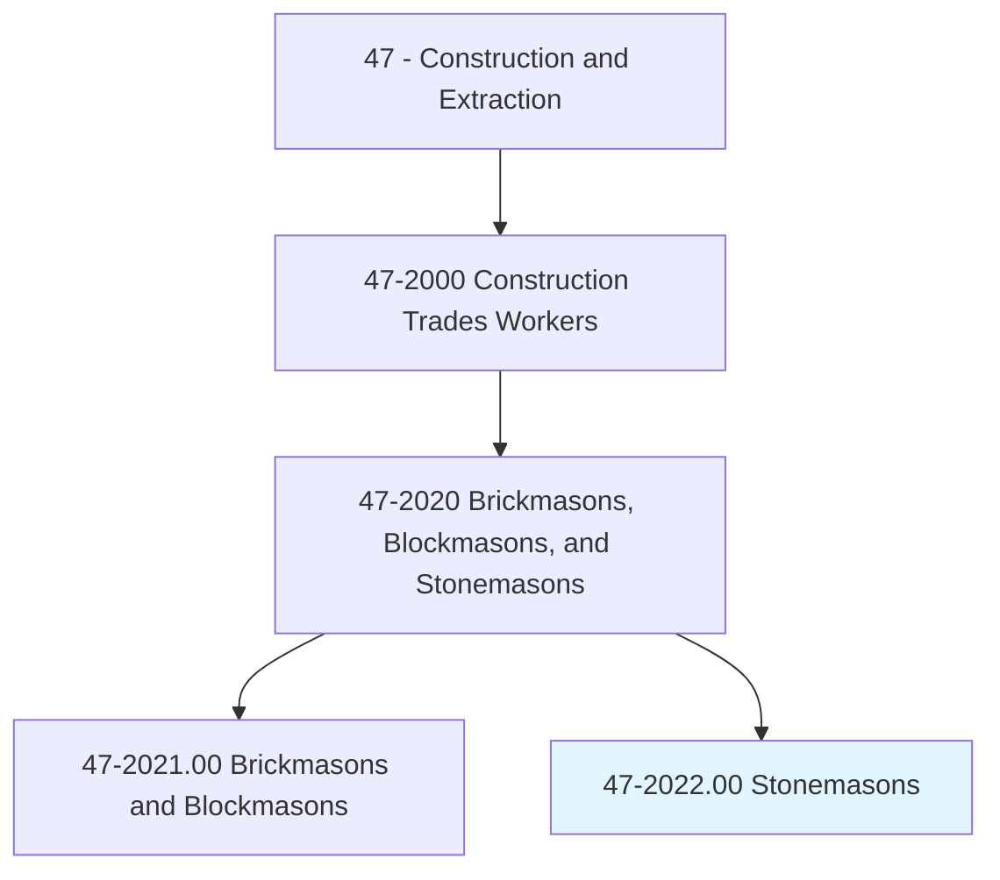
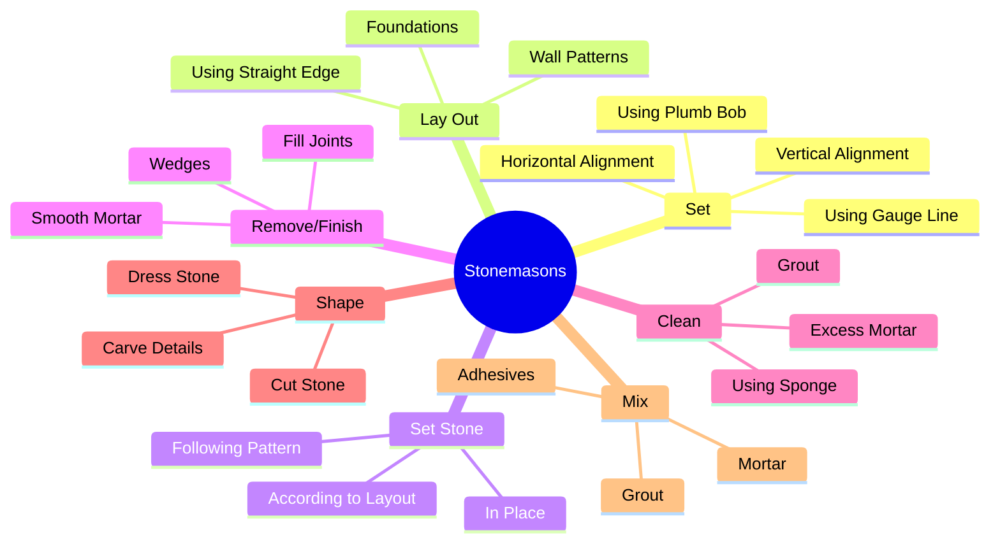
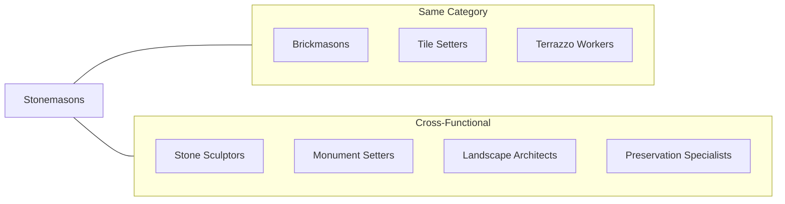
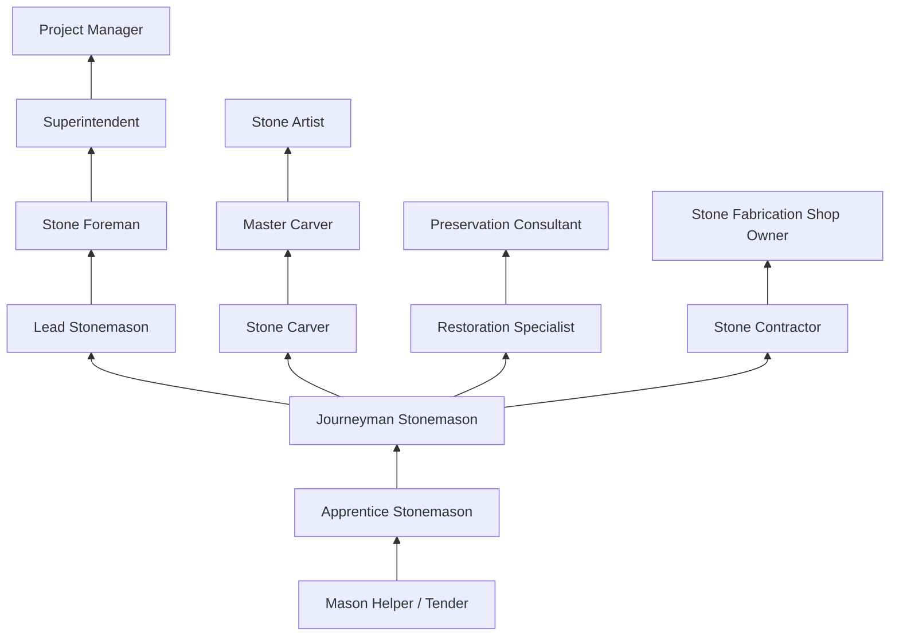

# Stonemasons

> Build stone structures, such as piers, walls, and abutments. Lay walks, curbstones, or special types of masonry for vats, tanks, and floors.

## Overview

Stonemasons are skilled artisans who shape, cut, and set natural and artificial stone to construct buildings, monuments, walls, and other structures. This craft has roots extending back thousands of years, and modern stonemasons continue traditions while incorporating contemporary techniques and tools. The work requires both artistic sensibility and technical precision, as stonemasons must understand stone properties, structural engineering principles, and aesthetic design. From restoring historic landmarks to creating new architectural features, stonemasons play a vital role in both construction and preservation.

## Classification Hierarchy

## Key Statistics

| Metric | Value |
|--------|-------|
| SOC Code | 47-2022.00 |
| Job Zone | 3 (Medium Preparation) |
| Category | [Construction](/occupations/Construction/index) |
| Core Tasks | 12+ |
| Physical Demands | Heavy |
| Source | O*NET |

## Core Tasks

### set.VerticalAlignment

Stonemasons establish precise alignment using traditional and modern tools.

**Actions:**
- `set.VerticalAlignment.of.Structures` - Ensure walls are plumb and true
- `set.VerticalAlignment.of.UsingPlumbBob` - Use gravity for vertical reference
- `set.VerticalAlignment.of.GaugeLine` - Set string lines for consistency
- `set.VerticalAlignment.of.Level` - Verify alignment with spirit levels
- `set.HorizontalAlignment.of.Structures` - Ensure courses are level
- `set.HorizontalAlignment.of.UsingPlumbBob` - Cross-check measurements
- `set.HorizontalAlignment.of.GaugeLine` - Maintain consistent course heights

### lay.Foundations

Stonemasons lay out patterns and foundations for stone structures.

**Actions:**
- `lay.Foundations` - Establish base courses for walls
- `lay.UsingStraightEdge` - Mark straight lines for layout
- `lay.Rule` - Measure and mark using rulers and tape
- `lay.StakedLines` - Set string lines for wall alignment

### set.Stone

Stonemasons position and set stone according to design specifications.

**Actions:**
- `set.Stone.in.Place` - Position stones in mortar bed
- `set.Stone.in.According.to.Layout` - Follow design drawings
- `set.Stone.in.Pattern` - Create decorative patterns
- `set.Marble.in.Place` - Install premium stone materials
- `set.Marble.in.According.to.Layout` - Position marble per specifications
- `set.Marble.in.Pattern` - Create marble pattern designs

### remove.Wedges

Stonemasons finish joints and create attractive surfaces.

**Actions:**
- `remove.Wedges.to.AttractiveFinish` - Remove temporary supports after mortar sets
- `remove.Wedges.to.UsingTuckPointer` - Tool joints for finished appearance
- `remove.FillJoints.between.StonesToAttractiveFinish` - Complete joint filling
- `remove.FinishJoints.between.StonesToAttractiveFinish` - Create final joint appearance
- `remove.UsingTrowel.to.AttractiveFinish` - Tool mortar for appearance
- `remove.SmoothMortar.to.AttractiveFinish` - Create uniform joint surfaces

### clean.ExcessMortar

Stonemasons clean stone surfaces during and after installation.

**Actions:**
- `clean.ExcessMortar.from.Surface.of.Marble` - Remove mortar from delicate surfaces
- `clean.ExcessMortar.from.Stone` - Clean natural stone faces
- `clean.ExcessMortar.from.Monument` - Maintain monument appearance
- `clean.ExcessMortar.from.UsingSponge` - Use sponge for gentle cleaning
- `clean.ExcessMortar.from.Brush` - Scrub with appropriate brushes
- `clean.ExcessGrout.from.Surface` - Remove excess grout from joints

## Skills & Competencies

### Technical Skills
- **Stone Selection and Properties** - Expert
- **Layout and Measurement** - Expert
- **Mortar and Grout Application** - Expert
- **Stone Cutting and Shaping** - Expert
- **Blueprint Reading** - Advanced
- **Mathematics (Geometry)** - Advanced
- **Hand and Power Tool Operation** - Expert

### Soft Skills
- **Attention to Detail** - Critical
- **Physical Stamina** - Critical
- **Artistic Sensibility** - Essential
- **Problem Solving** - Essential
- **Patience** - Critical
- **Hand-Eye Coordination** - Critical

## Related Occupations

## Industry Variations

### Building Construction
- Structural stone walls
- Exterior cladding and facades
- Interior stone features
- Commercial and residential projects
- New construction focus

### Monument and Memorial
- Headstones and markers
- Memorial monuments
- Public art installations
- Inscriptions and lettering
- Cemetery and memorial park work

### Historical Restoration
- Historic building preservation
- Matching original materials and techniques
- Period-appropriate methods
- Heritage compliance
- Museum-quality work

### Landscape Stonework
- Retaining walls
- Garden features
- Walkways and patios
- Water features
- Outdoor living spaces

### Specialty Fabrication
- Custom architectural elements
- Decorative carvings
- Fireplace surrounds
- Countertops and vanities
- Specialty installations

## Stone Types and Materials

### Natural Stone
- **Granite** - Durable, weather-resistant
- **Marble** - Premium, decorative applications
- **Limestone** - Versatile, workable
- **Sandstone** - Traditional, regional character
- **Slate** - Roofing, flooring, cladding
- **Bluestone** - Walkways, patios

### Manufactured Stone
- **Cast Stone** - Architectural elements
- **Cultured Stone** - Veneer applications
- **Concrete Masonry** - Structural applications

## Industries

- [Residential Building Construction](/industries/ResidentialConstruction) - High Employment
- [Commercial Building Construction](/industries/CommercialConstruction) - High Employment
- [Specialty Trade Contractors](/industries/SpecialtyTrade) - High Employment
- [Museums and Historical Sites](/industries/MuseumsHistorical) - Moderate Employment
- [Landscape Services](/industries/LandscapeServices) - Moderate Employment

## Career Progression

## Education & Training

| Requirement | Details |
|-------------|---------|
| Typical Education | High school diploma or equivalent |
| Apprenticeship | 3-4 year apprenticeship program |
| On-the-Job Training | Continuous skills development |
| Specialty Training | Carving, restoration, specific stone types |

## Certifications

- **NCCER Masonry** - Industry-recognized credential
- **Stone Industry Education Certificate** - Marble Institute of America
- **Historic Preservation Certificate** - For restoration work
- **OSHA 10/30-Hour Construction** - Safety certification
- **Scaffold User** - Safety certification

## Tools and Equipment

### Hand Tools
- Chisels (various types and sizes)
- Bush hammers
- Pointing tools
- Trowels
- Mallets and hammers
- Plumb bobs and levels
- Wire brushes

### Power Tools
- Stone saws (bridge, rail, wire)
- Angle grinders
- Pneumatic chisels
- Polishing machines
- Core drills
- Diamond blades

### Lifting Equipment
- Chain falls and hoists
- Suction lifters
- Spreader bars
- Stone clamps
- Forklifts

## Work Environment

### Physical Demands
- Heavy lifting (stone can weigh hundreds of pounds)
- Prolonged standing, kneeling, bending
- Working at heights on scaffolding
- Fine detail work requiring steady hands
- Outdoor work in various weather conditions

### Safety Considerations
- Dust exposure (silicosis risk)
- Heavy lifting injury prevention
- Scaffold safety
- Eye and hearing protection
- Vibration exposure from power tools
- Sharp edge hazards

### Work Settings
- Construction sites
- Stone fabrication shops
- Historic buildings
- Cemeteries and memorial parks
- Quarries (some positions)

## Departments

This occupation typically works in:
- [Field Operations](/departments/FieldOperations)
- [Masonry Division](/departments/Masonry)
- [Restoration Division](/departments/Restoration)
- [Stone Fabrication](/departments/Fabrication)

## Artistic Heritage

Stonemasonry is one of humanity's oldest crafts, with techniques passed down through generations:

- **Medieval traditions** - Cathedral and castle construction
- **Classical methods** - Greek and Roman architectural elements
- **Regional styles** - Local stone and design traditions
- **Modern innovation** - Contemporary design with traditional skills

Many stonemasons take pride in continuing these traditions while adapting to modern requirements and technologies.

## Related Occupations in this Group

- [Brickmasons and Blockmasons](./Masons.mdx) - 47-2021.00

---

*Source: O*NET 47-2022.00 - ONETOccupation*
