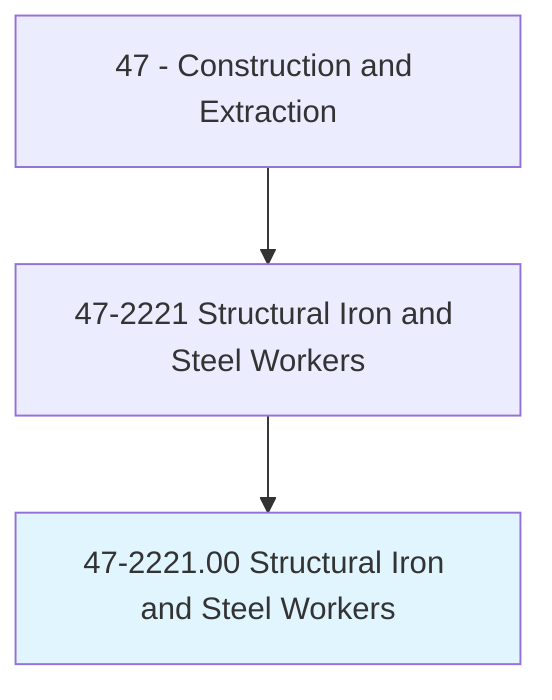
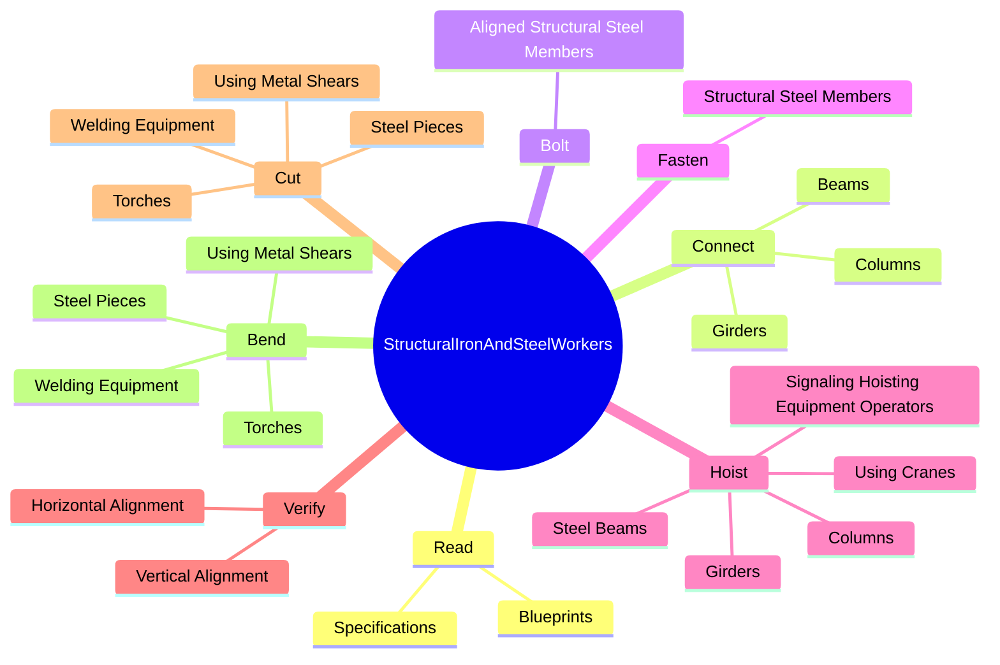
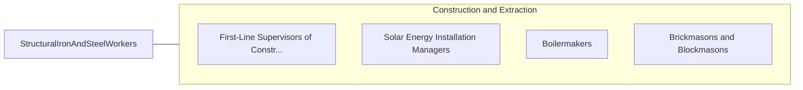

# Structural Iron and Steel Workers

> Raise, place, and unite iron or steel girders, columns, and other structural members to form completed structures or structural frameworks. May erect metal storage tanks and assemble prefabricated metal buildings.

## Overview

Structural Iron and Steel Workers is an occupation within the Construction and Extraction category. Raise, place, and unite iron or steel girders, columns, and other structural members to form completed structures or structural frameworks. 

## Classification Hierarchy

## Key Statistics

| Metric | Value |
|--------|-------|
| SOC Code | 47-2221.00 |
| Category | [Construction and Extraction](/occupations/Construction/index) |
| Task Count | 119 |
| Source | O*NET |

## Core Tasks

### read.Specifications

Structural Iron and Steel Workers read specifications as part of their core responsibilities.

**Actions:**
- `read.Specifications.to.determine.Locations`
- `read.Specifications.to.Quantities`
- `read.Specifications.to.SizesOfMaterialsRequired`
- `read.Blueprints.to.determine.Locations`

### connect.Columns

Structural Iron and Steel Workers connect columns as part of their core responsibilities.

**Actions:**
- `connect.Columns.with.Bolts`
- `connect.Columns.with.FollowingBlueprints`
- `connect.Columns.with.Instructions.from.Supervisors`
- `connect.Beams.with.Bolts`

### bolt.AlignedStructuralSteelMembers

Structural Iron and Steel Workers bolt aligned structural steel members as part of their core responsibilities.

**Actions:**
- `bolt.AlignedStructuralSteelMembers.in.Position.for.PermanentRiveting`
- `bolt.AlignedStructuralSteelMembers.in.Bolting`
- `bolt.AlignedStructuralSteelMembers.in.WeldingIntoPlace`

## Skills & Competencies

### Technical Skills
- **Construction Methods** - Advanced
- **Blueprint Reading** - Advanced
- **Safety Compliance** - Advanced

### Soft Skills
- **Communication** - Essential
- **Problem Solving** - Essential
- **Critical Thinking** - Important
- **Teamwork** - Important
- **Adaptability** - Important

## Related Occupations

## Industries

This occupation is found across multiple industries. See [Industries](/industries) for sector-specific employment data.

## Career Progression

---

*Source: O*NET 47-2221.00 - ONETOccupation*
