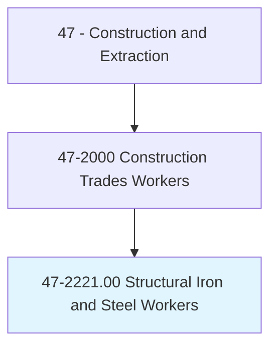
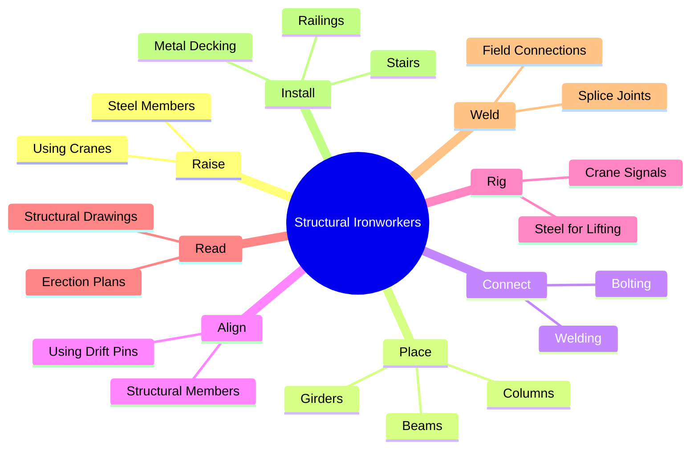
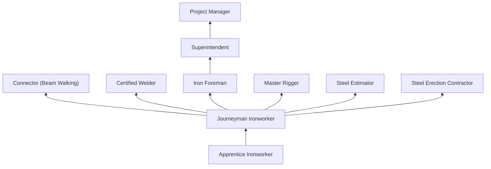
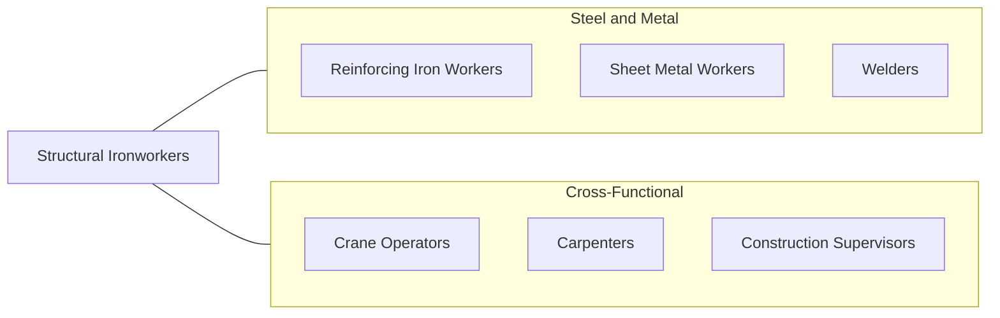

# Structural Iron and Steel Workers

> Raise, place, and unite iron or steel girders, columns, and other structural members to form completed structures or structural frameworks of buildings, bridges, and other structures using various welding equipment and other tools.

## Overview

Structural Iron and Steel Workers (ironworkers) erect the steel skeletons of buildings, bridges, stadiums, industrial plants, and other large structures. They unload, rig, and position structural steel members weighing up to many tons using cranes, then connect them using bolts, welds, and rivets to create the structural framework that supports the entire building. Ironwork is among the most dangerous construction trades, as workers perform their tasks at extreme heights on narrow beams with minimal fall protection surfaces.

The trade encompasses several specialties: structural ironworkers who erect building frames, reinforcing ironworkers (rodbusters) who place rebar, ornamental ironworkers who install metal stairs, railings, and curtain wall supports, and rigging specialists who plan and execute complex crane lifts. Structural ironworkers must read structural drawings, understand steel connection details, and perform bolt tightening and field welding at heights that can exceed 1,000 feet on skyscraper projects.

The work demands exceptional physical fitness, comfort at extreme heights, and precision in aligning heavy steel members. Ironworkers use spud wrenches, drift pins, and come-alongs to draw steel into alignment, then secure connections with high-strength bolts or field welds. Modern construction uses Building Information Modeling (BIM) to coordinate steel erection sequences, and GPS systems to verify member placement, but the hands-on skills of connecting steel remain unchanged.

## Classification Hierarchy

## Key Statistics

| Metric | Value |
|--------|-------|
| SOC Code | 47-2221.00 |
| Job Zone | 3 (Medium Preparation) |
| Category | [Construction and Extraction](/occupations/Construction/index) |
| Task Count | 118 |
| Median Salary | $57,200 / year |
| Employment | ~90,000 |
| Job Outlook | 4% (As fast as average) |
| Physical Demands | Very Heavy |
| Source | O*NET |

## Core Tasks

### raise.SteelMembers

Ironworkers rig and direct crane placement of structural steel.

**Actions:**
- `raise.SteelMembers.using.Cranes`
- `place.Girders.on.SteelConnections`
- `align.StructuralMembers.using.DriftPins`

### connect.SteelMembers

Ironworkers secure structural connections with bolts and welds.

**Actions:**
- `connect.SteelMembers.using.HighStrengthBolts`
- `weld.FieldConnections.per.WeldingProcedure`
- `install.MetalDecking.on.SteelFramework`

## Skills & Competencies

### Technical Skills
- **Structural Steel Erection** - Expert
- **Rigging and Crane Signaling** - Expert
- **Structural Drawing Reading** - Expert
- **Welding (SMAW, FCAW)** - Advanced
- **Bolt Tightening (TC, DTI)** - Expert
- **Metal Decking Installation** - Advanced
- **Mathematics** - Advanced

### Soft Skills
- **Heights Comfort** - Critical
- **Physical Stamina** - Critical
- **Courage** - Critical
- **Teamwork** - Critical
- **Communication** - Essential

## Education & Certifications

| Requirement | Details |
|-------------|---------|
| Typical Education | High school diploma or equivalent |
| Apprenticeship | 3-4 year Ironworkers apprenticeship |
| On-the-Job Training | 6,000-8,000 hours |

### Certifications
- **Ironworkers Union Journeyman Card** - Trade credential
- **OSHA 10/30-Hour Construction** - Safety certification
- **Welding Certification (AWS D1.1)** - Structural welding
- **NCCCO Rigger/Signal Person** - Crane support
- **Fall Protection Competent Person** - Required
- **First Aid/CPR** - Required

## Career Progression

## Specializations

- **Structural Erection** - Building and bridge frameworks
- **Ornamental Iron** - Stairs, railings, curtain wall supports
- **Reinforcing** - Rebar placement (rodbusting)
- **Rigging** - Heavy lift planning and execution
- **Welding** - Certified structural field welding
- **Metal Building Erection** - Pre-engineered metal buildings

## Tools & Equipment

- Spud wrenches and drift pins
- Impact wrenches (pneumatic and battery)
- Welding equipment (SMAW, FCAW)
- Come-alongs and chain falls
- Bolt tension indicators
- Rigging hardware (shackles, slings, spreaders)
- Fall protection equipment (harness, retractable, rope grab)
- Structural steel beams (walking surfaces)

## Safety Considerations

- **Falls from Heights** - Primary hazard; 100% tie-off required above 15 feet
- **Struck-By (Crane Loads)** - Steel being lifted; tag lines and clearance
- **Collapse** - Incomplete connections; temporary bracing required
- **Burns** - Welding and cutting; fire prevention
- **Pinch Points** - Between steel members during connections
- **Weather** - Wind limits for crane operations and beam walking
- **Noise** - Impact wrenches and welding; hearing protection

## Related Occupations

## Industries

- [Steel Erection Contractors](/industries/SpecialtyTrade) - Primary Employment
- [Commercial Building Construction](/industries/CommercialConstruction) - High Employment
- [Bridge Construction](/industries/HeavyCivil) - High Employment
- [Industrial Construction](/industries/IndustrialConstruction) - Moderate Employment

## Departments

- [Iron/Steel Erection](/departments/SteelErection)
- [Field Operations](/departments/FieldOperations)
- [Welding](/departments/Welding)
- [Rigging](/departments/Rigging)

---

*Source: O*NET 47-2221.00 - ONETOccupation*
