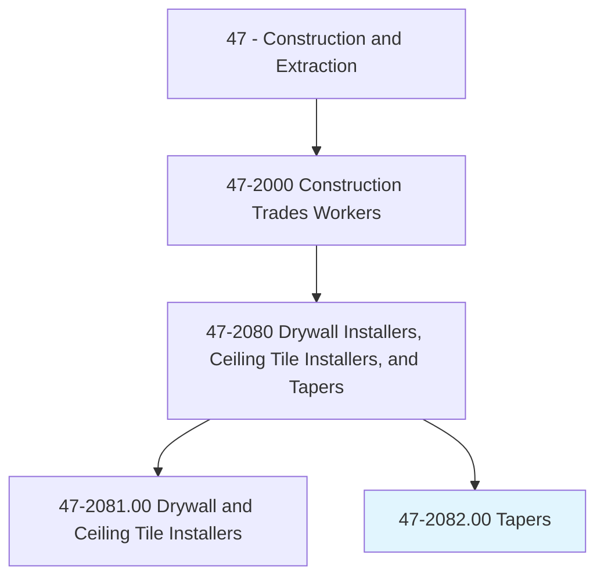
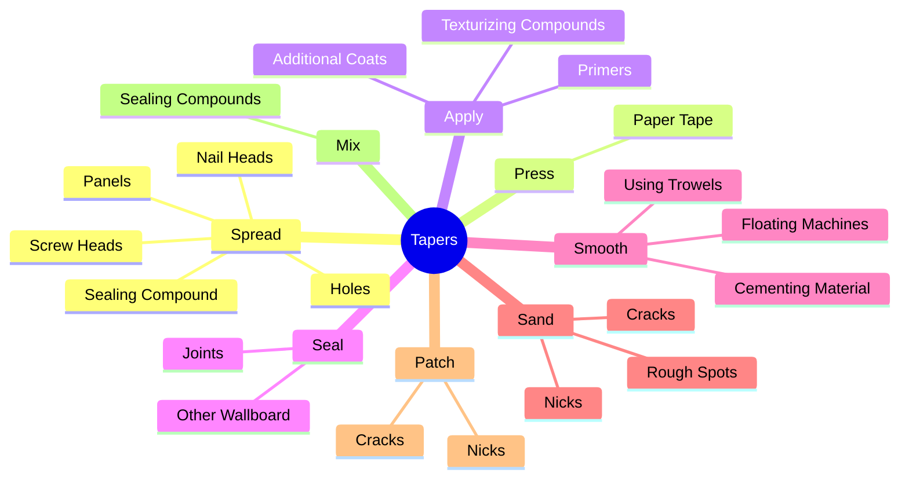
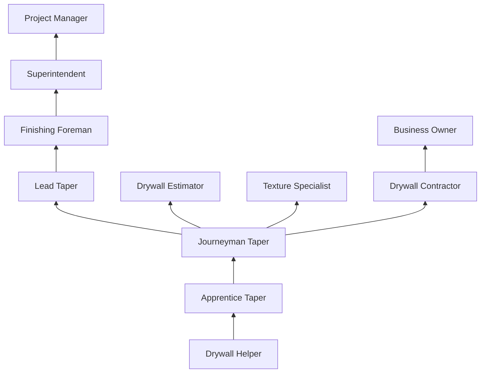
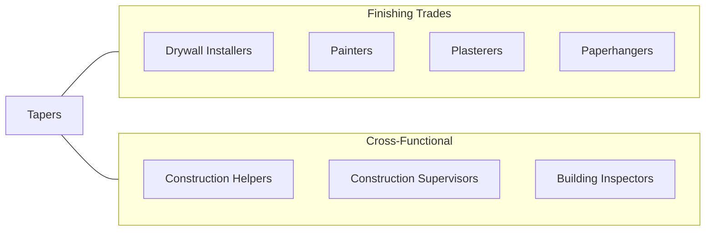

# Tapers

> Seal joints between plasterboard or other wallboard to prepare wall surface for painting or papering.

## Overview

Tapers are specialized finishing trade workers who prepare drywall surfaces for final decoration by sealing joints, covering fastener heads, and creating smooth, seamless wall and ceiling surfaces. This trade sits at a critical point in the construction sequence: after drywall installers hang the boards and before painters apply the final finish. The quality of a taper's work directly determines the visual appearance of every interior wall and ceiling in a building.

The work requires patience, precision, and a developed eye for surface imperfections. Tapers apply joint compound (commonly called "mud") in multiple coats, embedding paper or fiberglass tape over seams, then sanding the dried compound to achieve a flawless surface. Different levels of finish (Levels 0-5 per ASTM standards) are specified depending on the final wall treatment, with the highest levels requiring exceptional skill to produce surfaces suitable for gloss paint or critical lighting conditions.

Tapers work primarily indoors, which provides shelter from weather but exposes them to drywall dust and compounds. The work involves extensive overhead reaching for ceiling work, repetitive arm motions, and time spent on stilts or scaffolds. Despite automation attempts, hand-finishing remains the industry standard for quality interior work.

## Classification Hierarchy

## Key Statistics

| Metric | Value |
|--------|-------|
| SOC Code | 47-2082.00 |
| Job Zone | 3 (Medium Preparation) |
| Category | [Construction and Extraction](/occupations/Construction/index) |
| Task Count | 62 |
| Median Salary | $48,700 / year |
| Employment | ~16,000 |
| Job Outlook | 1% (Little or no change) |
| Physical Demands | Medium to Heavy |
| Source | O*NET |

## Core Tasks

### spread.SealingCompound

Tapers spread sealing compound over joints, fastener heads, and imperfections to create uniform surfaces.

**Actions:**
- `spread.SealingCompound.between.BoardsOverCracks`
- `spread.Panels.over.Cracks`
- `spread.Holes`
- `spread.NailHeads`

### press.PaperTape

Tapers press paper or fiberglass tape into wet compound to reinforce joints and prevent cracking.

**Actions:**
- `press.PaperTape.over.Joints.to.embed.TapeIntoSealingCompoundSealJoints`
- `press.PaperTape.over.JointsToToSealJoints`

### apply.AdditionalCoats

Tapers apply multiple coats of compound, feathering each coat wider to create invisible seams.

**Actions:**
- `apply.AdditionalCoats.to.fill.InHoles`
- `apply.AdditionalCoats.to.make.SurfacesSmooth`
- `apply.TexturizingCompounds.to.Walls`
- `apply.TexturizingCompounds.to.CeilingsBeforeFinalFinishing`

## Skills & Competencies

### Technical Skills
- **Joint Compound Application** - Expert
- **Tape Embedding Techniques** - Expert
- **Surface Finishing (Levels 1-5)** - Expert
- **Sanding and Surface Preparation** - Expert
- **Texture Application** - Advanced
- **Corner Bead Installation** - Advanced
- **Blueprint Reading** - Intermediate
- **Drywall Patch and Repair** - Expert

### Trade-Specific Skills
- **Feathering Techniques** - Blending compound edges invisibly
- **Stilt Walking** - Working on drywall stilts for ceiling work
- **Automatic Taping Tools** - Bazookas, flat boxes, corner rollers
- **Level 5 Finishing** - Premium skim-coat finishing
- **Texture Matching** - Matching existing textures for repairs

### Soft Skills
- **Attention to Detail** - Critical
- **Patience** - Critical
- **Physical Stamina** - Essential
- **Hand-Eye Coordination** - Critical
- **Time Management** - Essential

## Education & Certifications

| Requirement | Details |
|-------------|---------|
| Typical Education | High school diploma or equivalent |
| Apprenticeship | 2-4 year apprenticeship (IUPAT, Carpenters Union) |
| On-the-Job Training | 3,000-6,000 hours |
| Classroom Training | 144+ hours/year during apprenticeship |

### Certifications
- **OSHA 10-Hour Construction** - Required safety certification
- **OSHA 30-Hour Construction** - Supervisory safety certification
- **Scaffold User Certification** - For elevated work platforms
- **IUPAT Journeyman Card** - Union trade credential
- **Lead-Safe Renovator (EPA RRP)** - Required for pre-1978 building work

## Career Progression

## Specializations

### Residential Finishing
- Single-family homes and townhouses
- Level 4 standard finish
- Production-pace work
- Small crew operations

### Commercial Finishing
- Office buildings, hospitals, schools
- Level 4-5 finish requirements
- Large crew coordination
- Strict schedule adherence

### Industrial and Institutional
- Clean rooms and laboratories
- Fire-rated assemblies
- Acoustic ceiling integration
- Specialty partition systems

### Specialty Textures
- Knockdown, orange peel, skip trowel
- Venetian plaster
- Custom decorative finishes
- Texture matching for repairs

## Tools & Equipment

### Hand Tools
- Taping knives (4", 6", 8", 10", 12")
- Corner trowels (inside and outside)
- Mud pans and hawks
- Sanding poles and blocks
- Utility knives
- Banjo tape dispensers

### Automatic Tools
- Automatic taper (bazooka)
- Flat finishing boxes (7", 10", 12")
- Corner applicators and rollers
- Compound pumps
- Power sanders (dustless)

### Equipment
- Drywall stilts
- Baker scaffolds
- Dust containment systems
- Lighting (work lights for finish inspection)

## Safety Considerations

- **Dust Inhalation** - Respiratory protection required during sanding; dustless sanding systems preferred
- **Repetitive Motion Injuries** - Shoulder, wrist, and elbow strain from overhead and repetitive finishing
- **Stilt Safety** - Fall risk when working on stilts; proper training required
- **Eye Protection** - Compound and dust exposure
- **Skin Irritation** - Joint compound can cause dermatitis; gloves recommended
- **Scaffold Safety** - Fall protection for elevated work
- **Chemical Exposure** - Primers, sealers, and texture compounds require ventilation

## Related Occupations

## Industries

- [Residential Building Construction](/industries/ResidentialConstruction) - High Employment
- [Commercial Building Construction](/industries/CommercialConstruction) - High Employment
- [Drywall and Insulation Contractors](/industries/SpecialtyTrade) - Primary Employment
- [Building Finishing Contractors](/industries/FinishingContractors) - High Employment

## Departments

This occupation typically works in:
- [Field Operations](/departments/FieldOperations)
- [Interior Finishing Division](/departments/InteriorFinishing)
- [Drywall Division](/departments/Drywall)
- [Estimating](/departments/Estimating)

---

*Source: O*NET 47-2082.00 - ONETOccupation*
