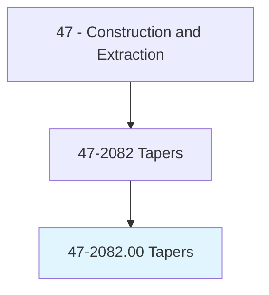
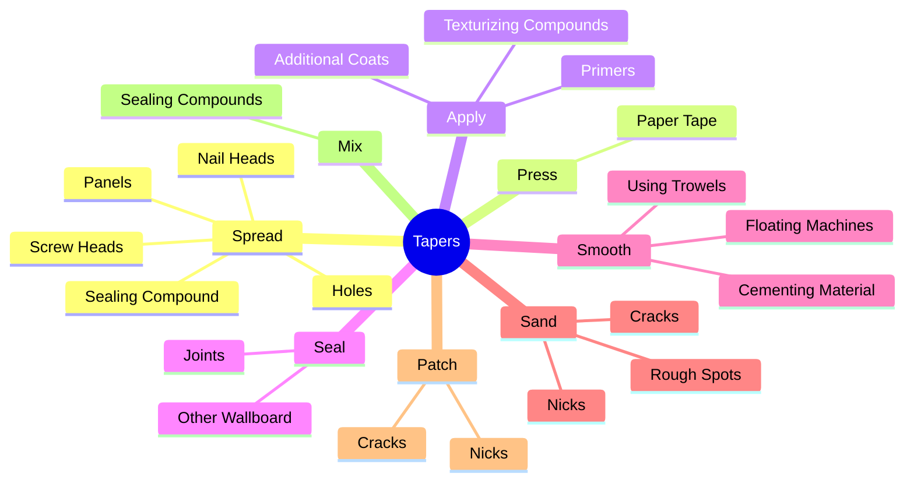
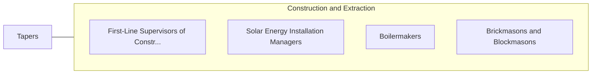

# Tapers

> Seal joints between plasterboard or other wallboard to prepare wall surface for painting or papering.

## Overview

Tapers is classified under Construction and Extraction (SOC 47). Seal joints between plasterboard or other wallboard to prepare wall surface for painting or papering.

## Classification Hierarchy

## Key Statistics

| Metric | Value |
|--------|-------|
| SOC Code | 47-2082.00 |
| Category | [Construction and Extraction](/occupations/Construction/index) |
| Task Count | 62 |
| Source | O*NET |

## Core Tasks

### spread.SealingCompound

Tapers spread sealing compound as part of their core responsibilities.

**Actions:**
- `spread.SealingCompound.between.BoardsOverCracks`
- `spread.Panels.over.Cracks`
- `spread.Holes`
- `spread.NailHeads`

### press.PaperTape

Tapers press paper tape as part of their core responsibilities.

**Actions:**
- `press.PaperTape.over.Joints.to.embed.TapeIntoSealingCompoundSealJoints`
- `press.PaperTape.over.JointsToToSealJoints`

### apply.AdditionalCoats

Tapers apply additional coats as part of their core responsibilities.

**Actions:**
- `apply.AdditionalCoats.to.fill.InHoles`
- `apply.AdditionalCoats.to.make.SurfacesSmooth`
- `apply.TexturizingCompounds.to.Walls`
- `apply.TexturizingCompounds.to.CeilingsBeforeFinalFinishing`

## Skills & Competencies

### Technical Skills
- **Construction Methods** - Advanced
- **Blueprint Reading** - Advanced
- **Safety Compliance** - Advanced

### Soft Skills
- **Communication** - Essential
- **Problem Solving** - Essential
- **Critical Thinking** - Important
- **Teamwork** - Important
- **Adaptability** - Important

## Related Occupations

## Industries

This occupation is found across multiple industries. See [Industries](/industries) for sector-specific employment data.

## Career Progression

---

*Source: O*NET 47-2082.00 - ONETOccupation*
