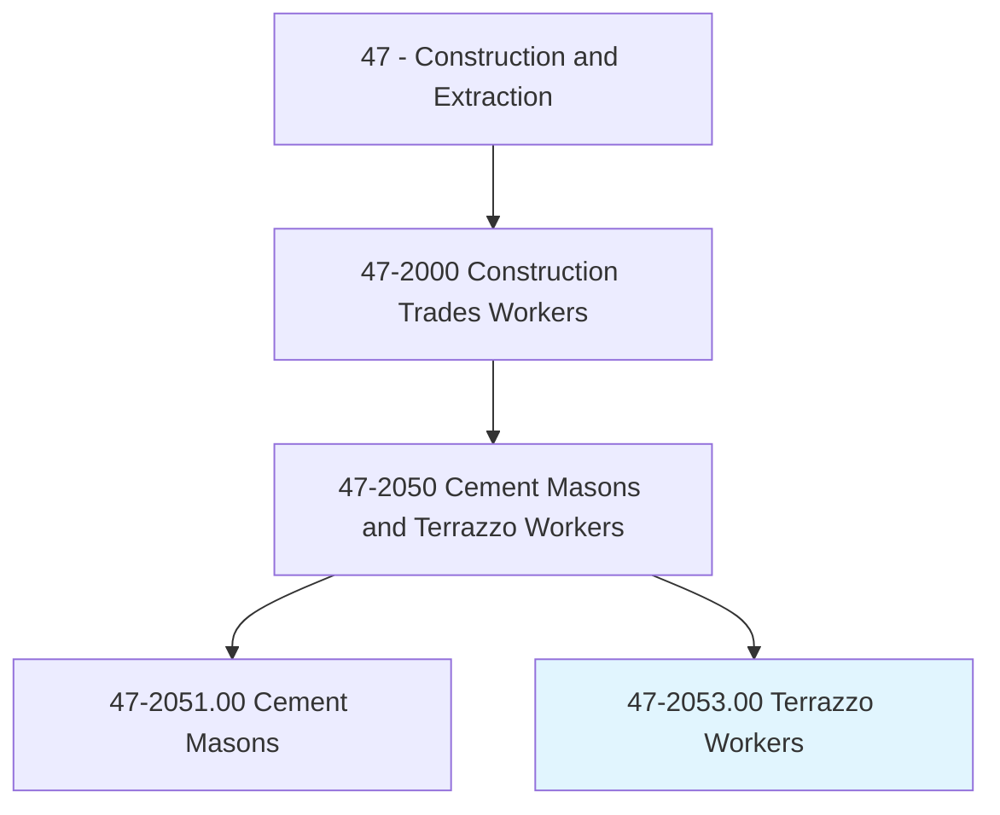
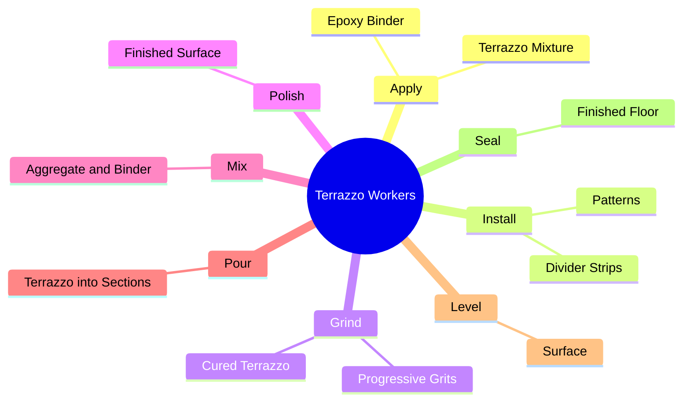
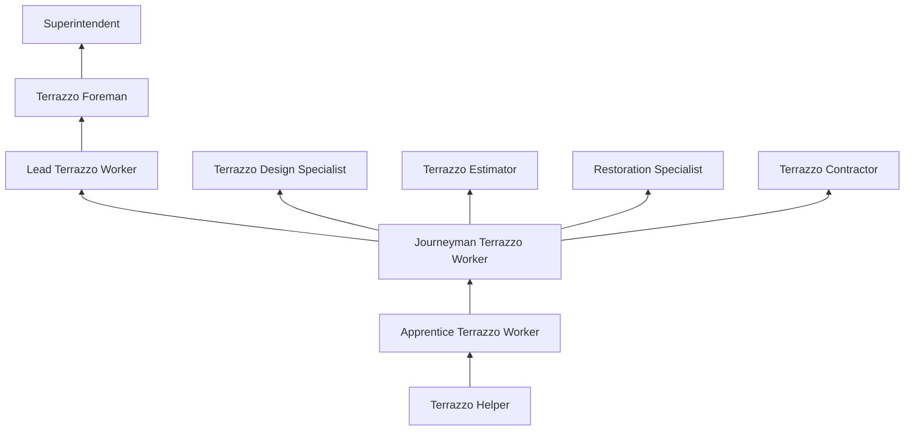

# Terrazzo Workers and Finishers

> Apply a mixture of cement, sand, pigment, or marble chips to floors, stairways, and cabinet fixtures to fashion durable and decorative surfaces.

## Overview

Terrazzo Workers and Finishers create durable, decorative flooring by applying a mixture of marble, granite, quartz, or glass chips set in a cementitious or epoxy binder matrix, then grinding and polishing the surface to reveal the aggregate pattern. Terrazzo is among the most durable and versatile flooring systems available, with properly maintained installations lasting 75+ years. The material appears in airports, hospitals, schools, government buildings, and commercial spaces where durability and design flexibility are paramount.

The trade requires both construction skill and artistic sensibility. Workers install divider strips (zinc, brass, or plastic) to create patterns and color separations, pour and spread the terrazzo mixture into defined sections, and grind the cured surface through progressively finer abrasives to achieve a smooth, polished finish. Modern terrazzo includes both traditional sand-cushion (thick-bed) and thin-set epoxy systems, each with distinct installation requirements and performance characteristics.

Epoxy terrazzo has expanded the design possibilities, allowing thinner installations, faster curing, unlimited color options, and enhanced chemical resistance. Terrazzo workers now create intricate floor logos, wayfinding systems, and artistic designs using CNC-cut divider strips and precisely color-matched aggregates. The trade, while small in number, produces some of the most striking and long-lasting floors in construction.

## Classification Hierarchy

## Key Statistics

| Metric | Value |
|--------|-------|
| SOC Code | 47-2053.00 |
| Job Zone | 3 (Medium Preparation) |
| Category | [Construction and Extraction](/occupations/Construction/index) |
| Task Count | 72 |
| Median Salary | $48,100 / year |
| Employment | ~5,000 |
| Job Outlook | 2% (Slower than average) |
| Physical Demands | Heavy |
| Source | O*NET |

## Core Tasks

### apply.TerrazzoMixture

Workers pour and spread terrazzo mixture into prepared sections.

**Actions:**
- `apply.TerrazzoMixture.to.FloorSections`
- `install.DividerStrips.for.PatternDefinition`
- `grind.CuredTerrazzo.to.SmoothFinish`

## Skills & Competencies

### Technical Skills
- **Terrazzo Installation (Cementitious and Epoxy)** - Expert
- **Grinding and Polishing** - Expert
- **Divider Strip Installation** - Expert
- **Color Mixing and Matching** - Advanced
- **Subfloor Preparation** - Advanced
- **Blueprint Reading** - Advanced
- **Mathematics** - Advanced

### Soft Skills
- **Artistic Sensibility** - Critical
- **Attention to Detail** - Critical
- **Physical Stamina** - Critical
- **Patience** - Critical
- **Craftsmanship** - Critical

## Education & Certifications

| Requirement | Details |
|-------------|---------|
| Typical Education | High school diploma or equivalent |
| Apprenticeship | 3-4 year program (OPCMIA) |
| On-the-Job Training | 4,000-6,000 hours |

### Certifications
- **OSHA 10/30-Hour Construction** - Safety certification
- **OPCMIA Journeyman Card** - Union credential
- **NTMA Certification** - National Terrazzo & Mosaic Association
- **First Aid/CPR** - Required

## Career Progression

## Specializations

- **Epoxy Terrazzo** - Thin-set resinous systems
- **Cementitious Terrazzo** - Traditional sand-cushion systems
- **Precast Terrazzo** - Factory-made terrazzo elements
- **Terrazzo Restoration** - Historic floor restoration and repair
- **Rustic Terrazzo** - Exposed aggregate with minimal grinding

## Tools & Equipment

- Terrazzo grinders (multi-head planetary)
- Diamond grinding stones (progressive grits)
- Polishing pads
- Mixing equipment
- Divider strip benders and cutters
- Trowels and floats
- Sealers and densifiers
- PPE (knee pads, respirator, hearing protection)

## Safety Considerations

- **Silica Dust** - Grinding operations; wet grinding and respiratory protection
- **Noise** - Grinding equipment; hearing protection
- **Chemical Exposure** - Epoxy and resin systems; ventilation and skin protection
- **Knee Injuries** - Floor-level work; knee pads required
- **Vibration** - Grinding equipment; hand-arm vibration
- **Slip Hazards** - Wet grinding operations

## Related Occupations

## Industries

- Terrazzo Contractors - Primary Employment
- Commercial Construction - High Employment
- Institutional Construction - Moderate Employment

## Departments

- Terrazzo Division
- Field Operations
- Estimating

---

*Source: O*NET 47-2053.00 - ONETOccupation*
