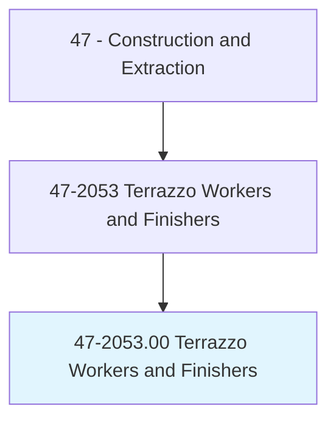
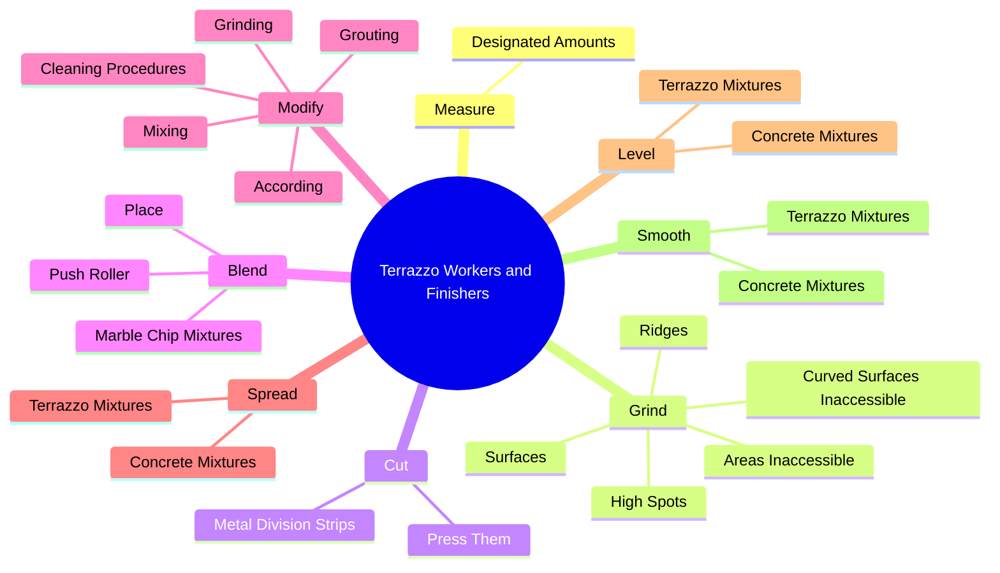
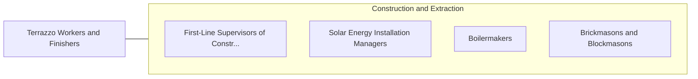

# Terrazzo Workers and Finishers

> Apply a mixture of cement, sand, pigment, or marble chips to floors, stairways, and cabinet fixtures to fashion durable and decorative surfaces.

## Overview

Terrazzo Workers and Finishers is classified under Construction and Extraction (SOC 47). Apply a mixture of cement, sand, pigment, or marble chips to floors, stairways, and cabinet fixtures to fashion durable and decorative surfaces.

## Classification Hierarchy

## Key Statistics

| Metric | Value |
|--------|-------|
| SOC Code | 47-2053.00 |
| Category | [Construction and Extraction](/occupations/Construction) |
| Task Count | 182 |
| Source | O*NET |

## Core Tasks

### measure.DesignatedAmounts

Terrazzo Workers and Finishers measure designated amounts as part of their core responsibilities.

**Actions:**
- `measure.DesignatedAmounts.of.Ingredients.for.Terrazzo`
- `measure.DesignatedAmounts.of.Grout`
- `measure.DesignatedAmounts.of.AccordingToStandardFormulas`
- `measure.DesignatedAmounts.of.Specifications`

### grind.Surfaces

Terrazzo Workers and Finishers grind surfaces as part of their core responsibilities.

**Actions:**
- `grind.Surfaces.with.PowerGrinder`
- `grind.Surfaces.with.PolishSurfaces.with.Polishing`
- `grind.Surfaces.with.SurfacingMachines`
- `grind.CurvedSurfacesInaccessible.to.SurfacingMachine`

### cut.MetalDivisionStrips

Terrazzo Workers and Finishers cut metal division strips as part of their core responsibilities.

**Actions:**
- `cut.MetalDivisionStrips.for.Joints`
- `cut.MetalDivisionStrips.for.ChangesOfColor.to.form.DesignsToHelpPreventCracks`
- `cut.MetalDivisionStrips.for.Patterns.to.help.PreventCracks`
- `cut.PressThem.into.TerrazzoBase.for.Joints`

## Skills & Competencies

### Technical Skills
- **Construction Methods** - Advanced
- **Blueprint Reading** - Advanced
- **Safety Compliance** - Advanced

### Soft Skills
- **Communication** - Essential
- **Problem Solving** - Essential
- **Critical Thinking** - Important
- **Teamwork** - Important
- **Adaptability** - Important

## Related Occupations

## Industries

This occupation is found across multiple industries. See [Industries](/industries) for sector-specific employment data.

## Career Progression

---

*Source: O*NET 47-2053.00 - ONETOccupation*
