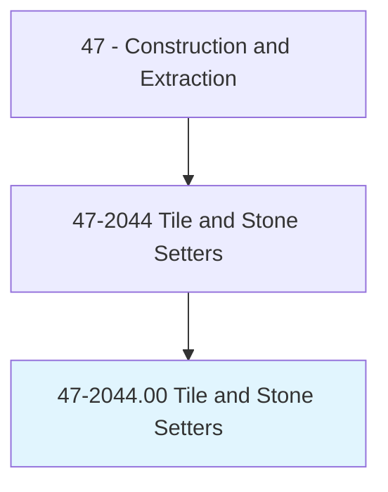
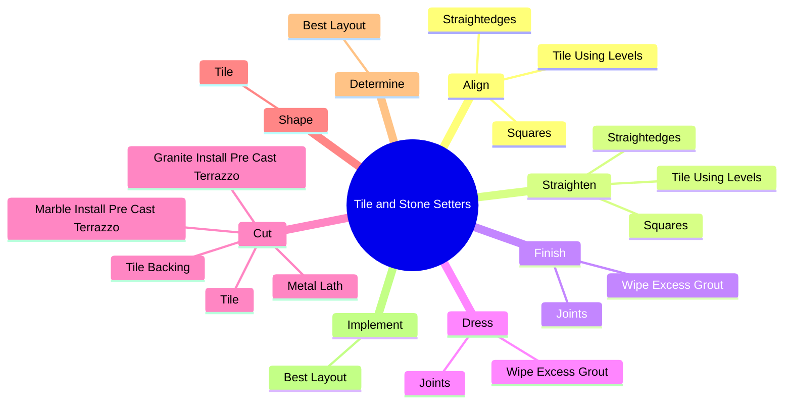
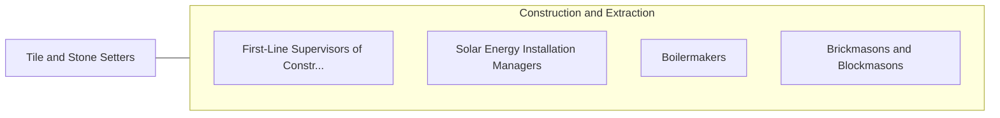

# Tile and Stone Setters

> Apply hard tile, stone, and comparable materials to walls, floors, ceilings, countertops, and roof decks.

## Overview

Tile and Stone Setters is classified under Construction and Extraction (SOC 47). Apply hard tile, stone, and comparable materials to walls, floors, ceilings, countertops, and roof decks.

## Classification Hierarchy

## Key Statistics

| Metric | Value |
|--------|-------|
| SOC Code | 47-2044.00 |
| Category | [Construction and Extraction](/occupations/Construction) |
| Task Count | 214 |
| Source | O*NET |

## Core Tasks

### align.TileUsingLevels

Tile and Stone Setters align tile using levels as part of their core responsibilities.

**Actions:**
- `align.TileUsingLevels`
- `align.Squares`
- `align.Straightedges`

### straighten.TileUsingLevels

Tile and Stone Setters straighten tile using levels as part of their core responsibilities.

**Actions:**
- `straighten.TileUsingLevels`
- `straighten.Squares`
- `straighten.Straightedges`

### finish.Joints

Tile and Stone Setters finish joints as part of their core responsibilities.

**Actions:**
- `finish.Joints.from.BetweenTiles`
- `finish.Joints.from.UsingDampSponge`
- `finish.WipeExcessGrout.from.BetweenTiles`
- `finish.WipeExcessGrout.from.UsingDampSponge`

## Skills & Competencies

### Technical Skills
- **Construction Methods** - Advanced
- **Blueprint Reading** - Advanced
- **Safety Compliance** - Advanced

### Soft Skills
- **Communication** - Essential
- **Problem Solving** - Essential
- **Critical Thinking** - Important
- **Teamwork** - Important
- **Adaptability** - Important

## Related Occupations

## Industries

This occupation is found across multiple industries. See [Industries](/industries) for sector-specific employment data.

## Career Progression

---

*Source: O*NET 47-2044.00 - ONETOccupation*
