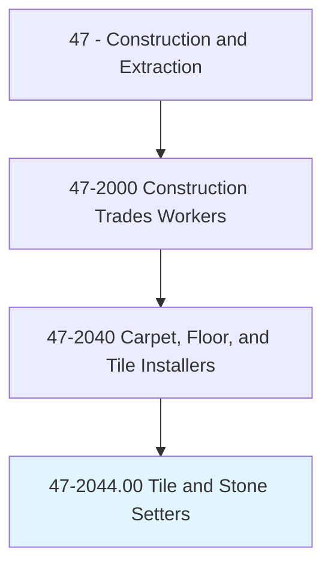
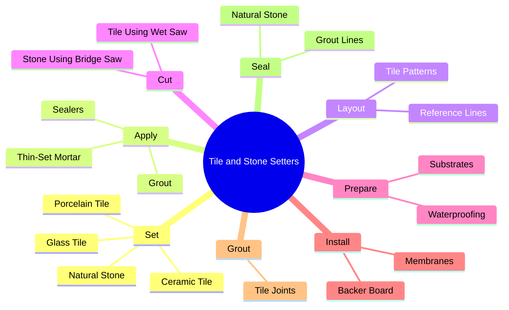
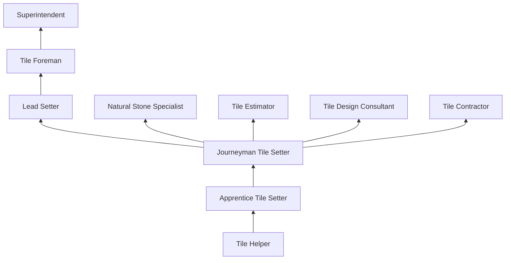
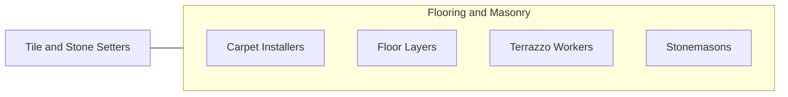

# Tile and Stone Setters

> Apply hard tile, stone, and comparable materials to walls, floors, ceilings, countertops, and roof decks.

## Overview

Tile and Stone Setters install ceramic, porcelain, natural stone, glass, and mosaic tile on floors, walls, countertops, showers, fireplaces, and exterior surfaces. The trade requires precision layout skills, knowledge of substrate preparation, thin-set mortar application, and grouting techniques to create durable, waterproof, and aesthetically pleasing tiled surfaces. Tile work is among the most visible finish trades, as the quality of installation directly impacts the beauty and functionality of kitchens, bathrooms, and commercial spaces.

Modern tile installation has become increasingly technical with the introduction of large-format porcelain panels (up to 10-foot slabs), heated floor systems, waterproof membrane integration, and structural movement joint design. Setters must understand substrate preparation including cement board, uncoupling membranes (Schluter DITRA), and waterproofing systems. They work with a wide range of setting materials including thin-set mortar, medium-bed mortar, and epoxy adhesives, each suited to specific applications.

The trade serves both residential and commercial markets. Residential work includes bathroom remodels, kitchen backsplashes, and flooring installations, while commercial work encompasses hospitals, restaurants, pools, and building lobbies. Natural stone installation (marble, granite, travertine, slate) requires additional skills in handling, cutting, and setting expensive materials where errors can be costly.

## Classification Hierarchy

## Key Statistics

| Metric | Value |
|--------|-------|
| SOC Code | 47-2044.00 |
| Job Zone | 3 (Medium Preparation) |
| Category | [Construction and Extraction](/occupations/Construction/index) |
| Task Count | 95 |
| Median Salary | $48,300 / year |
| Employment | ~60,000 |
| Job Outlook | 2% (Slower than average) |
| Physical Demands | Heavy |
| Source | O*NET |

## Core Tasks

### set.CeramicTile

Tile setters install tile using proper techniques for each application.

**Actions:**
- `set.CeramicTile.using.ThinSetMortar`
- `set.NaturalStone.using.MediumBedMortar`
- `set.GlassTile.using.WhiteThinSet`

## Skills & Competencies

### Technical Skills
- **Tile Setting** - Expert
- **Layout and Pattern Design** - Expert
- **Waterproofing Systems** - Expert
- **Substrate Preparation** - Expert
- **Wet Saw and Tile Cutting** - Expert
- **Grouting and Sealing** - Expert
- **Blueprint Reading** - Advanced
- **Mathematics** - Advanced

### Trade-Specific Skills
- **Large-Format Tile** - Handling and setting 24"+ tiles
- **Shower and Wet Area Waterproofing** - Kerdi, RedGard, Laticrete
- **Natural Stone** - Marble, granite, travertine installation
- **Mosaic Installation** - Sheet-mounted and hand-set
- **Heated Floor Integration** - Electric mat and cable systems

### Soft Skills
- **Attention to Detail** - Critical
- **Artistic Sensibility** - Essential
- **Physical Stamina** - Critical
- **Customer Service** - Essential (residential)
- **Patience** - Critical

## Education & Certifications

| Requirement | Details |
|-------------|---------|
| Typical Education | High school diploma or equivalent |
| Apprenticeship | 3-4 year program (BAC/IUBAC) |
| On-the-Job Training | 4,000-6,000 hours |

### Certifications
- **CTEF Certified Tile Installer** - Ceramic Tile Education Foundation
- **OSHA 10-Hour Construction** - Safety certification
- **TCNA Handbook Knowledge** - Tile Council of North America standards
- **Manufacturer Certifications** - Schluter, Laticrete, MAPEI training
- **ACT Certified Installer** - Advanced Certifications for Tile

## Career Progression

## Specializations

- **Residential Tile** - Bathrooms, kitchens, floors
- **Commercial Tile** - Large-scale floor and wall installations
- **Natural Stone** - Marble, granite, travertine
- **Pool and Fountain** - Underwater tile installation
- **Mosaic and Decorative** - Artistic tile installations

## Tools & Equipment

- Wet tile saws (rail and bridge)
- Tile cutters (manual snap)
- Trowels (square-notch, U-notch)
- Tile leveling systems (clips and wedges)
- Grout floats and sponges
- Mixing drills and paddles
- Levels and laser levels
- PPE (knee pads, safety glasses, gloves)

## Safety Considerations

- **Knee Injuries** - Prolonged kneeling; gel knee pads required
- **Silica Dust** - Cutting tile and stone; wet cutting mandatory
- **Sharp Edges** - Cut tile; cut-resistant gloves
- **Chemical Exposure** - Thin-set, grout, sealers; skin protection
- **Heavy Lifting** - Stone slabs; mechanical aids for large pieces
- **Electrical** - Wet saw operation near water; GFCI protection

## Related Occupations

## Industries

- Tile and Stone Contractors - Primary Employment
- Residential Construction - High Employment
- Commercial Construction - High Employment

## Departments

- Tile Division
- Field Operations
- Estimating

---

*Source: O*NET 47-2044.00 - ONETOccupation*
