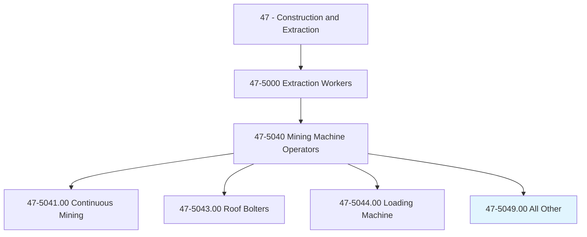
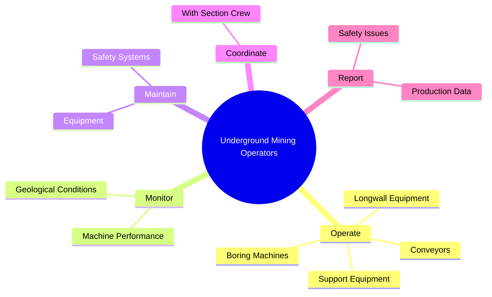
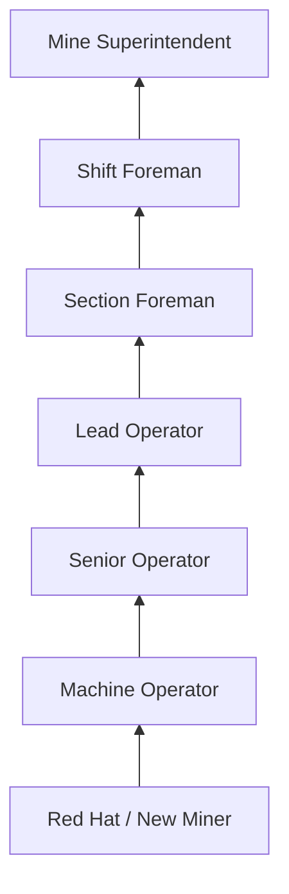
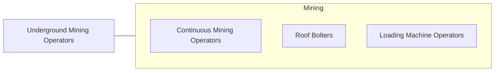

# Underground Mining Machine Operators, All Other

> All underground mining machine operators not listed separately.

## Overview

Underground Mining Machine Operators, All Other encompasses operators of specialized underground mining equipment not classified in other specific categories. This includes operators of longwall mining equipment (shearer operators, shield operators, stage loader operators), boring machines, underground conveyor systems, and other specialized extraction and support machinery. These workers perform essential roles in underground mining operations that do not fit neatly into the continuous miner, roof bolter, or loading machine classifications.

Workers in this category operate in the challenging underground environment: confined spaces with limited headroom, continuous exposure to dust, noise, and humidity, limited natural light, and the ever-present risks of roof collapse, gas accumulation, and equipment malfunction. Modern underground mines employ increasingly automated systems, but skilled operators remain essential for managing equipment in the variable geological conditions encountered underground.

The occupation is concentrated in coal, metal ore, and nonmetallic mineral mining operations. Employment has declined with the shift from underground to surface mining and the overall reduction in coal production, but specialized underground operations for metals, salt, potash, and other minerals continue to require skilled machine operators.

## Classification Hierarchy

## Key Statistics

| Metric | Value |
|--------|-------|
| SOC Code | 47-5049.00 |
| Job Zone | 2 (Some Preparation) |
| Category | [Construction and Extraction](/occupations/Construction/index) |
| Task Count | Variable |
| Median Salary | $50,400 / year |
| Employment | ~4,000 |
| Job Outlook | -10% (Decline) |
| Physical Demands | Heavy |
| Source | O*NET |

## Core Tasks

### operate.SpecializedMiningEquipment

Operators run various specialized underground mining machines.

**Actions:**
- `operate.LongwallEquipment.for.CoalExtraction`
- `operate.BoringMachines.for.TunnelDevelopment`
- `operate.ConveyorSystems.for.MaterialTransport`

## Skills & Competencies

### Technical Skills
- **Specialized Mining Equipment** - Expert
- **Underground Navigation** - Advanced
- **Equipment Maintenance** - Advanced
- **Safety Systems** - Expert
- **Communication Systems** - Intermediate

### Soft Skills
- **Safety Consciousness** - Critical
- **Situational Awareness** - Critical
- **Physical Stamina** - Critical
- **Reliability** - Critical
- **Teamwork** - Essential

## Education & Certifications

| Requirement | Details |
|-------------|---------|
| Typical Education | High school diploma or equivalent |
| MSHA Training | 40-hour new miner + annual refresher |
| Equipment Training | Company-provided |

### Certifications
- **MSHA New Miner Training (Part 48)** - Mandatory
- **MSHA Annual Refresher** - 8-hour requirement
- **State Mining License** - Where required
- **Equipment-Specific Certification** - Company-provided
- **First Aid/CPR** - Required

## Career Progression

## Safety Considerations

- **Roof Falls** - Underground collapse risk; ground control measures
- **Methane and Gas** - Explosive atmosphere; continuous monitoring
- **Equipment Entanglement** - Moving machinery parts
- **Noise and Dust** - Continuous exposure; PPE mandatory
- **Confined Space** - Limited headroom and escape routes
- **Electrical Hazards** - High-voltage equipment underground

## Related Occupations

## Industries

- [Coal Mining](/industries/CoalMining) - Primary Employment
- [Metal Ore Mining](/industries/MetalMining) - Moderate Employment
- [Nonmetallic Mineral Mining](/industries/MineralMining) - Moderate Employment

## Departments

- [Underground Operations](/departments/UndergroundOps)
- [Production](/departments/Production)
- [Safety](/departments/Safety)

---

*Source: O*NET 47-5049.00 - ONETOccupation*
