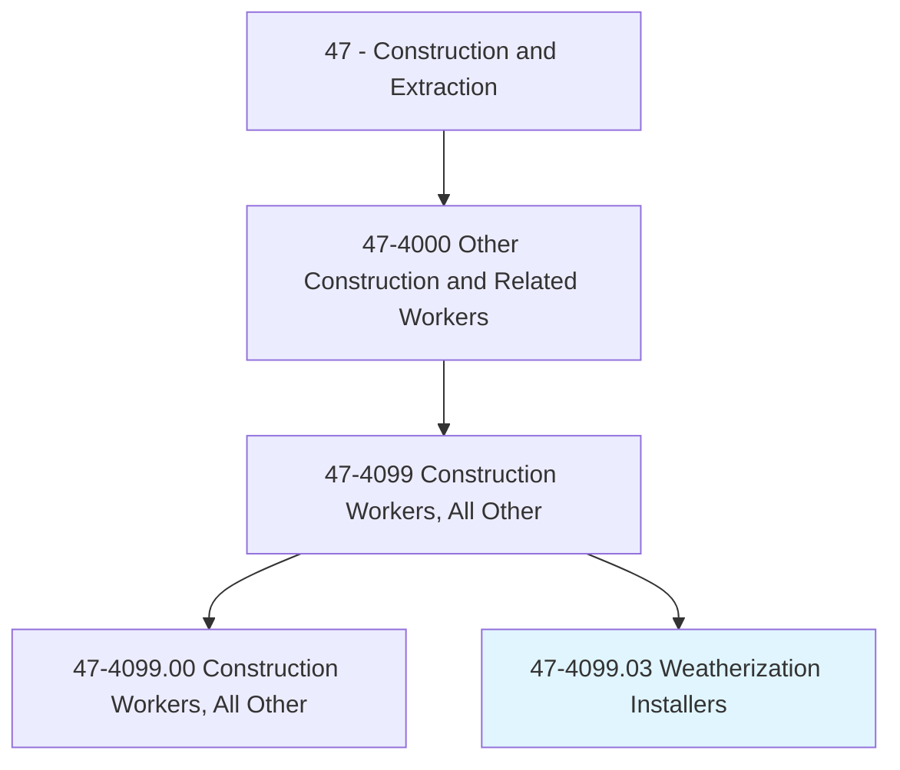
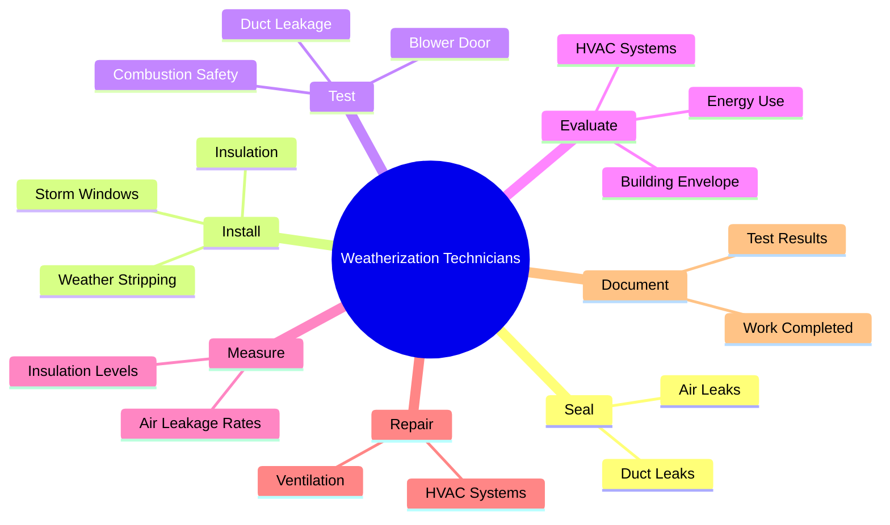
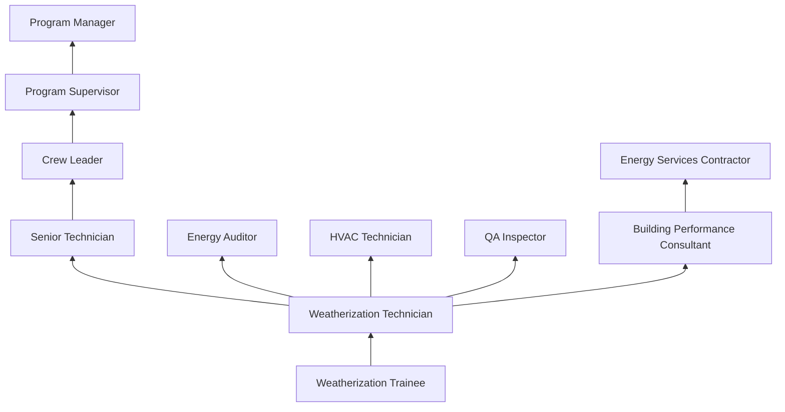
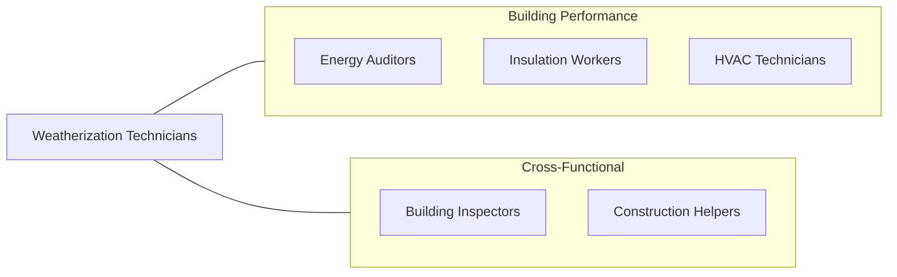

# Weatherization Installers and Technicians

> Perform weatherization of buildings to reduce energy consumption. Install, maintain, or repair insulation, air sealing, HVAC, and other energy-efficiency measures in buildings.

## Overview

Weatherization Installers and Technicians perform energy efficiency upgrades on existing buildings to reduce energy consumption, lower utility costs, and improve indoor comfort and air quality. The work typically involves air sealing, insulation installation, HVAC system optimization, duct sealing, and window/door weatherstripping. These technicians serve a critical role in national energy policy, as the federal Weatherization Assistance Program (WAP) and utility-funded programs provide services to low-income households and broader energy efficiency initiatives.

The trade combines building science knowledge with hands-on installation skills. Technicians use blower door testing to identify and quantify air leakage, infrared cameras to locate insulation gaps, and combustion analyzers to ensure heating equipment safety. They perform a systematic evaluation of the building envelope and mechanical systems, then implement prioritized improvements based on energy savings potential and cost-effectiveness. The work requires understanding the complex interactions between air sealing, insulation, ventilation, and moisture management.

Weatherization is both an environmental and social equity occupation. Programs target low-income households that spend a disproportionate share of income on energy, and weatherization improvements reduce energy burden while improving health and safety conditions. The field has expanded beyond traditional weatherization to include electrification, heat pump installation, and deep energy retrofits as climate policy drives building decarbonization efforts.

## Classification Hierarchy

## Key Statistics

| Metric | Value |
|--------|-------|
| SOC Code | 47-4099.03 |
| Job Zone | 3 (Medium Preparation) |
| Category | [Construction and Extraction](/occupations/Construction/index) |
| Task Count | 88 |
| Median Salary | $44,600 / year |
| Employment | ~12,000 |
| Job Outlook | 8% (Faster than average) |
| Physical Demands | Medium to Heavy |
| Source | O*NET |

## Core Tasks

### seal.AirLeaks

Technicians identify and seal air leakage points throughout the building envelope.

**Actions:**
- `seal.AirLeaks.using.CaulkAndFoam`
- `seal.DuctLeaks.using.MasticAndTape`
- `install.Insulation.in.AtticsAndWalls`

### test.BlowerDoor

Technicians use diagnostic equipment to measure building performance.

**Actions:**
- `test.BlowerDoor.to.measure.AirLeakage`
- `test.DuctLeakage.to.quantify.Losses`
- `test.CombustionSafety.to.ensure.Ventilation`

## Skills & Competencies

### Technical Skills
- **Building Science** - Advanced
- **Air Sealing Techniques** - Expert
- **Insulation Installation** - Expert
- **Blower Door Testing** - Expert
- **Duct Sealing** - Advanced
- **HVAC Basics** - Intermediate
- **Combustion Safety Testing** - Advanced
- **Energy Auditing** - Intermediate

### Trade-Specific Skills
- **Attic Air Sealing** - Bypasses, chases, penetrations
- **Dense Pack Insulation** - Wall cavity retrofit
- **Crawl Space Encapsulation** - Vapor barriers and insulation
- **Ventilation Assessment** - Exhaust fans, fresh air
- **Health and Safety Testing** - CO, gas leaks, mold

### Soft Skills
- **Problem Solving** - Essential
- **Attention to Detail** - Critical
- **Physical Stamina** - Essential
- **Communication** - Essential (client education)
- **Safety Consciousness** - Critical

## Education & Certifications

| Requirement | Details |
|-------------|---------|
| Typical Education | High school diploma or equivalent |
| Specialized Training | Weatherization-specific programs |
| On-the-Job Training | 6-12 months |

### Certifications
- **BPI Building Analyst** - Building Performance Institute
- **BPI Envelope Professional** - Specialty certification
- **BPI Heating Professional** - HVAC specialist
- **EPA RRP Certified (Lead-Safe)** - Pre-1978 buildings
- **OSHA 10-Hour Construction** - Safety certification
- **EPA 608** - Refrigerant handling (if servicing HVAC)
- **First Aid/CPR** - Recommended

## Career Progression

## Specializations

### Residential Weatherization
- Low-income weatherization (WAP)
- Utility-funded programs
- Home performance contracting

### Building Envelope
- Air sealing specialist
- Insulation specialist
- Window and door replacement

### HVAC and Mechanical
- Duct sealing and repair
- Heating system optimization
- Heat pump installation
- Ventilation systems

### Quality Assurance
- Post-installation inspection
- Program quality control
- Training and mentoring

## Tools & Equipment

### Diagnostic Equipment
- Blower door systems (Minneapolis, Retrotec)
- Infrared cameras
- Duct blaster
- Combustion analyzers (CO, draft, efficiency)
- Gas leak detectors
- Moisture meters
- Data loggers

### Installation Tools
- Caulk guns and foam dispensers
- Insulation blowing machines
- Dense pack fill tubes
- Weather stripping tools
- Duct mastic and tape
- Basic hand and power tools

### Safety Equipment
- Respirators (N95, half-face)
- Tyvek suits
- Safety glasses and gloves
- Hard hats (attic work)
- Knee pads

## Safety Considerations

- **Attic Hazards** - Heat stress, confined space, electrical wiring
- **Crawl Space Hazards** - Moisture, insects, limited space
- **Insulation Irritation** - Fiberglass; PPE required
- **Chemical Exposure** - Spray foam, caulk, mastic
- **Combustion Gas Exposure** - CO during furnace testing
- **Asbestos and Lead** - Older buildings; awareness and EPA compliance
- **Electrical Hazards** - Working near wiring in attics and walls
- **Ladder Safety** - Exterior inspections and access

## Related Occupations

## Industries

- [Weatherization Program Agencies](/industries/Government) - Primary Employment
- [Energy Services Companies](/industries/ProfessionalServices) - High Employment
- [Utility Companies](/industries/Utilities) - Moderate Employment
- [Home Performance Contractors](/industries/SpecialtyTrade) - Growing Employment
- [Nonprofit Organizations](/industries/Nonprofit) - Moderate Employment

## Departments

This occupation typically works in:
- [Weatherization Division](/departments/Weatherization)
- [Energy Services](/departments/EnergyServices)
- [Field Operations](/departments/FieldOperations)
- [Quality Assurance](/departments/QualityAssurance)

---

*Source: O*NET 47-4099.03 - ONETOccupation*
