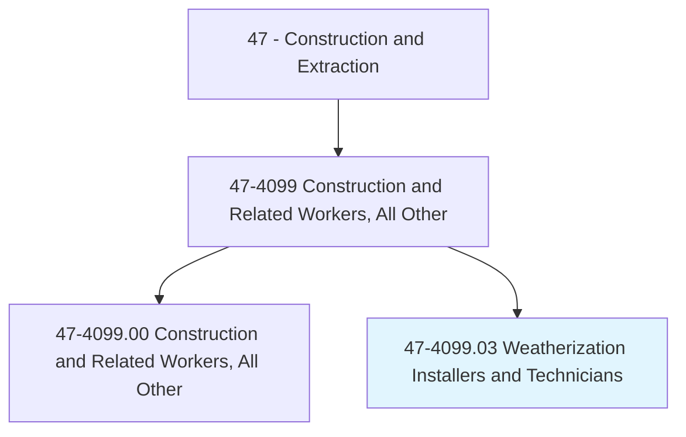
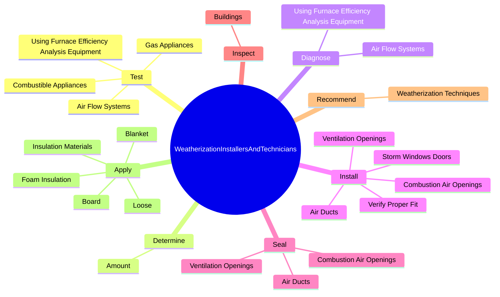
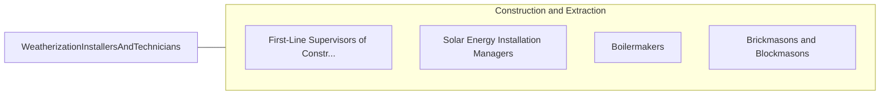

# Weatherization Installers and Technicians

> Perform a variety of activities to weatherize homes and make them more energy efficient. Duties include repairing windows, insulating ducts, and performing heating, ventilating, and air-conditioning (HVAC) work. May perform energy audits and advise clients on energy conservation measures.

## Overview

Weatherization Installers and Technicians is a specialized variant within the Construction and Extraction category. Perform a variety of activities to weatherize homes and make them more energy efficient. Duties include repairing windows, insulating ducts, and performing heating, ventilating, and air-conditioning (HVAC) work.

## Classification Hierarchy

## Key Statistics

| Metric | Value |
|--------|-------|
| SOC Code | 47-4099.03 |
| Category | [Construction and Extraction](/occupations/Construction/index) |
| Task Count | 99 |
| Source | O*NET |

## Core Tasks

### test.CombustibleAppliances

Weatherization Installers and Technicians test combustible appliances as part of their core responsibilities.

**Actions:**
- `test.CombustibleAppliances`
- `test.GasAppliances`
- `test.AirFlowSystems`
- `test.UsingFurnaceEfficiencyAnalysisEquipment`

### determine.Amount

Weatherization Installers and Technicians determine amount as part of their core responsibilities.

**Actions:**
- `determine.Amount.of.AirLeakage.in.Buildings`
- `determine.Amount.of.UsingBlowerDo`
- `determine.Amount.of.Machine`

### diagnose.AirFlowSystems

Weatherization Installers and Technicians diagnose air flow systems as part of their core responsibilities.

**Actions:**
- `diagnose.AirFlowSystems`
- `diagnose.UsingFurnaceEfficiencyAnalysisEquipment`

## Skills & Competencies

### Technical Skills
- **Construction Methods** - Advanced
- **Blueprint Reading** - Advanced
- **Safety Compliance** - Advanced

### Soft Skills
- **Communication** - Essential
- **Problem Solving** - Essential
- **Critical Thinking** - Important
- **Teamwork** - Important
- **Adaptability** - Important

## Related Occupations

## Industries

This occupation is found across multiple industries. See [Industries](/industries) for sector-specific employment data.

## Career Progression

---

*Source: O*NET 47-4099.03 - ONETOccupation*
