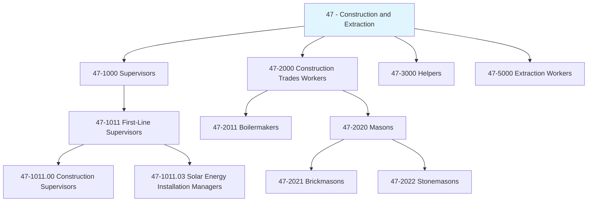
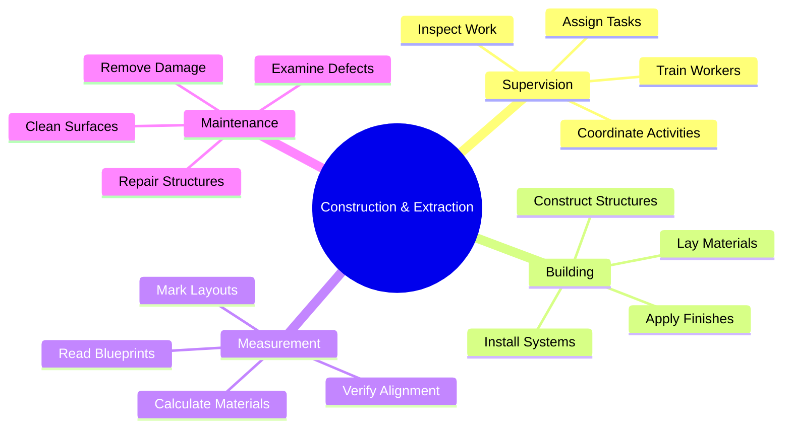
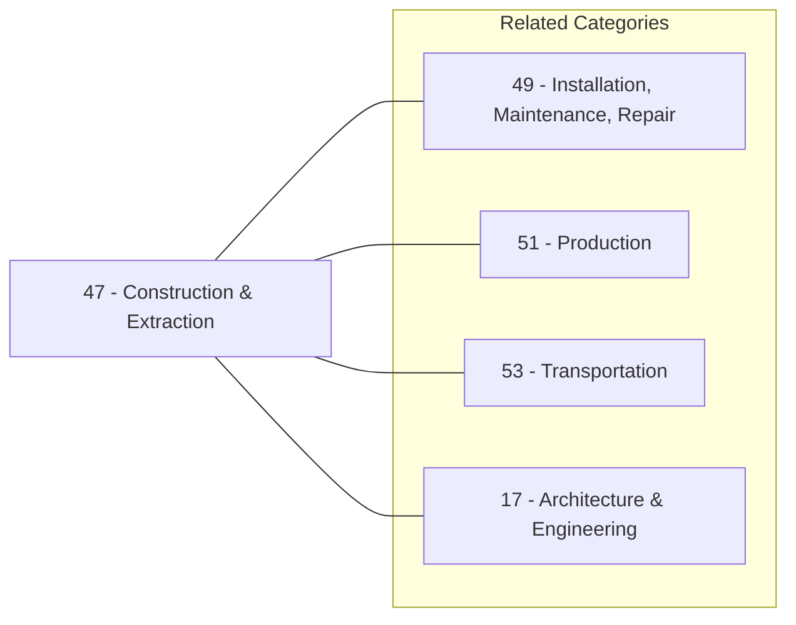
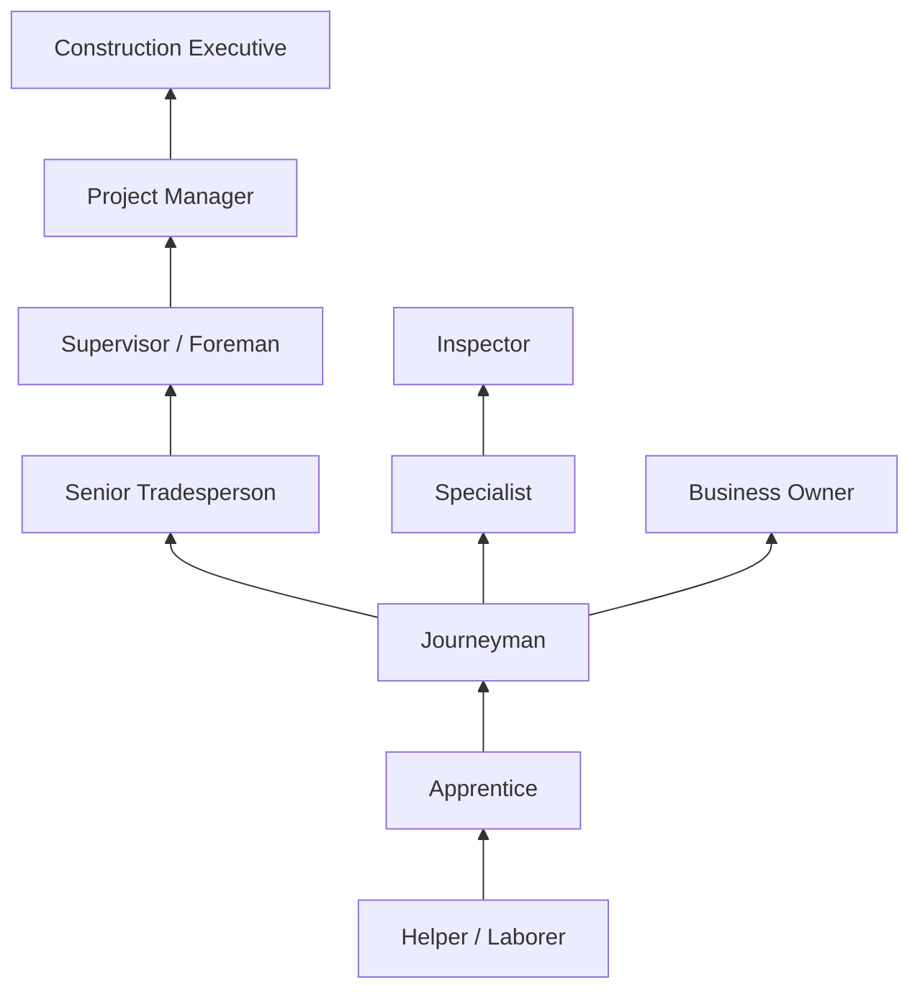

# Construction and Extraction

> Workers who construct, alter, and maintain buildings, highways, roads, and other structures; operate equipment to excavate, load, and move earth and other materials.

## Overview

Construction and Extraction occupations encompass skilled trades that build and maintain the physical infrastructure of society. This category includes workers who construct buildings, bridges, and roads, as well as those who extract natural resources from the earth. These occupations combine physical labor with technical knowledge, requiring expertise in reading blueprints, operating specialized equipment, and applying construction methods that meet safety codes and quality standards.

## Classification Hierarchy

## Key Statistics

| Metric | Value |
|--------|-------|
| SOC Major Group | 47-0000 |
| Occupation Groups | 5 |
| Base Occupations | 40+ |
| Job Zone Range | 2-4 |

## Occupations in this Category

### Supervisory Occupations

- [First-Line Supervisors of Construction Trades and Extraction Workers](./ConstructionSupervisors.mdx) - 47-1011.00
- [Solar Energy Installation Managers](./SolarEnergyInstallationManagers.mdx) - 47-1011.03

### Construction Trades Workers

- [Boilermakers](./Boilermakers.mdx) - 47-2011.00
- [Brickmasons and Blockmasons](./Masons.mdx) - 47-2021.00
- [Stonemasons](./Stonemasons.mdx) - 47-2022.00

## Core Task Domains

## Skills Across Category

### Technical Skills
- **Blueprint Reading** - Interpreting technical drawings and specifications
- **Material Knowledge** - Understanding properties of construction materials
- **Tool Operation** - Using hand and power tools safely
- **Safety Compliance** - Following OSHA and industry regulations
- **Quality Control** - Ensuring work meets specifications

### Soft Skills
- **Physical Stamina** - Critical for demanding work conditions
- **Attention to Detail** - Essential for precision work
- **Problem Solving** - Addressing on-site challenges
- **Team Coordination** - Working with crews and contractors
- **Communication** - Conveying technical information clearly

## Related Categories

## Industries

- [Construction](/industries/Construction/index) - Primary Employment
- [Mining and Extraction](/industries/Mining/index) - High Employment
- [Utilities](/industries/Utilities/index) - Moderate Employment
- [Manufacturing](/industries/Manufacturing/index) - Moderate Employment
- [Government](/industries/PublicAdministration) - Moderate Employment

## Career Pathways

## Education & Training

| Level | Typical Path |
|-------|--------------|
| Entry | High school diploma + apprenticeship |
| Journeyman | 3-5 year apprenticeship program |
| Supervisor | 5+ years experience + leadership training |
| Manager | Bachelor's degree or extensive experience |

## Certifications

- OSHA Safety Certifications (10-hour, 30-hour)
- Trade-specific licenses (Electrician, Plumber, etc.)
- Equipment operator certifications
- Green building certifications (LEED)
- Solar installation certifications (NABCEP)

---

*Source: O*NET Major Group 47 - Construction and Extraction Occupations*
