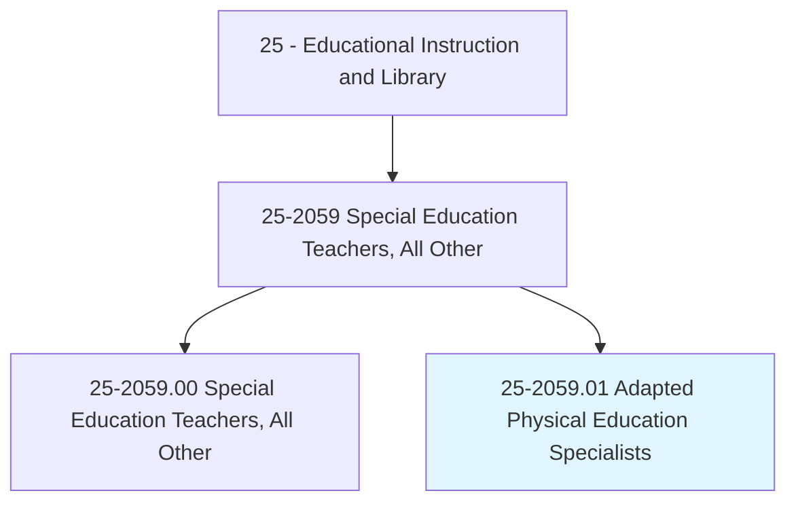
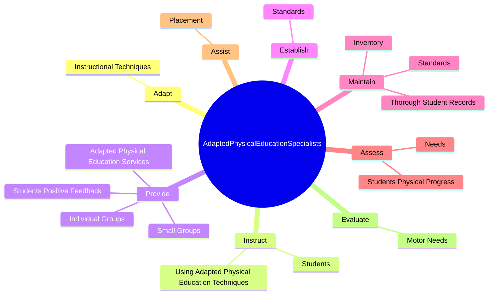

# Adapted Physical Education Specialists

> Provide individualized physical education instruction or services to children, youth, or adults with exceptional physical needs due to gross motor developmental delays or other impairments.

## Overview

Adapted Physical Education Specialists is classified under Educational Instruction and Library (SOC 25). Provide individualized physical education instruction or services to children, youth, or adults with exceptional physical needs due to gross motor developmental delays or other impairments.

## Classification Hierarchy

## Key Statistics

| Metric | Value |
|--------|-------|
| SOC Code | 25-2059.01 |
| Category | [Educational Instruction and Library](/occupations/Education) |
| Task Count | 72 |
| Source | O*NET |

## Core Tasks

### adapt.InstructionalTechniques

Adapted Physical Education Specialists adapt instructional techniques as part of their core responsibilities.

**Actions:**
- `adapt.InstructionalTechniques.to.AgeLevelsOfStudents`
- `adapt.InstructionalTechniques.to.SkillLevelsOfStudents`

### instruct.Students

Adapted Physical Education Specialists instruct students as part of their core responsibilities.

**Actions:**
- `instruct.Students.to.improve.PhysicalFitness`
- `instruct.Students.to.GrossMot`
- `instruct.Students.to.Skills`
- `instruct.Students.to.PerceptualMot`

### provide.IndividualGroups

Adapted Physical Education Specialists provide individual groups as part of their core responsibilities.

**Actions:**
- `provide.IndividualGroups.of.Students.with.AdaptedPhysicalEducationInstructionMeetsDesiredPhysicalNeeds`
- `provide.IndividualGroups.of.Goals`
- `provide.SmallGroups.of.Students.with.AdaptedPhysicalEducationInstructionMeetsDesiredPhysicalNeeds`
- `provide.SmallGroups.of.Goals`

## Skills & Competencies

### Technical Skills
- **Curriculum Development** - Advanced
- **Instructional Design** - Advanced
- **Assessment** - Advanced

### Soft Skills
- **Communication** - Essential
- **Problem Solving** - Essential
- **Critical Thinking** - Important
- **Teamwork** - Important
- **Adaptability** - Important

## Related Occupations

## Industries

This occupation is found across multiple industries. See [Industries](/industries) for sector-specific employment data.

## Career Progression

---

*Source: O*NET 25-2059.01 - ONETOccupation*
