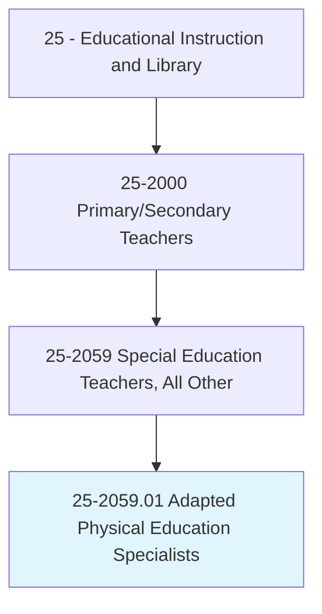
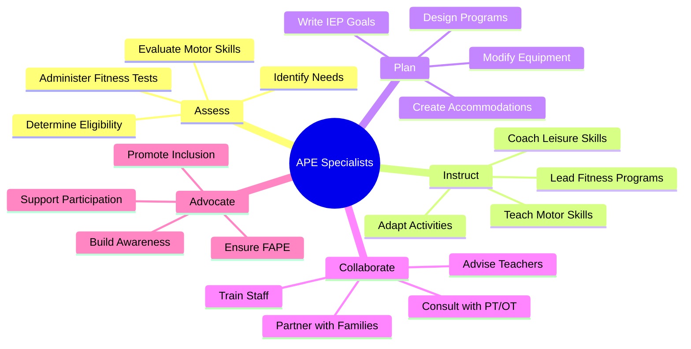
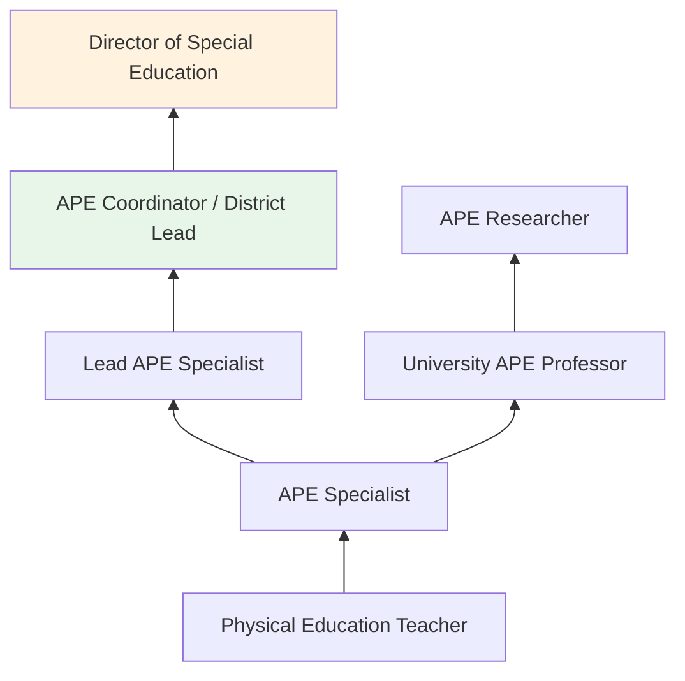
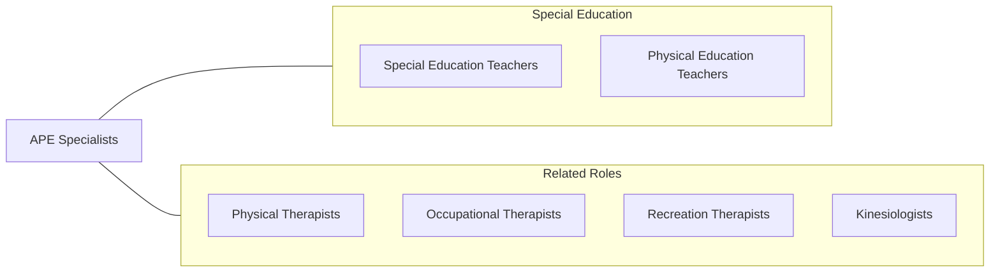

# Adapted Physical Education Specialists

> Provide individualized physical education instruction or services to children, youth, or adults with exceptional physical needs due to gross motor developmental delays or other impairments.

## Overview

Adapted Physical Education (APE) Specialists design and deliver individualized physical education programs for students with disabilities whose needs cannot be met through regular physical education. They assess students' motor abilities, develop IEP goals related to physical development and fitness, and implement instruction tailored to each student's capabilities. They work across grade levels from preschool through transition-age (21), serving students with physical disabilities, intellectual disabilities, autism, sensory impairments, and other conditions affecting motor function.

APE specialists modify activities, equipment, and instructional approaches to ensure students with disabilities can participate meaningfully in physical education. They adapt sports, fitness activities, dance, aquatics, and recreational skills to meet individual needs while promoting inclusion with non-disabled peers whenever possible. Their work addresses gross motor development, physical fitness, balance, coordination, body awareness, and lifetime leisure skills.

These specialists often serve as itinerant staff, traveling between multiple schools within a district. They collaborate with physical therapists, occupational therapists, classroom teachers, and families to create cohesive programs. APE is a federally mandated related service under IDEA, making these specialists essential for ensuring students with disabilities receive appropriate physical education.

## Classification Hierarchy

## Key Statistics

| Metric | Value |
|--------|-------|
| SOC Code | 25-2059.01 |
| Job Zone | 4 (Considerable Preparation) |
| Category | [Educational Instruction and Library](/occupations/Education/index) |
| Median Salary | $55,000 - $70,000 |
| Employment | ~5,000 |
| Projected Growth | 4-6% (Average) |
| Source | O*NET |

## Core Tasks

### instruct.StudentsWithPhysicalNeeds

APE Specialists deliver adapted physical education instruction.

**Actions:**
- `adapt.PhysicalActivities.for.StudentsWithDisabilities` - Modify sports, fitness, and movement activities for individual needs
- `teach.MotorSkills.through.IndividualizedInstruction` - Develop gross motor, balance, coordination, and fitness abilities
- `promote.Inclusion.in.PhysicalEducation` - Support participation alongside non-disabled peers

### assess.MotorDevelopmentAndFitness

APE Specialists evaluate students' physical abilities and needs.

**Actions:**
- `assess.MotorSkills.using.StandardizedTools` - Administer TGMD, BOT-2, Brockport assessments
- `develop.IEPGoals.for.PhysicalDevelopment` - Write measurable goals for motor skills and fitness
- `monitor.Progress.toward.PhysicalEducationGoals` - Track student achievement through regular assessment

## Skills & Competencies

### Technical Skills
- **Adapted Physical Education** - Expert (activity modification, disability-specific strategies)
- **Motor Assessment** - Expert (TGMD, BOT-2, Brockport Physical Fitness Test)
- **Kinesiology** - Advanced (biomechanics, motor development, exercise science)
- **Disability Knowledge** - Advanced (physical, intellectual, sensory, ASD, multiple disabilities)
- **IEP Development** - Advanced (goal writing for physical education)
- **Equipment Adaptation** - Advanced (modifying tools, assistive devices, adaptive equipment)

### Soft Skills
- **Creativity** - Critical (adapting activities for diverse abilities)
- **Patience** - Critical (working with students with significant motor challenges)
- **Communication** - Essential (consulting across multiple schools and teams)
- **Enthusiasm** - Essential (motivating students in physical activity)
- **Flexibility** - Important (itinerant schedule, varied settings)
- **Advocacy** - Important (ensuring APE services are provided)

## Education & Certifications

| Requirement | Details |
|-------------|---------|
| Typical Education | Bachelor's or master's degree in Adapted Physical Education or Kinesiology |
| State Licensure | Physical education license plus adapted PE credential (varies by state) |
| Clinical Experience | Practicum with students with disabilities in physical education |
| Continuing Education | Professional development in adapted PE |
| Common Certifications | CAPE (Certified Adapted Physical Educator) from APENS; state PE license; CPR/First Aid |

## Career Progression

## Setting Variations

### Public School Districts
Itinerant service across multiple schools. Caseload-based scheduling.

### Special Education Schools
Full-time placement serving students with significant disabilities. Daily PE programming.

### Residential Programs
Physical education within residential treatment or care settings.

### Community Recreation
Adapted sports and recreation programs for individuals with disabilities.

## Technology & Tools

| Category | Tools |
|----------|-------|
| Assessment | TGMD-3, BOT-2, Brockport, APEAS |
| Adaptive Equipment | Sport wheelchairs, beep balls, guide wires, tactile markers |
| Fitness | Heart rate monitors, adapted exercise equipment |
| Documentation | IEP software, progress monitoring tools |
| Instruction | Visual schedules, task analysis cards, video modeling |
| Communication | Email, scheduling software, collaboration platforms |

## Related Occupations

## Industries

- [Educational Services](/industries/Education/index) - Primary Employment
- [Government](/industries/PublicAdministration) - Public School Districts
- Arts, Entertainment, and Recreation - Adapted Sports Programs
- [Healthcare](/industries/Healthcare) - Rehabilitation Programs

## Departments

This occupation typically works in:
- Special Education Department
- Physical Education Department
- Student Support Services

---

*Source: O*NET 25-2059.01 - ONETOccupation*
