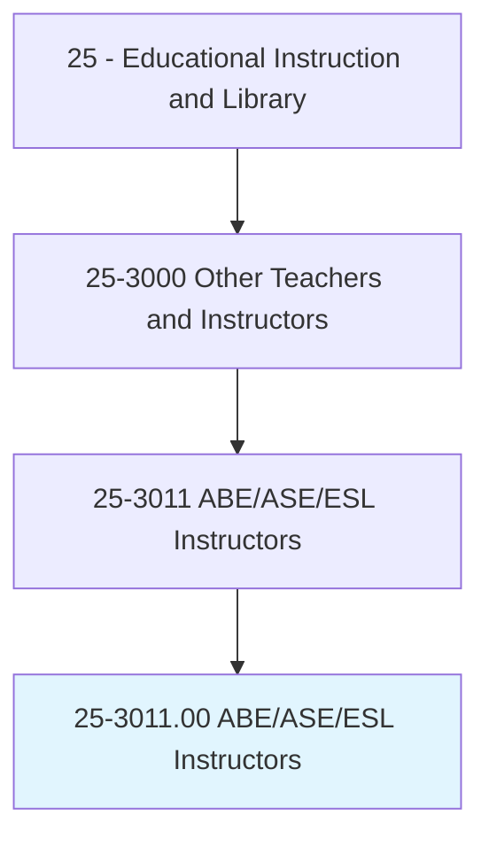
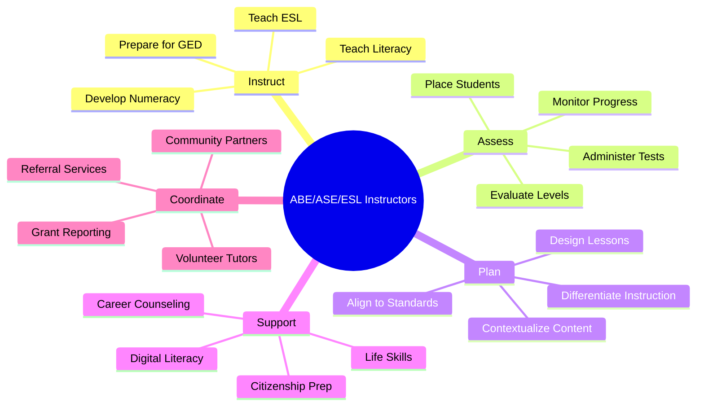
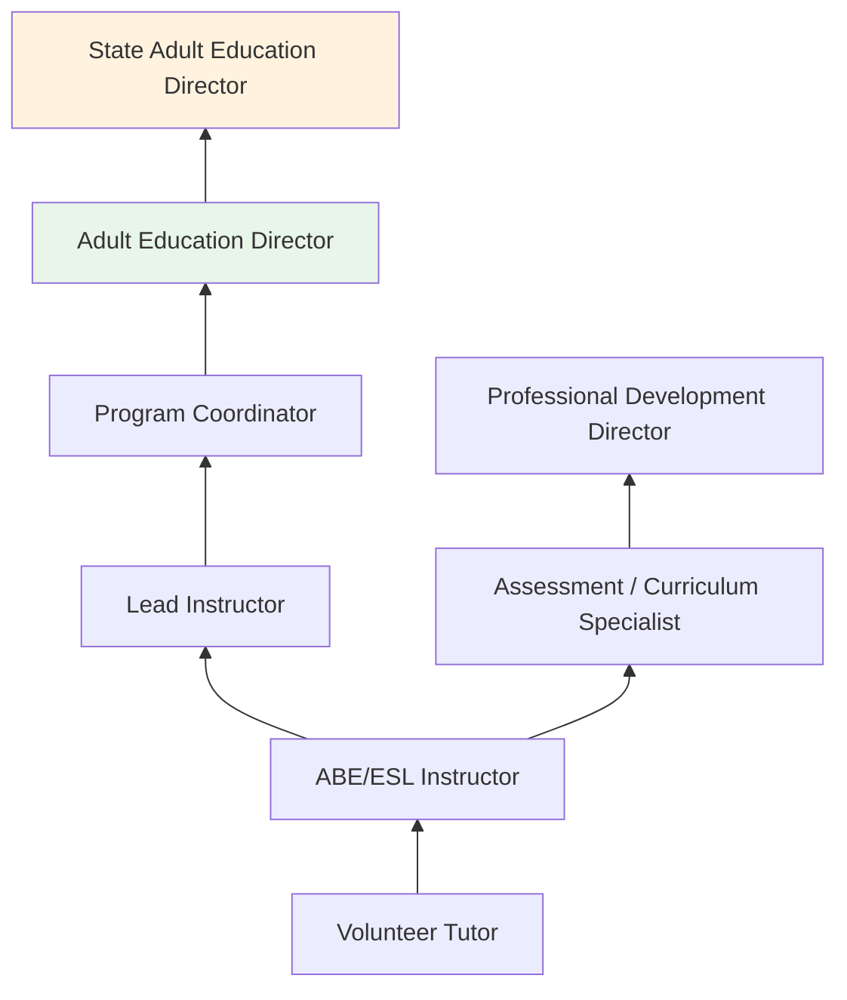
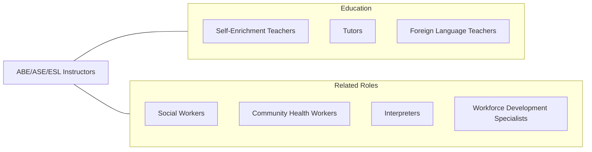

# Adult Basic Education, Adult Secondary Education, and English as a Second Language Instructors

> Teach or instruct out-of-school youths and adults in remedial education classes, preparatory classes for the General Educational Development (GED) test, literacy, or English as a Second Language (ESL). Teaching may or may not take place in a traditional educational institution.

## Overview

Adult Basic Education (ABE), Adult Secondary Education (ASE), and English as a Second Language (ESL) Instructors teach foundational academic skills and English language proficiency to adult learners who did not complete traditional schooling or who are immigrants and refugees learning English. They help students achieve literacy, earn GED or high school equivalency diplomas, develop workforce-ready skills, and build the English proficiency needed for employment, citizenship, and daily life.

These instructors serve some of the most diverse and underserved populations in education, including adults with limited formal schooling, individuals re-entering society from incarceration, refugees and asylum seekers, and workers seeking to advance beyond entry-level employment. They teach in community colleges, adult education centers, community organizations, libraries, correctional facilities, workplaces, and faith-based organizations.

Instruction requires exceptional differentiation skills, as classrooms may include learners ranging from pre-literate to near-high-school completion, or from beginner to advanced English proficiency. Instructors use contextualized instruction connecting academic content to students' lives, employment goals, and civic participation. The field is heavily supported by federal funding through the Workforce Innovation and Opportunity Act (WIOA) Title II.

## Classification Hierarchy

## Key Statistics

| Metric | Value |
|--------|-------|
| SOC Code | 25-3011.00 |
| Job Zone | 4 (Considerable Preparation) |
| Category | [Educational Instruction and Library](/occupations/Education/index) |
| Median Salary | $45,000 - $58,000 |
| Employment | ~55,000 |
| Projected Growth | 4-6% (Average) |
| Source | O*NET |

## Core Tasks

### instruct.AdultLearners

Instructors provide foundational education to adults.

**Actions:**
- `teach.Literacy.to.AdultLearners` - Develop reading, writing, and comprehension skills for non-literate adults
- `prepare.Students.for.GEDExamination` - Instruct in math, science, social studies, and language arts at secondary level
- `teach.EnglishLanguage.to.Immigrants` - Build listening, speaking, reading, and writing skills for non-native speakers

### support.AdultTransitions

Instructors help adults achieve educational and life goals.

**Actions:**
- `assess.StudentLevels.for.InstructionalPlacement` - Administer CASAS, TABE, or BEST assessments for proper placement
- `contextualize.Instruction.for.WorkforceReadiness` - Connect academic content to employment and career goals
- `connect.Students.to.SupportServices` - Refer learners to childcare, transportation, legal aid, and social services

## Skills & Competencies

### Technical Skills
- **Adult Learning Theory** - Expert (andragogy, self-directed learning, motivation)
- **ESL/TESOL Methods** - Advanced (communicative approach, SIOP, task-based learning)
- **Literacy Instruction** - Advanced (phonics, fluency, comprehension for adults)
- **GED Preparation** - Advanced (test content, strategies, practice testing)
- **Assessment** - Advanced (CASAS, TABE, BEST Plus, NRS levels)
- **Differentiated Instruction** - Advanced (multi-level classrooms, varied proficiencies)

### Soft Skills
- **Cultural Sensitivity** - Critical (serving diverse immigrant and refugee populations)
- **Empathy** - Critical (understanding barriers adult learners face)
- **Patience** - Essential (working with beginners and slow progress)
- **Communication** - Essential (clear, accessible instruction)
- **Flexibility** - Essential (adapting to varied levels and needs)
- **Resourcefulness** - Important (finding materials and support for underfunded programs)

## Education & Certifications

| Requirement | Details |
|-------------|---------|
| Typical Education | Bachelor's degree; master's in TESOL, Adult Education, or related field preferred |
| State Requirements | Vary; some states require teaching credential or adult education certificate |
| Work Experience | Experience with adult learners or diverse populations valued |
| Continuing Education | Professional development through state adult education offices |
| Common Certifications | TESOL certificate; state adult education credential; CELTA/DELTA for ESL; CASAS/TABE assessment training |

## Career Progression

## Setting Variations

### Community Colleges
ABE/GED/ESL programs within larger institutions. Access to student services and pathways to credit programs.

### Community-Based Organizations
Nonprofit organizations serving immigrants, refugees, and underserved communities. Often grant-funded.

### Correctional Facilities
Education programs for incarcerated adults. GED preparation and re-entry skills.

### Workplace Programs
Employer-sponsored ESL and basic skills training. Contextualized for specific industries.

### Libraries
Literacy programs and ESL conversation groups in public library settings.

## Technology & Tools

| Category | Tools |
|----------|-------|
| Assessment | CASAS, TABE, BEST Plus, GED Ready |
| Learning Platforms | Burlington English, USA Learns, Khan Academy |
| Classroom | Projectors, document cameras, language labs |
| Digital Literacy | Northstar Digital Literacy, GCFGlobal |
| GED Prep | GED.com, Kaplan, Essential Education |
| Communication | Google Classroom, Remind, WhatsApp (for ESL) |

## Related Occupations

## Industries

- [Educational Services](/industries/Education/index) - Primary Employment
- [Government](/industries/Government) - State and Local Adult Education Programs
- [Social Assistance](/industries/SocialAssistance) - Community Organizations, Refugee Services
- [Other Services](/industries/OtherServices) - Nonprofits, Faith-Based Organizations

## Departments

This occupation typically works in:
- [Adult Education Department](/departments/AdultEducation)
- [ESL / World Languages](/departments/ESL)
- [Workforce Development](/departments/WorkforceDevelopment)

---

*Source: O*NET 25-3011.00 - ONETOccupation*
