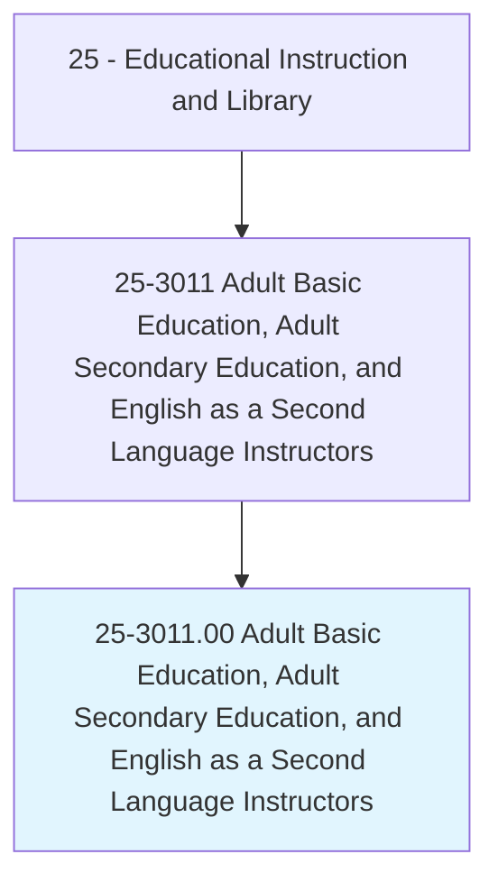
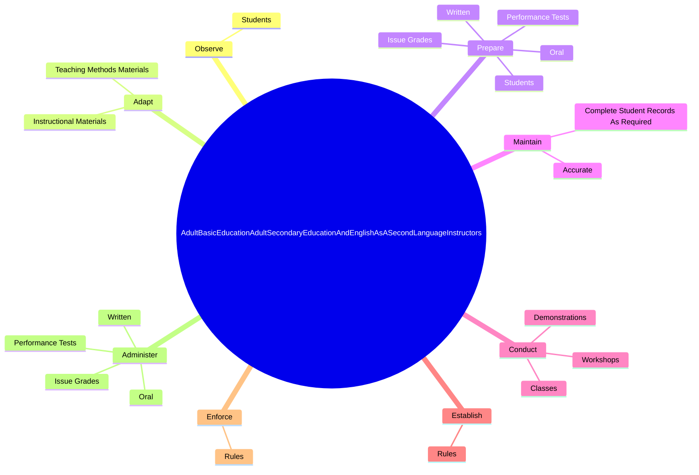
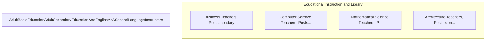

# Adult Basic Education, Adult Secondary Education, and English as a Second Language Instructors

> Teach or instruct out-of-school youths and adults in basic education, literacy, or English as a Second Language classes, or in classes for earning a high school equivalency credential.

## Overview

Adult Basic Education, Adult Secondary Education, and English as a Second Language Instructors is classified under Educational Instruction and Library (SOC 25). Teach or instruct out-of-school youths and adults in basic education, literacy, or English as a Second Language classes, or in classes for earning a high school equivalency credential.

## Classification Hierarchy

## Key Statistics

| Metric | Value |
|--------|-------|
| SOC Code | 25-3011.00 |
| Category | [Educational Instruction and Library](/occupations/Education/index) |
| Task Count | 105 |
| Source | O*NET |

## Core Tasks

### observe.Students

Adult Basic Education, Adult Secondary Education, and English as a Second Language Instructors observe students as part of their core responsibilities.

**Actions:**
- `observe.Students.to.determine.Qualifications`
- `observe.Students.to.Limitations`
- `observe.Students.to.Abilities`
- `observe.Students.to.Interests`

### adapt.TeachingMethodsMaterials

Adult Basic Education, Adult Secondary Education, and English as a Second Language Instructors adapt teaching methods materials as part of their core responsibilities.

**Actions:**
- `adapt.TeachingMethodsMaterials.to.Abilities`
- `adapt.InstructionalMaterials.to.Abilities`

### prepare.Students

Adult Basic Education, Adult Secondary Education, and English as a Second Language Instructors prepare students as part of their core responsibilities.

**Actions:**
- `prepare.Students.for.FurtherEducationByEncouragingThem.to.explore.LearningOpportunitiesPersevereWithChallengingTasks`
- `prepare.Written.in.Accordance.with.Performance`
- `prepare.Oral.in.Accordance.with.Performance`
- `prepare.PerformanceTests.in.Accordance.with.Performance`

## Skills & Competencies

### Technical Skills
- **Curriculum Development** - Advanced
- **Instructional Design** - Advanced
- **Assessment** - Advanced

### Soft Skills
- **Communication** - Essential
- **Problem Solving** - Essential
- **Critical Thinking** - Important
- **Teamwork** - Important
- **Adaptability** - Important

## Related Occupations

## Industries

This occupation is found across multiple industries. See [Industries](/industries) for sector-specific employment data.

## Career Progression

---

*Source: O*NET 25-3011.00 - ONETOccupation*
