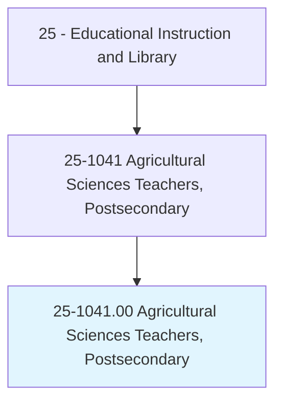
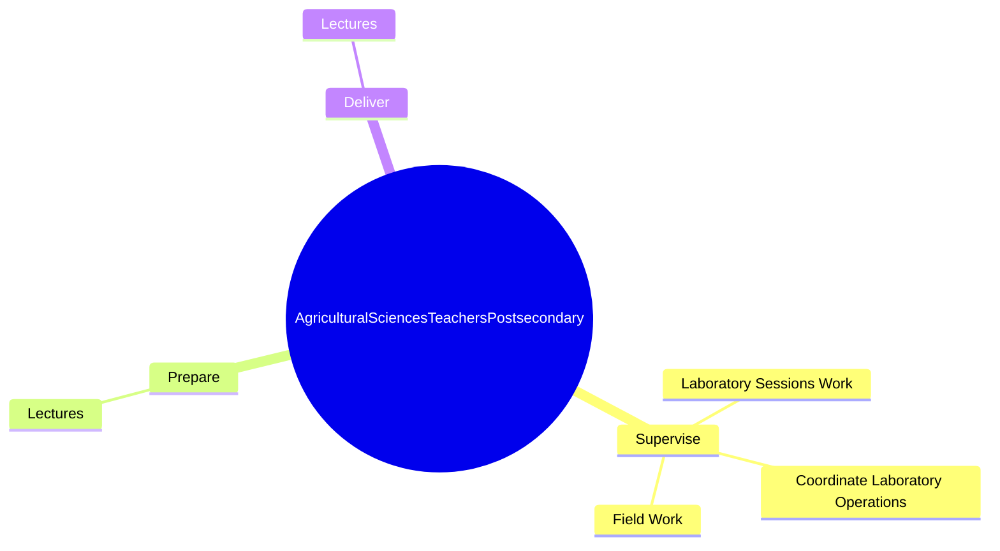
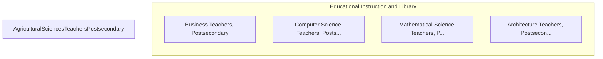

# Agricultural Sciences Teachers, Postsecondary

> Teach courses in the agricultural sciences. Includes teachers of agronomy, dairy sciences, fisheries management, horticultural sciences, poultry sciences, range management, and agricultural soil conservation. Includes both teachers primarily engaged in teaching and those who do a combination of teaching and research.

## Overview

Agricultural Sciences Teachers, Postsecondary is an occupation within the Educational Instruction and Library category. Teach courses in the agricultural sciences. Includes teachers of agronomy, dairy sciences, fisheries management, horticultural sciences, poultry sciences, range management, and agricultural soil conservation.

## Classification Hierarchy

## Key Statistics

| Metric | Value |
|--------|-------|
| SOC Code | 25-1041.00 |
| Category | [Educational Instruction and Library](/occupations/Education) |
| Task Count | 9 |
| Source | O*NET |

## Core Tasks

### supervise.LaboratorySessionsWork

Agricultural Sciences Teachers, Postsecondary supervise laboratory sessions work as part of their core responsibilities.

**Actions:**
- `supervise.LaboratorySessionsWork`
- `supervise.CoordinateLaboratoryOperations`
- `supervise.FieldWork`

### prepare.Lectures

Agricultural Sciences Teachers, Postsecondary prepare lectures as part of their core responsibilities.

**Actions:**
- `prepare.Lectures.to.CropProduction`
- `prepare.Lectures.to.plant.Genetics`
- `prepare.Lectures.to.SoilChemistry`

### deliver.Lectures

Agricultural Sciences Teachers, Postsecondary deliver lectures as part of their core responsibilities.

**Actions:**
- `deliver.Lectures.to.CropProduction`
- `deliver.Lectures.to.plant.Genetics`
- `deliver.Lectures.to.SoilChemistry`

## Skills & Competencies

### Technical Skills
- **Curriculum Development** - Advanced
- **Instructional Design** - Advanced
- **Assessment** - Advanced

### Soft Skills
- **Communication** - Essential
- **Problem Solving** - Essential
- **Critical Thinking** - Important
- **Teamwork** - Important
- **Adaptability** - Important

## Related Occupations

## Industries

This occupation is found across multiple industries. See [Industries](/industries) for sector-specific employment data.

## Career Progression

---

*Source: O*NET 25-1041.00 - ONETOccupation*
