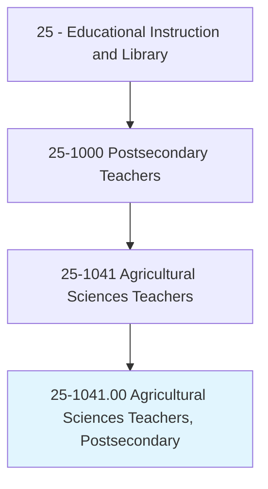
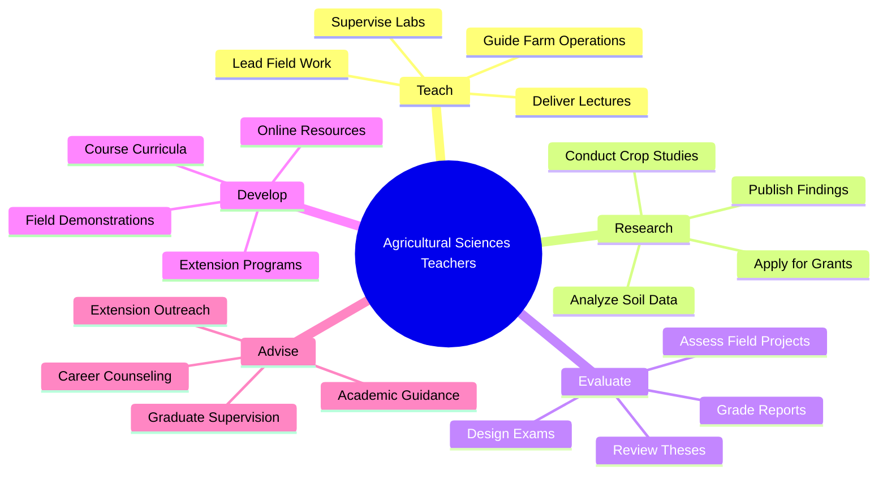
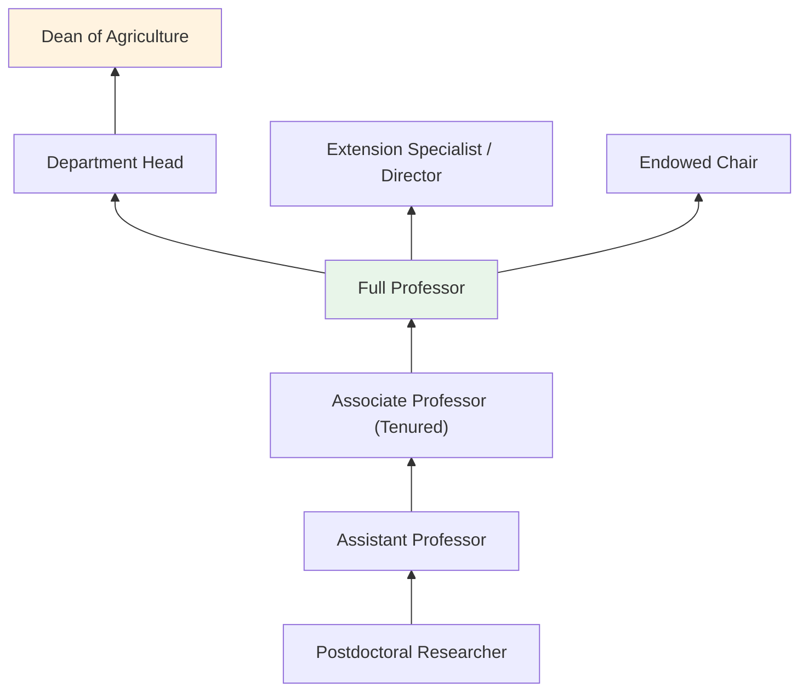
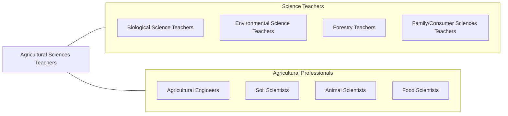

# Agricultural Sciences Teachers, Postsecondary

> Teach courses in the agricultural sciences. Includes teachers of agronomy, dairy sciences, fisheries management, horticultural sciences, poultry sciences, range management, and agricultural soil conservation. Includes both teachers primarily engaged in teaching and those who do a combination of teaching and research.

## Overview

Agricultural Sciences Teachers in postsecondary education instruct students in the science and management of food production, natural resources, and agricultural systems. They teach courses in agronomy, animal science, soil science, horticulture, aquaculture, food science, agricultural economics, precision agriculture, and sustainable farming systems. These educators combine classroom instruction with laboratory experiments, field demonstrations, and farm-based learning to prepare students for careers in food production, agricultural research, extension services, and agribusiness.

Many faculty conduct applied research on crop improvement, livestock management, soil health, irrigation efficiency, pest management, food safety, and sustainable agriculture. They secure funding from USDA, NSF, and industry partners, and their research directly impacts agricultural productivity, environmental sustainability, and food security. Land-grant university faculty often have extension appointments connecting their work to farmers and communities.

Agricultural science faculty play a vital role in feeding a growing global population while addressing environmental challenges. They train agronomists, animal scientists, food technologists, and agricultural engineers who will develop and implement the innovations needed for sustainable food systems.

## Classification Hierarchy

## Key Statistics

| Metric | Value |
|--------|-------|
| SOC Code | 25-1041.00 |
| Job Zone | 5 (Extensive Preparation) |
| Category | [Educational Instruction and Library](/occupations/Education/index) |
| Median Salary | $80,000 - $105,000 |
| Employment | ~12,000 |
| Projected Growth | 5-8% (Average) |
| Source | O*NET |

## Core Tasks

### teach.AgriculturalSciences

Faculty deliver instruction across agricultural disciplines.

**Actions:**
- `deliver.Lectures.on.Agronomy` - Teach crop science, plant genetics, and field management
- `deliver.Lectures.on.AnimalScience` - Instruct on livestock nutrition, reproduction, and management
- `supervise.FieldWork.on.ResearchFarms` - Guide hands-on agricultural experiments and demonstrations

### conduct.AgriculturalResearch

Faculty pursue applied research improving agricultural systems.

**Actions:**
- `conduct.Research.on.CropImprovement` - Study plant breeding, genetics, and yield optimization
- `conduct.Research.on.SoilHealth` - Investigate nutrient management, conservation, and sustainability
- `publish.Findings.in.AgriculturalJournals` - Contribute to Agronomy Journal, Journal of Animal Science, and similar venues

## Skills & Competencies

### Technical Skills
- **Agricultural Science** - Expert (crop, animal, soil, or food science)
- **Field Research Methods** - Expert (plot design, data collection, farm management)
- **Laboratory Methods** - Advanced (soil analysis, plant tissue analysis, genomics)
- **Statistical Analysis** - Advanced (SAS, R, experimental design)
- **Precision Agriculture** - Advanced (GPS, drones, variable rate technology)
- **Curriculum Design** - Advanced (agricultural education accreditation)

### Soft Skills
- **Communication** - Critical (farmer outreach, academic publication)
- **Collaboration** - Essential (interdisciplinary teams, industry partners)
- **Fieldwork Leadership** - Essential (outdoor research management)
- **Mentorship** - Essential (student development)
- **Problem Solving** - Important (agricultural challenges)
- **Public Engagement** - Important (extension, community education)

## Education & Certifications

| Requirement | Details |
|-------------|---------|
| Typical Education | Ph.D. in Agricultural Science, Agronomy, Animal Science, or related field |
| Work Experience | Farm or agricultural industry experience valued |
| On-the-Job Training | Faculty development; extension training |
| Common Certifications | CCA (Certified Crop Adviser); ASA/CSSA/SSSA membership; PAS (Professional Animal Scientist) |

## Career Progression

## Setting Variations

### Land-Grant Universities
Strong research, teaching, and extension missions. Experimental farms and USDA-funded programs.

### Community Colleges
Agricultural technology programs. Workforce preparation for farming and agribusiness.

### Online Programs
Distance agricultural education for working professionals. Growing enrollment.

### Extension Services
Community outreach and farmer education through cooperative extension.

## Technology & Tools

| Category | Tools |
|----------|-------|
| Precision Agriculture | GPS, drones, yield monitors, variable rate technology |
| Laboratory | Soil analyzers, NIR spectrometers, PCR, greenhouses |
| Statistical Software | SAS, R, JMP |
| GIS | ArcGIS, QGIS, remote sensing platforms |
| Learning Management Systems | Canvas, Blackboard, Moodle |
| Farm Equipment | Tractors, planters, combines (research scale) |

## Related Occupations

## Industries

- [Educational Services - Colleges of Agriculture](/industries/Education/index) - Primary Employment
- [Government](/industries/PublicAdministration) - USDA, Extension Services
- [Agriculture](/industries/Agriculture) - Agribusiness Research
- [Professional Services](/industries/Scientific) - Agricultural Consulting

## Departments

This occupation typically works in:
- College of Agriculture and Life Sciences
- Department of Agronomy
- Department of Animal Science
- Cooperative Extension

---

*Source: O*NET 25-1041.00 - ONETOccupation*
