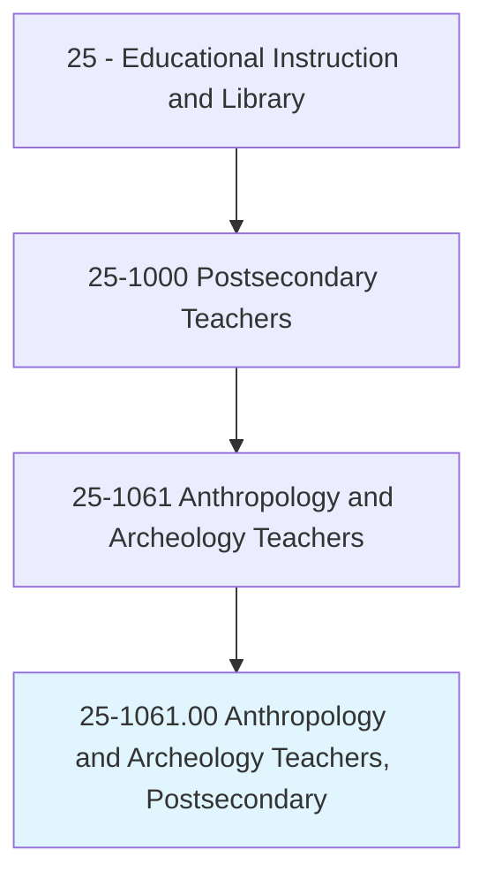
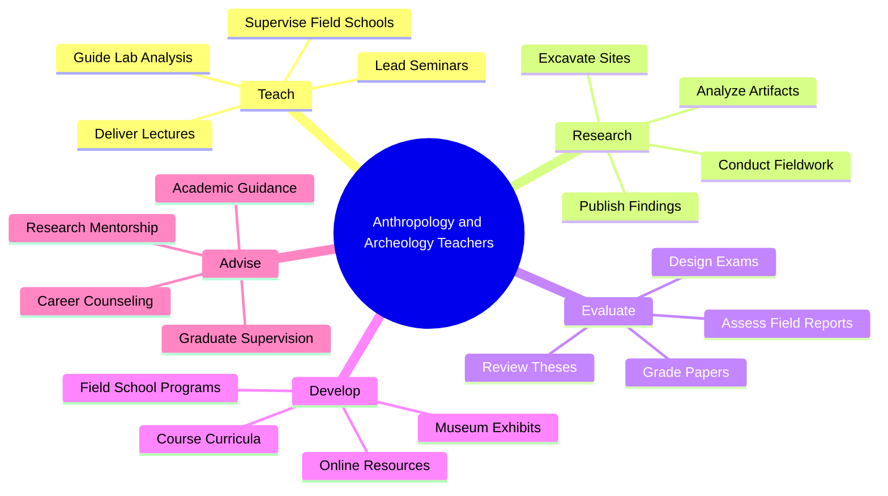
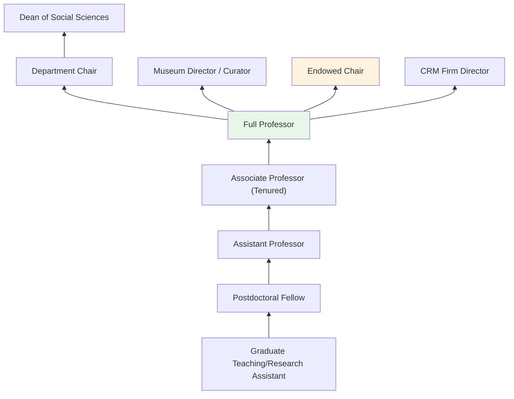
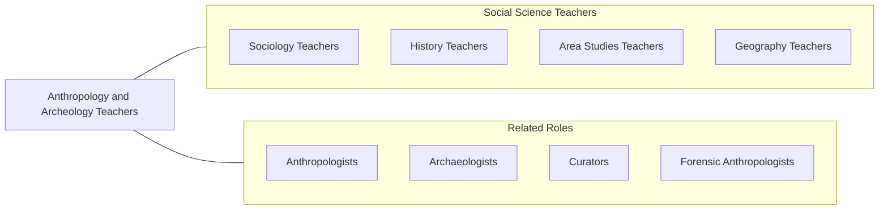

# Anthropology and Archeology Teachers, Postsecondary

> Teach courses in anthropology or archeology. Includes both teachers primarily engaged in teaching and those who do a combination of teaching and research.

## Overview

Anthropology and Archeology Teachers in postsecondary education instruct students in the holistic study of human cultures, societies, biological variation, and material remains. They teach courses across the four traditional subfields of anthropology: cultural anthropology, physical/biological anthropology, archaeology, and linguistic anthropology. Course offerings include ethnography, human evolution, archaeological methods, medical anthropology, forensic anthropology, indigenous peoples, globalization, and material culture studies.

Many faculty maintain active research programs involving fieldwork across the globe. Cultural anthropologists conduct ethnographic research in communities ranging from urban neighborhoods to remote villages. Archaeologists excavate sites spanning from early human origins to recent historical periods. Biological anthropologists study primate behavior, human skeletal remains, and genetic variation. Their research produces original knowledge about human diversity, adaptation, and cultural change while often engaging with contemporary issues of social justice, heritage preservation, and indigenous rights.

Anthropology faculty serve a broad educational role, teaching introductory courses that develop students' cultural competency, critical thinking, and appreciation for human diversity. They prepare graduates for careers in cultural resource management, museum work, international development, public health, forensics, and academic research.

## Classification Hierarchy

## Key Statistics

| Metric | Value |
|--------|-------|
| SOC Code | 25-1061.00 |
| Job Zone | 5 (Extensive Preparation) |
| Category | [Educational Instruction and Library](/occupations/Education/index) |
| Median Salary | $72,000 - $90,000 |
| Employment | ~7,500 |
| Projected Growth | 3-5% (Average) |
| Source | O*NET |

## Core Tasks

### teach.AnthropologyCourses

Faculty deliver instruction across anthropological subfields.

**Actions:**
- `deliver.Lectures.on.CulturalAnthropology` - Teach ethnography, kinship, religion, and globalization
- `deliver.Lectures.on.Archaeology` - Instruct on excavation methods, material culture, and site analysis
- `supervise.FieldSchools.for.ArchaeologicalExcavation` - Lead hands-on field training programs

### conduct.AnthropologicalResearch

Faculty pursue original fieldwork and laboratory research.

**Actions:**
- `conduct.Ethnographic.Fieldwork.in.Communities` - Perform participant observation and qualitative research
- `conduct.ArchaeologicalExcavations.at.Sites` - Direct systematic excavation and artifact recovery
- `publish.Findings.in.AnthropologyJournals` - Contribute to journals such as American Anthropologist and American Antiquity

## Skills & Competencies

### Technical Skills
- **Anthropological Theory** - Expert (cultural, biological, archaeological, linguistic)
- **Field Methods** - Expert (ethnography, excavation, survey, biological sampling)
- **Laboratory Analysis** - Advanced (artifact analysis, osteology, dating methods)
- **Research Methods** - Advanced (qualitative, quantitative, mixed methods)
- **GIS and Mapping** - Intermediate to Advanced (site mapping, spatial analysis)
- **Curriculum Design** - Advanced (anthropology pedagogy)

### Soft Skills
- **Cultural Sensitivity** - Critical (working across diverse communities)
- **Communication** - Critical (conveying complex cultural concepts)
- **Fieldwork Leadership** - Essential (managing excavations and field teams)
- **Critical Thinking** - Essential (cross-cultural analysis)
- **Mentorship** - Essential (training student researchers)
- **Collaboration** - Important (interdisciplinary and community partnerships)

## Education & Certifications

| Requirement | Details |
|-------------|---------|
| Typical Education | Ph.D. in Anthropology or Archaeology |
| Alternative Entry | M.A. for community college or CRM positions |
| Work Experience | Extensive fieldwork experience required |
| On-the-Job Training | Faculty development; field safety training |
| Common Certifications | AAA membership; SAA/SHA membership (archaeology); RPA (Register of Professional Archaeologists) |

## Career Progression

## Setting Variations

### Research Universities
Emphasis on original fieldwork, doctoral student training, and publication. NSF and Wenner-Gren funded research.

### Liberal Arts Colleges
Four-field anthropology teaching with close undergraduate mentorship. Field school opportunities.

### Community Colleges
Introduction to Anthropology and Cultural Diversity courses. General education and transfer credit.

### Museums
Faculty affiliated with anthropology or natural history museums. Curation and public education roles.

### Cultural Resource Management
Applied archaeology teaching with connections to CRM firms and compliance work.

## Technology & Tools

| Category | Tools |
|----------|-------|
| GIS & Mapping | ArcGIS, QGIS, total stations, drones |
| Laboratory | Microscopes, calipers, radiocarbon dating, mass spectrometry |
| Field Equipment | Excavation tools, GPS, photogrammetry (Agisoft), soil probes |
| Statistical Software | SPSS, R, NVivo |
| Learning Management Systems | Canvas, Blackboard, Moodle |
| Research Databases | JSTOR, AnthroSource, HRAF |

## Related Occupations

## Industries

- [Educational Services - Colleges and Universities](/industries/Education/index) - Primary Employment
- [Government](/industries/Government) - Smithsonian, NPS, BLM
- [Arts and Entertainment](/industries/ArtsEntertainment) - Museums
- [Professional Services](/industries/ProfessionalServices) - CRM Firms

## Departments

This occupation typically works in:
- [Department of Anthropology](/departments/Anthropology)
- [Department of Sociology and Anthropology](/departments/SociologyAnthropology)
- [Museum of Anthropology](/departments/Museum)
- [Archaeology Program](/departments/Archaeology)

---

*Source: O*NET 25-1061.00 - ONETOccupation*
