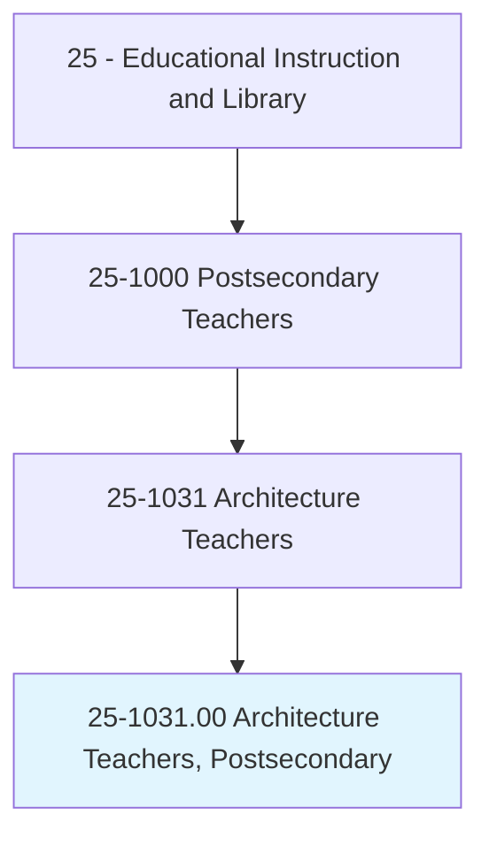
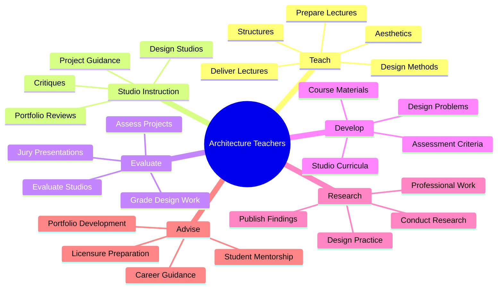
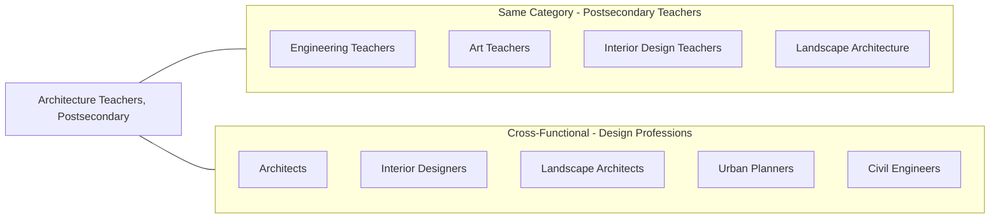
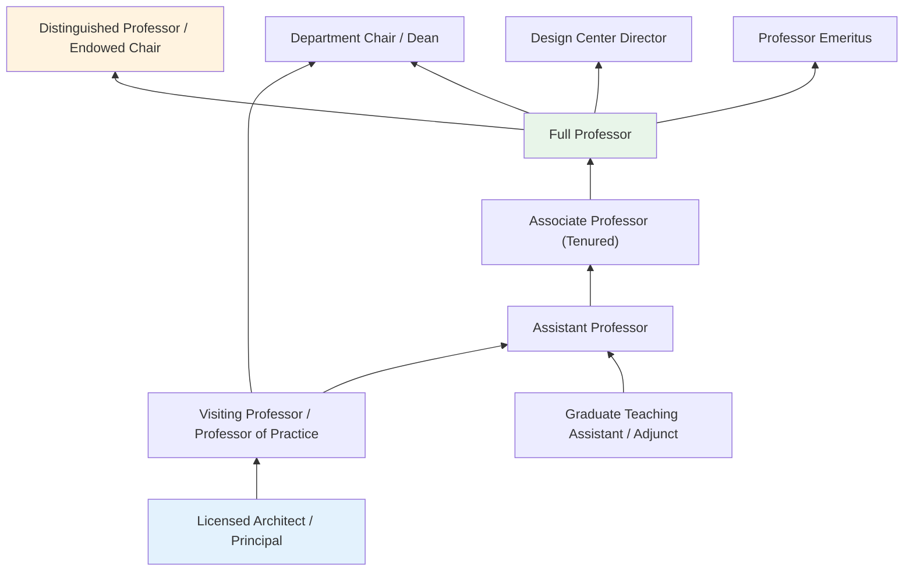
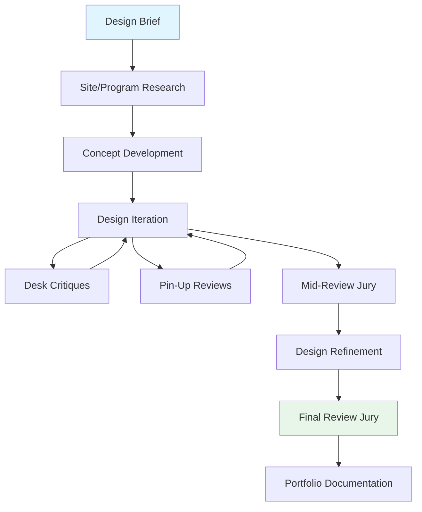

# Architecture Teachers, Postsecondary

> Teach courses in architecture and architectural design, such as architectural environmental design, interior architecture/design, and landscape architecture. Includes both teachers primarily engaged in teaching and those who do a combination of teaching and research.

## Overview

Architecture Teachers in postsecondary education instruct students in the theory, history, and practice of architectural design. They teach across multiple specializations including building design, interior architecture, landscape architecture, and sustainable design. These educators combine studio-based instruction with lecture courses, guiding students through the creative process of translating concepts into built environments. Many maintain active architectural practices alongside their teaching, bringing real-world project experience into the classroom. They evaluate student design work through critiques, portfolio reviews, and studio presentations, preparing students for professional licensure and practice.

## Classification Hierarchy



## Key Statistics

| Metric | Value |
|--------|-------|
| SOC Code | 25-1031.00 |
| Job Zone | 5 (Extensive Preparation) |
| Category | [Educational Instruction and Library](/occupations/Education) |
| Core Tasks | 15+ |
| Source | O*NET |

## Core Tasks



### prepare.Lectures

Architecture Teachers develop instructional content covering architectural theory, design methods, building technology, and professional practice.

**Actions:**
- `prepare.Lectures.to.ArchitecturalDesignMethods` - Create lectures on design process, methodology, and creative approaches
- `prepare.Lectures.to.Aesthetics` - Develop content on architectural aesthetics, form, and visual composition
- `prepare.Lectures.to.design` - Prepare lectures on design principles and spatial organization
- `prepare.Lectures.to.structures` - Create content on structural systems and building technology
- `prepare.Lectures.to.Materials` - Develop lectures on building materials and construction methods

### deliver.Lectures

Architecture Teachers present course material through lectures, demonstrations, and visual presentations.

**Actions:**
- `deliver.Lectures.to.ArchitecturalDesignMethods` - Teach design methodologies and creative processes
- `deliver.Lectures.to.Aesthetics` - Instruct students on architectural beauty, proportion, and composition
- `deliver.Lectures.to.design` - Present design theory and spatial relationships
- `deliver.Lectures.to.structures` - Teach structural engineering principles for architects
- `deliver.Lectures.to.Materials` - Explain material properties and appropriate applications

### evaluate.StudentsWork

Architecture Teachers assess student design work through studio critiques, portfolio reviews, and jury presentations.

**Actions:**
- `evaluate.StudentsWork.in.DesignStudios` - Review and critique student design projects in studio settings
- `evaluate.IncludingWorkPerformed.in.DesignStudios` - Assess the full body of studio work including process and final presentations
- `grade.StudentsWork.in.DesignStudios` - Assign grades based on design quality, presentation, and process
- `grade.IncludingWorkPerformed.in.DesignStudios` - Evaluate comprehensive design performance

## Skills & Competencies

### Technical Skills
- **Architectural Design** - Expert (conceptual design through construction documents)
- **Building Technology** - Advanced (structures, mechanical systems, materials)
- **Design Software** - Advanced (CAD, BIM, Rhino, Adobe Suite, rendering)
- **Sustainable Design** - Advanced (LEED, passive design, environmental systems)
- **Visual Communication** - Expert (drawing, modeling, presentation)
- **Research Methods** - Advanced

### Soft Skills
- **Communication** - Critical (design critique, visual presentation)
- **Creativity** - Critical (design innovation, problem-solving)
- **Critical Analysis** - Essential (evaluating design decisions)
- **Mentorship** - Essential (guiding design development)
- **Collaboration** - Essential (studio culture, team projects)

## Related Occupations



## Industry Variations

### Accredited Architecture Programs (NAAB)
Focus on preparing students for professional licensure; required curriculum coverage; design studio sequence; comprehensive education in building technology, history, and professional practice.

### Research Universities
Emphasis on design research; doctoral programs; advanced theory; computational design; building science research; sustainability studies.

### Art and Design Schools
Strong emphasis on conceptual design; interdisciplinary connections; experimental approaches; visual arts integration.

### Technical Schools
Focus on building technology; construction management integration; practical skills; industry partnerships; BIM proficiency.

### Community Colleges
Architectural drafting and technology; transfer preparation; continuing education; industry certifications.

### Graduate Programs (M.Arch)
Advanced design studios; thesis projects; professional preparation for career changers; intensive studio culture.

## Industries

- [Educational Services - Colleges and Universities](/industries/EducationalServices) - Primary Employment
- [Professional, Scientific, and Technical Services](/industries/ProfessionalServices) - Architecture Practice
- [Construction](/industries/Construction) - Design-Build
- [Real Estate](/industries/RealEstate) - Development Consulting
- [Government](/industries/Government) - Public Universities, Planning Departments

## Career Progression



## Education & Training

| Requirement | Details |
|-------------|---------|
| Typical Education | Master of Architecture (M.Arch) or Ph.D.; terminal degree required for tenure-track positions |
| Work Experience | Professional architecture practice highly valued; licensure (RA, AIA) preferred; portfolio of built work or design research |
| On-the-Job Training | Faculty development; studio teaching methods; accreditation requirements |
| Common Certifications | Licensed Architect (RA); AIA membership; LEED AP; WELL AP; specialty credentials |

## Departments

This occupation typically works in:
- [School of Architecture](/departments/Architecture)
- [Department of Interior Design](/departments/InteriorDesign)
- [Department of Landscape Architecture](/departments/LandscapeArchitecture)
- [College of Design](/departments/Design)
- [Urban Planning Program](/departments/UrbanPlanning)

## GraphDL Semantic Structure

The core semantic patterns for Architecture Teachers follow this structure:

```
verb.Object.preposition.PrepObject

Primary Actions:
- prepare.Lectures.to.{ArchitectureTopic}
- deliver.Lectures.to.{ArchitectureTopic}
- evaluate.StudentsWork.in.DesignStudios
- grade.StudentsWork.in.DesignStudios
- evaluate.IncludingWorkPerformed.in.DesignStudios
- grade.IncludingWorkPerformed.in.DesignStudios
```

## Specialization Areas

### Design
- **Building Design** - Residential, commercial, institutional architecture
- **Interior Architecture** - Space planning, interior environments
- **Landscape Architecture** - Site design, outdoor spaces
- **Urban Design** - City scale design, public spaces

### Technology
- **Building Structures** - Structural systems, engineering integration
- **Environmental Systems** - HVAC, lighting, acoustics
- **Building Envelope** - Facades, roofing, waterproofing
- **Digital Fabrication** - Parametric design, CNC, 3D printing

### Theory and History
- **Architectural History** - Period styles, movements, precedents
- **Design Theory** - Phenomenology, semiotics, critical theory
- **Sustainable Design** - Green building, regenerative design
- **Social Equity** - Community design, affordable housing

### Professional Practice
- **Project Management** - Construction administration, contracts
- **Building Codes** - Zoning, accessibility, life safety
- **Professional Ethics** - Licensing, liability, standards of care
- **Entrepreneurship** - Firm management, business development

## Studio Teaching Model

Architecture education is distinguished by its studio-based pedagogy:



---

*Source: O*NET 25-1031.00 - ONETOccupation*
