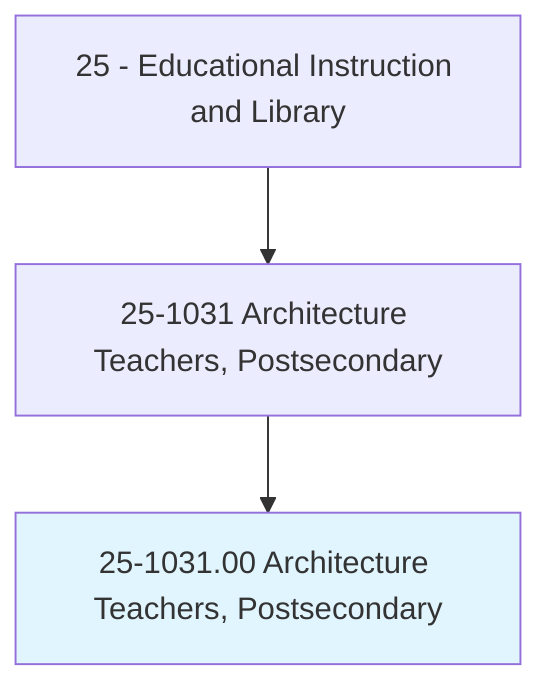
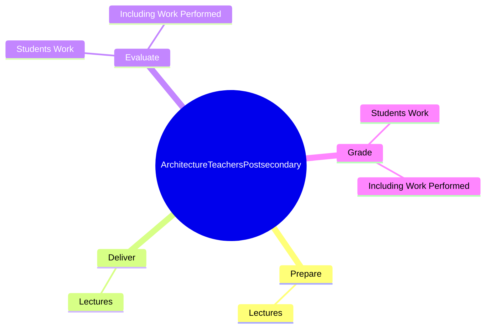
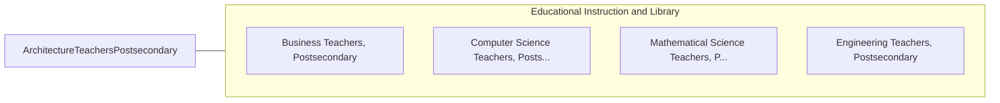

# Architecture Teachers, Postsecondary

> Teach courses in architecture and architectural design, such as architectural environmental design, interior architecture/design, and landscape architecture. Includes both teachers primarily engaged in teaching and those who do a combination of teaching and research.

## Overview

Architecture Teachers, Postsecondary is an occupation within the Educational Instruction and Library category. Teach courses in architecture and architectural design, such as architectural environmental design, interior architecture/design, and landscape architecture. 

## Classification Hierarchy

## Key Statistics

| Metric | Value |
|--------|-------|
| SOC Code | 25-1031.00 |
| Category | [Educational Instruction and Library](/occupations/Education/index) |
| Task Count | 14 |
| Source | O*NET |

## Core Tasks

### prepare.Lectures

Architecture Teachers, Postsecondary prepare lectures as part of their core responsibilities.

**Actions:**
- `prepare.Lectures.to.ArchitecturalDesignMethods`
- `prepare.Lectures.to.Aesthetics`
- `prepare.Lectures.to.design`
- `prepare.Lectures.to.structures`

### deliver.Lectures

Architecture Teachers, Postsecondary deliver lectures as part of their core responsibilities.

**Actions:**
- `deliver.Lectures.to.ArchitecturalDesignMethods`
- `deliver.Lectures.to.Aesthetics`
- `deliver.Lectures.to.design`
- `deliver.Lectures.to.structures`

### evaluate.StudentsWork

Architecture Teachers, Postsecondary evaluate students work as part of their core responsibilities.

**Actions:**
- `evaluate.StudentsWork.in.DesignStudios`
- `evaluate.IncludingWorkPerformed.in.DesignStudios`

## Skills & Competencies

### Technical Skills
- **Curriculum Development** - Advanced
- **Instructional Design** - Advanced
- **Assessment** - Advanced

### Soft Skills
- **Communication** - Essential
- **Problem Solving** - Essential
- **Critical Thinking** - Important
- **Teamwork** - Important
- **Adaptability** - Important

## Related Occupations

## Industries

This occupation is found across multiple industries. See [Industries](/industries) for sector-specific employment data.

## Career Progression

---

*Source: O*NET 25-1031.00 - ONETOccupation*
