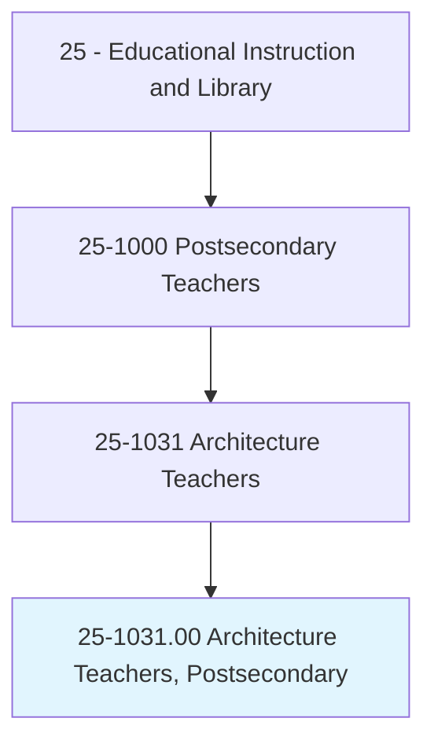
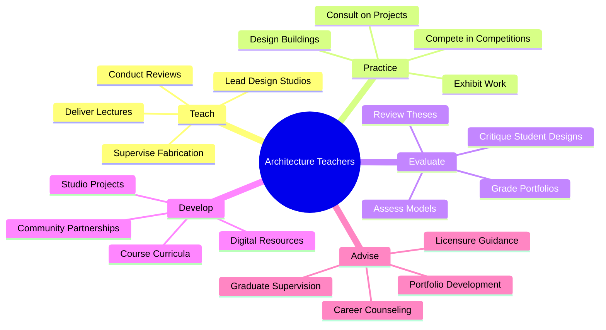
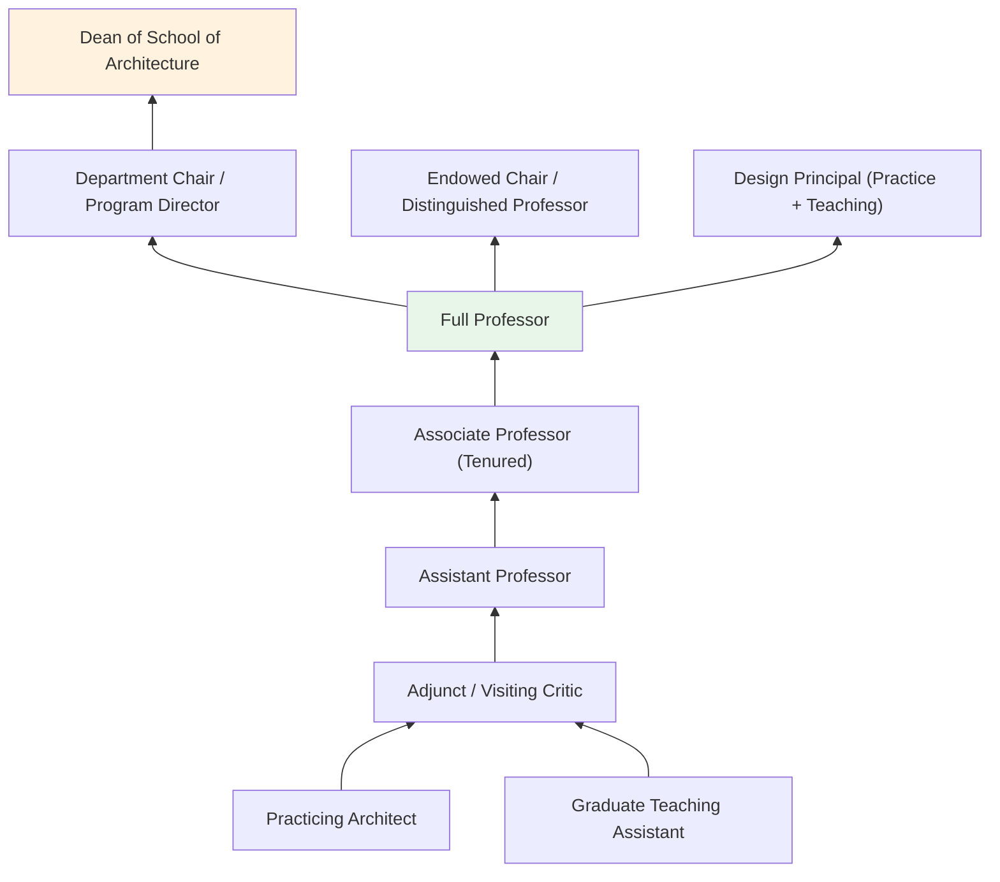
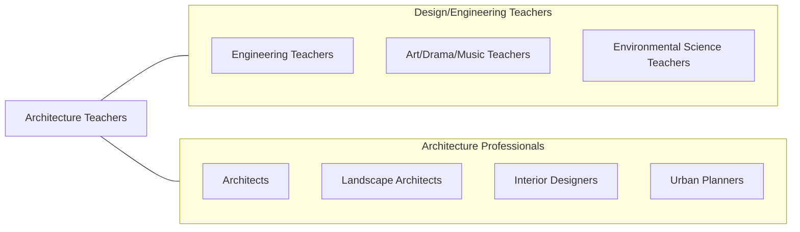

# Architecture Teachers, Postsecondary

> Teach courses in architecture and architectural design, such as architectural environmental design, interior architecture/design, and landscape architecture. Includes both teachers primarily engaged in teaching and those who do a combination of teaching and research.

## Overview

Architecture Teachers in postsecondary education instruct students in the theory, design, technology, and practice of architecture. They teach courses in architectural design studios, building systems, structural engineering, environmental design, sustainable architecture, urban design, landscape architecture, interior design, architectural history, and digital fabrication. These educators guide students through the creative and technical processes of designing buildings and environments that are functional, aesthetically compelling, structurally sound, and environmentally responsible.

Architecture education is distinctively studio-based, with faculty leading intensive design studios where students develop projects from conceptual exploration through schematic design to detailed resolution. Faculty provide individualized desk critiques, lead group reviews (juries), and model the iterative design process. Many maintain active architectural practices, bringing current professional experience into their teaching and contributing built works alongside scholarly research.

Faculty prepare students for professional licensure (ARE), accreditation requirements (NAAB), and careers in architectural firms, urban planning, interior design, construction management, and related design professions. They also advance architectural knowledge through research on topics such as sustainable design, computational design, housing, public space, and preservation.

## Classification Hierarchy

## Key Statistics

| Metric | Value |
|--------|-------|
| SOC Code | 25-1031.00 |
| Job Zone | 5 (Extensive Preparation) |
| Category | [Educational Instruction and Library](/occupations/Education/index) |
| Median Salary | $82,000 - $105,000 |
| Employment | ~6,000 |
| Projected Growth | 3-5% (Average) |
| Source | O*NET |

## Core Tasks

### teach.ArchitecturalDesign

Architecture Teachers lead studio-based design instruction.

**Actions:**
- `lead.DesignStudios.for.ArchitecturalProjects` - Guide students through iterative design processes
- `deliver.Lectures.on.BuildingSystems` - Teach structural, mechanical, and environmental systems
- `conduct.DesignReviews.with.ExternalCritics` - Facilitate critique sessions with practicing architects

### practice.Architecture

Many faculty maintain active design practices alongside teaching.

**Actions:**
- `design.Buildings.for.ProfessionalCommissions` - Create built works contributing to architectural discourse
- `compete.InDesignCompetitions` - Enter and win architectural competitions
- `exhibit.DesignWork.in.GalleriesAndMuseums` - Present creative work in professional venues

## Skills & Competencies

### Technical Skills
- **Architectural Design** - Expert (conceptual design, space planning, detailing)
- **Building Technology** - Advanced (structures, MEP, building envelopes)
- **Digital Design** - Advanced (Revit, Rhino, AutoCAD, Grasshopper)
- **Fabrication** - Advanced (3D printing, laser cutting, CNC, model making)
- **Sustainability** - Advanced (LEED, Passive House, net-zero design)
- **Curriculum Design** - Advanced (NAAB accreditation standards)

### Soft Skills
- **Creativity** - Critical (design innovation and spatial thinking)
- **Communication** - Critical (design critique, visual presentation)
- **Mentorship** - Essential (one-on-one studio guidance)
- **Visual Thinking** - Essential (spatial reasoning and representation)
- **Collaboration** - Essential (interdisciplinary design teams)
- **Critical Analysis** - Important (evaluating design proposals)

## Education & Certifications

| Requirement | Details |
|-------------|---------|
| Typical Education | M.Arch (professional degree) or Ph.D. (for history/theory positions) |
| Professional License | Licensed Architect (AIA, RA) preferred or required |
| Work Experience | Professional practice experience typically expected |
| On-the-Job Training | Faculty development; fabrication lab safety |
| Common Certifications | AIA membership; LEED AP; NCARB certificate; NAAB reviewer |

## Career Progression

## Setting Variations

### NAAB-Accredited Programs
Professional architecture degree programs (B.Arch, M.Arch) with accreditation requirements. Studio-intensive curricula.

### Research Universities
Architecture programs with Ph.D. tracks in history, theory, building technology, and computational design.

### Art and Design Schools
Architecture programs within broader design institutions. Emphasis on creative and interdisciplinary approaches.

### Online and Hybrid Programs
Growing online offerings for architectural history and theory. Studio components still primarily in-person.

### Community Engagement Programs
Architecture programs with community design studios, pro bono projects, and social impact initiatives.

## Technology & Tools

| Category | Tools |
|----------|-------|
| Design Software | Revit, Rhino, AutoCAD, SketchUp, Grasshopper |
| Rendering | V-Ray, Enscape, Lumion, Twinmotion |
| Fabrication | 3D printers, laser cutters, CNC routers, robotic arms |
| BIM | Revit, ArchiCAD, Navisworks |
| Presentation | Adobe Creative Suite, InDesign, Illustrator |
| Learning Management Systems | Canvas, Blackboard |

## Related Occupations

## Industries

- [Educational Services - Schools of Architecture](/industries/Education/index) - Primary Employment
- [Professional Services - Architecture Firms](/industries/ProfessionalServices) - Concurrent Practice
- [Government](/industries/Government) - Public Works and Historic Preservation
- [Construction](/industries/Construction) - Design-Build Firms

## Departments

This occupation typically works in:
- [School of Architecture](/departments/Architecture)
- [Department of Landscape Architecture](/departments/LandscapeArchitecture)
- [School of Design](/departments/Design)
- [College of Built Environment](/departments/BuiltEnvironment)

---

*Source: O*NET 25-1031.00 - ONETOccupation*
