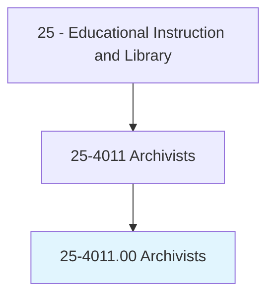
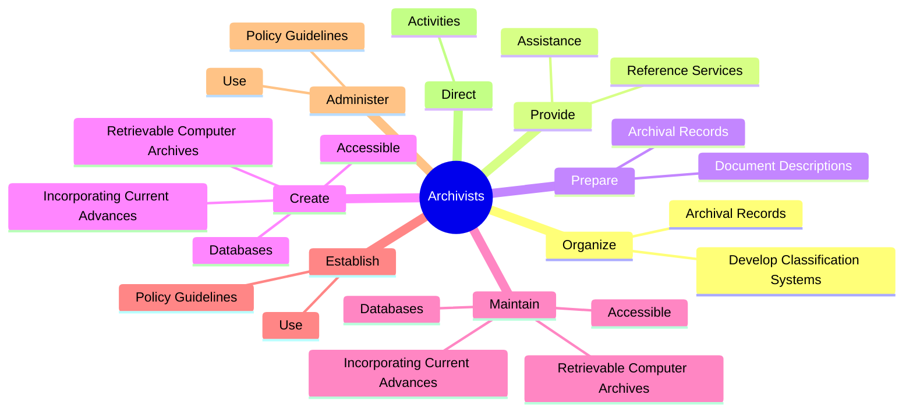
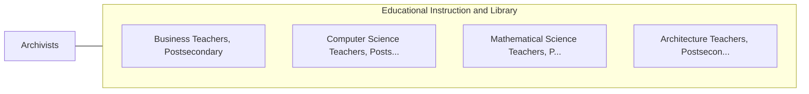

# Archivists

> Appraise, edit, and direct safekeeping of permanent records and historically valuable documents. Participate in research activities based on archival materials.

## Overview

Archivists is an occupation within the Educational Instruction and Library category. Appraise, edit, and direct safekeeping of permanent records and historically valuable documents. 

## Classification Hierarchy

## Key Statistics

| Metric | Value |
|--------|-------|
| SOC Code | 25-4011.00 |
| Category | [Educational Instruction and Library](/occupations/Education/index) |
| Task Count | 69 |
| Source | O*NET |

## Core Tasks

### organize.ArchivalRecords

Archivists organize archival records as part of their core responsibilities.

**Actions:**
- `organize.ArchivalRecords.to.facilitate.AccessToArchivalMaterials`
- `organize.DevelopClassificationSystems.to.facilitate.AccessToArchivalMaterials`

### provide.ReferenceServices

Archivists provide reference services as part of their core responsibilities.

**Actions:**
- `provide.ReferenceServices.for.UsersNeedingArchivalMaterials`
- `provide.Assistance.for.UsersNeedingArchivalMaterials`

### prepare.ArchivalRecords

Archivists prepare archival records as part of their core responsibilities.

**Actions:**
- `prepare.ArchivalRecords.to.allow.EasyAccessToInformation`
- `prepare.DocumentDescriptions.to.allow.EasyAccessToInformation`

## Skills & Competencies

### Technical Skills
- **Curriculum Development** - Advanced
- **Instructional Design** - Advanced
- **Assessment** - Advanced

### Soft Skills
- **Communication** - Essential
- **Problem Solving** - Essential
- **Critical Thinking** - Important
- **Teamwork** - Important
- **Adaptability** - Important

## Related Occupations

## Industries

This occupation is found across multiple industries. See [Industries](/industries) for sector-specific employment data.

## Career Progression

---

*Source: O*NET 25-4011.00 - ONETOccupation*
