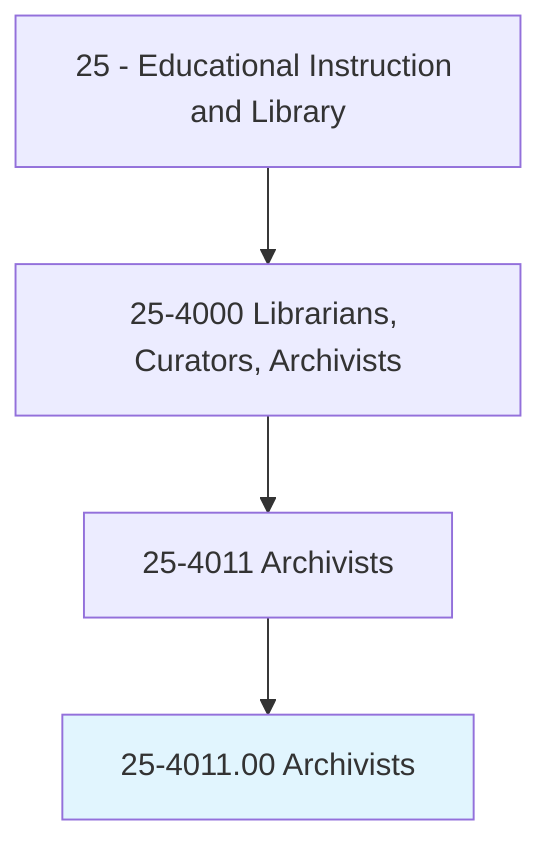
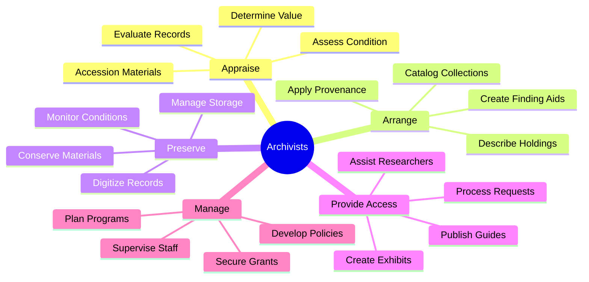
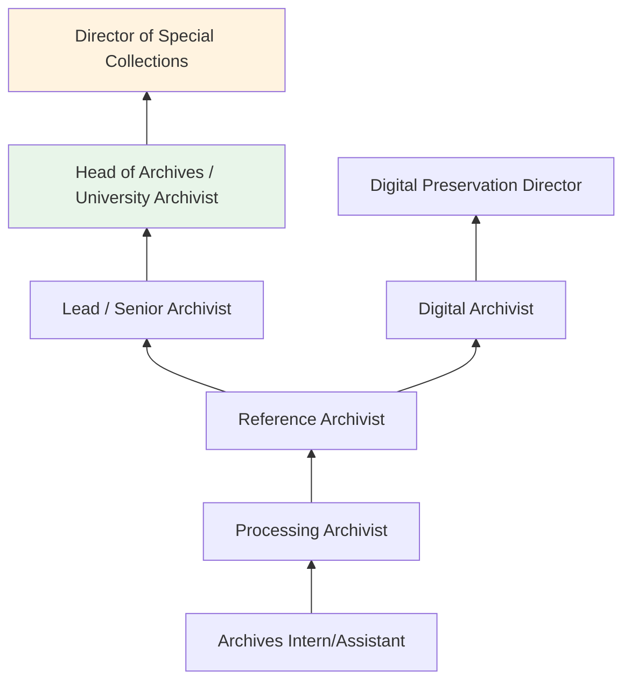
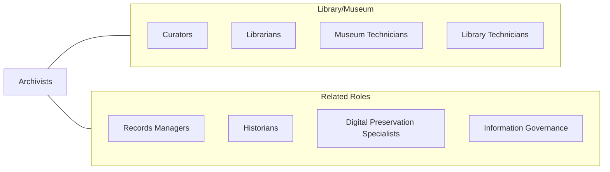

# Archivists

> Appraise, edit, and direct safekeeping of permanent records and historically valuable documents. Participate in research activities based on archival materials.

## Overview

Archivists appraise, acquire, organize, describe, preserve, and provide access to records of enduring historical, legal, fiscal, and administrative value. They work with documents, photographs, maps, audiovisual materials, digital files, and other primary sources in institutional archives, government agencies, historical societies, corporations, and universities. Archivists evaluate which records have permanent value and develop policies for their long-term management.

The profession requires deep knowledge of provenance, original order, and archival description standards such as DACS (Describing Archives: A Content Standard) and EAD (Encoded Archival Description). Archivists create finding aids that enable researchers to discover and access collections efficiently. They also implement preservation strategies for fragile physical materials and develop digital preservation workflows for born-digital records.

The digital transformation has significantly expanded the archivist's role to include managing electronic records, web archiving, digital forensics, and ensuring long-term accessibility of digital assets. Archivists increasingly collaborate with IT professionals to implement digital asset management systems and address challenges of format obsolescence and data migration.

## Classification Hierarchy

## Key Statistics

| Metric | Value |
|--------|-------|
| SOC Code | 25-4011.00 |
| Job Zone | 5 (Extensive Preparation) |
| Category | [Educational Instruction and Library](/occupations/Education/index) |
| Median Salary | $55,000 - $68,000 |
| Employment | ~7,500 |
| Projected Growth | 9-12% (Faster than average) |
| Source | O*NET |

## Core Tasks

### appraise.ArchivalMaterials

Archivists evaluate records for permanent retention.

**Actions:**
- `appraise.Records.for.PermanentRetention` - Determine historical, legal, and administrative value of materials
- `arrange.Collections.using.ArchivalStandards` - Organize materials following provenance and original order
- `describe.Holdings.in.FindingAids` - Create DACS-compliant descriptions for researcher access

### preserve.ArchivalCollections

Archivists ensure long-term survival of archival materials.

**Actions:**
- `preserve.Materials.through.ConservationMethods` - Implement environmental controls, rehousing, and treatment
- `digitize.Records.for.AccessAndPreservation` - Create digital surrogates of fragile or high-demand materials
- `manage.DigitalRecords.using.PreservationSystems` - Maintain born-digital archives with format migration and fixity checks

## Skills & Competencies

### Technical Skills
- **Archival Theory** - Expert (provenance, original order, appraisal, arrangement and description)
- **Description Standards** - Expert (DACS, EAD, MARC, Dublin Core)
- **Digital Preservation** - Advanced (OAIS model, format migration, checksums, digital forensics)
- **Records Management** - Advanced (retention schedules, disposition, compliance)
- **Conservation** - Intermediate (handling, storage, environmental controls)
- **Research Methods** - Advanced (primary source analysis, historical methodology)

### Soft Skills
- **Attention to Detail** - Critical (accurate description and cataloging)
- **Research Aptitude** - Essential (understanding historical context)
- **Communication** - Essential (assisting researchers, writing finding aids)
- **Organization** - Critical (managing complex collections)
- **Discretion** - Important (handling confidential or sensitive records)
- **Patience** - Essential (processing large collections systematically)

## Education & Certifications

| Requirement | Details |
|-------------|---------|
| Typical Education | Master's degree in Library/Information Science with archival concentration, or M.A. in History with archival coursework |
| Alternative Entry | Graduate certificate in archival studies |
| Work Experience | Practicum or internship in archives required |
| On-the-Job Training | Moderate; mentorship in institutional practices |
| Common Certifications | CA (Certified Archivist) from ACA; Digital Archives Specialist (DAS) from SAA |

## Career Progression

## Setting Variations

### University and College Archives
Institutional records and special collections supporting academic research. Often part of library systems.

### Government Archives
National, state, and local government records. NARA (National Archives) and state archives. Legal and regulatory requirements.

### Corporate Archives
Business records, brand heritage, and institutional memory. Growing field in major corporations.

### Historical Societies and Museums
Community collections, manuscripts, and local history materials. Often grant-funded.

### Digital Archives
Born-digital collections, web archiving, and electronic records programs. Rapidly growing specialization.

## Technology & Tools

| Category | Tools |
|----------|-------|
| Archival Management | ArchivesSpace, Archon, AtoM |
| Digital Preservation | Preservica, Archivematica, LOCKSS, DPN |
| Digitization | Scanners, camera systems, OCR software |
| Description | EAD XML editors, DACS toolkit |
| Digital Asset Management | CONTENTdm, Islandora, DSpace |
| Reference | Aeon, Atlas Systems |

## Related Occupations

## Industries

- [Educational Services - Colleges and Universities](/industries/Education/index) - Primary Employment
- [Government](/industries/PublicAdministration) - National, State, and Local Archives
- [Information Services](/industries/Information) - Libraries and Archives
- [Other Services](/industries/OtherServices) - Historical Societies, Nonprofits

## Departments

This occupation typically works in:
- Archives and Special Collections
- Library Services
- Records Management

---

*Source: O*NET 25-4011.00 - ONETOccupation*
