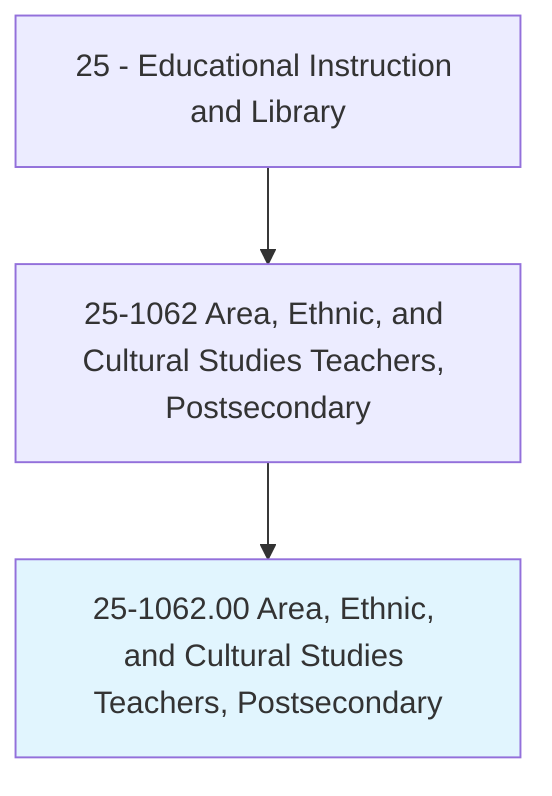
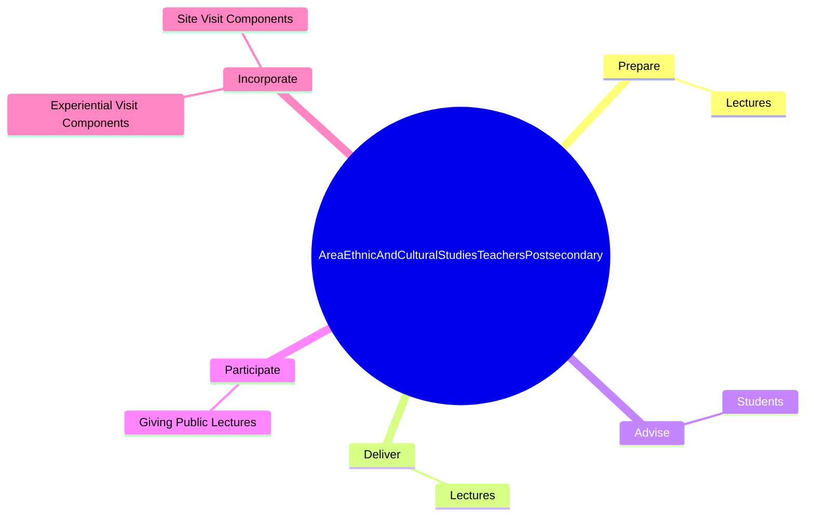
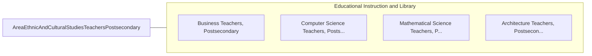

# Area, Ethnic, and Cultural Studies Teachers, Postsecondary

> Teach courses pertaining to the culture and development of an area, an ethnic group, or any other group, such as Latin American studies, women's studies, or urban affairs. Includes both teachers primarily engaged in teaching and those who do a combination of teaching and research.

## Overview

Area, Ethnic, and Cultural Studies Teachers, Postsecondary is an occupation within the Educational Instruction and Library category. Teach courses pertaining to the culture and development of an area, an ethnic group, or any other group, such as Latin American studies, women's studies, or urban affairs. 

## Classification Hierarchy

## Key Statistics

| Metric | Value |
|--------|-------|
| SOC Code | 25-1062.00 |
| Category | [Educational Instruction and Library](/occupations/Education/index) |
| Task Count | 12 |
| Source | O*NET |

## Core Tasks

### prepare.Lectures

Area, Ethnic, and Cultural Studies Teachers, Postsecondary prepare lectures as part of their core responsibilities.

**Actions:**
- `prepare.Lectures.to.Race`
- `prepare.Lectures.to.EthnicRelations`
- `prepare.Lectures.to.GenderStudies`
- `prepare.Lectures.to.CrossCulturalPerspectives`

### deliver.Lectures

Area, Ethnic, and Cultural Studies Teachers, Postsecondary deliver lectures as part of their core responsibilities.

**Actions:**
- `deliver.Lectures.to.Race`
- `deliver.Lectures.to.EthnicRelations`
- `deliver.Lectures.to.GenderStudies`
- `deliver.Lectures.to.CrossCulturalPerspectives`

### advise.Students

Area, Ethnic, and Cultural Studies Teachers, Postsecondary advise students as part of their core responsibilities.

**Actions:**
- `advise.Students.on.OnCareerIssues`

## Skills & Competencies

### Technical Skills
- **Curriculum Development** - Advanced
- **Instructional Design** - Advanced
- **Assessment** - Advanced

### Soft Skills
- **Communication** - Essential
- **Problem Solving** - Essential
- **Critical Thinking** - Important
- **Teamwork** - Important
- **Adaptability** - Important

## Related Occupations

## Industries

This occupation is found across multiple industries. See [Industries](/industries) for sector-specific employment data.

## Career Progression

---

*Source: O*NET 25-1062.00 - ONETOccupation*
