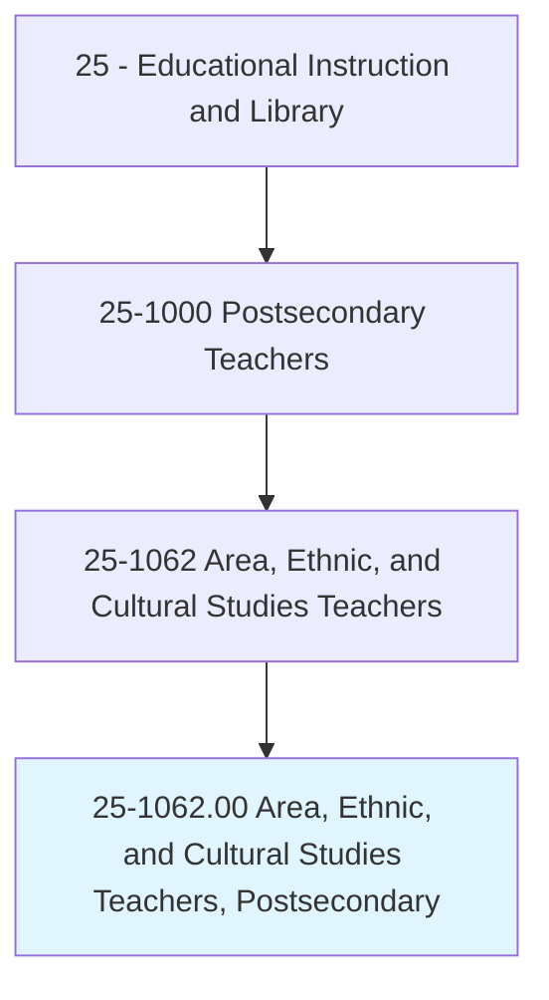
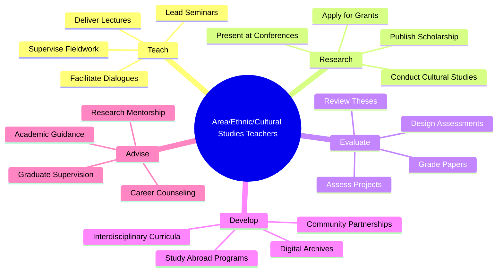
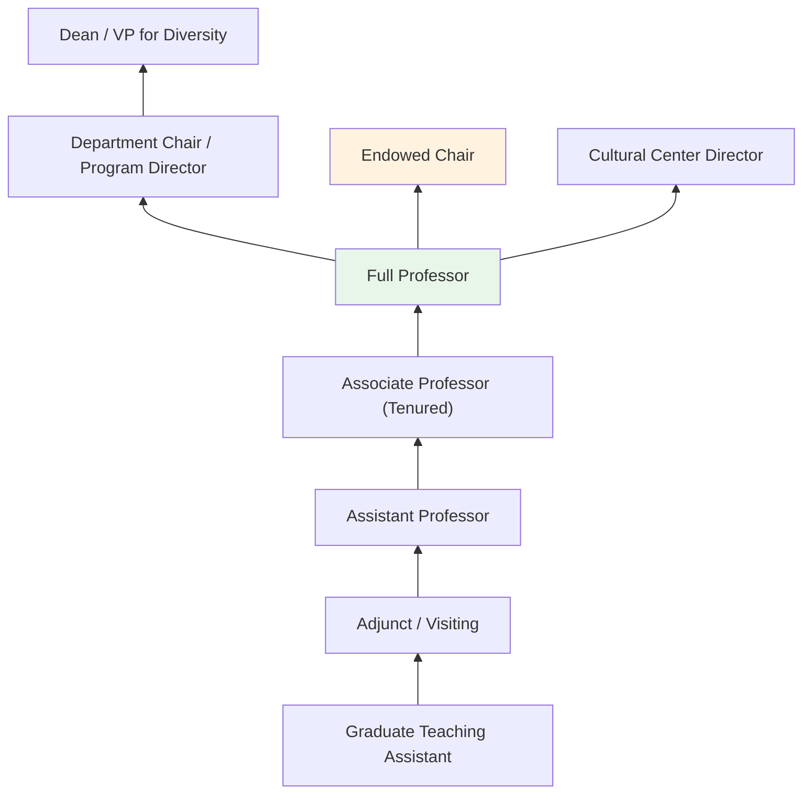
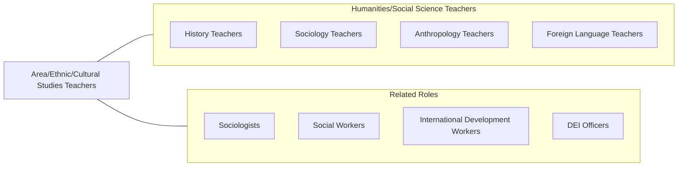

# Area, Ethnic, and Cultural Studies Teachers, Postsecondary

> Teach courses pertaining to the culture and development of an area, an ethnic group, or any other group, such as Latin American studies, women's studies, or urban affairs. Includes both teachers primarily engaged in teaching and those who do a combination of teaching and research.

## Overview

Area, Ethnic, and Cultural Studies Teachers in postsecondary education instruct students in the interdisciplinary study of specific geographic regions, ethnic and racial groups, gender identities, and cultural communities. They teach courses in African American studies, Latino/a studies, Asian studies, Middle Eastern studies, women's and gender studies, LGBTQ studies, Indigenous studies, and urban affairs. These educators employ interdisciplinary frameworks drawing from history, literature, sociology, political science, and the arts to analyze the experiences, contributions, and challenges of specific communities and regions.

Many faculty conduct research on topics such as racial inequality, diaspora, immigration, gender dynamics, postcolonial theory, cultural production, social movements, and transnational identity. They publish in journals such as Signs, American Quarterly, and Journal of African American History. Their scholarship advances understanding of social justice, cultural diversity, and the complex dynamics of identity and power.

These educators serve a vital role in diversifying the curriculum, fostering inclusive campus cultures, and preparing students to live and work in an increasingly multicultural and interconnected world. They prepare graduates for careers in social services, international development, education, government, nonprofits, and cultural organizations.

## Classification Hierarchy

## Key Statistics

| Metric | Value |
|--------|-------|
| SOC Code | 25-1062.00 |
| Job Zone | 5 (Extensive Preparation) |
| Category | [Educational Instruction and Library](/occupations/Education/index) |
| Median Salary | $72,000 - $90,000 |
| Employment | ~10,000 |
| Projected Growth | 4-6% (Average) |
| Source | O*NET |

## Core Tasks

### teach.AreaAndCulturalStudies

Faculty deliver interdisciplinary instruction on specific communities and regions.

**Actions:**
- `deliver.Lectures.on.EthnicStudies` - Teach history, culture, and contemporary issues of racial/ethnic groups
- `deliver.Lectures.on.GenderStudies` - Instruct on gender theory, feminism, and sexuality studies
- `facilitate.Dialogues.on.SocialJustice` - Lead critical discussions on inequality, power, and social change

### conduct.InterdisciplinaryResearch

Faculty pursue scholarship on cultural and identity topics.

**Actions:**
- `conduct.Research.on.RacialInequality` - Study systemic racism, disparities, and resistance movements
- `conduct.Research.on.GlobalCultures` - Investigate transnational identity, migration, and cultural exchange
- `publish.Scholarship.in.InterdisciplinaryJournals` - Contribute to area studies and ethnic studies literature

## Skills & Competencies

### Technical Skills
- **Interdisciplinary Analysis** - Expert (cultural theory, postcolonial studies, critical race theory)
- **Research Methods** - Advanced (ethnography, oral history, archival, textual analysis)
- **Academic Writing** - Expert (scholarly monographs and articles)
- **Curriculum Design** - Advanced (interdisciplinary program development)
- **Language Skills** - Advanced (proficiency in relevant languages for area studies)
- **Community Engagement** - Advanced (participatory research, cultural programming)

### Soft Skills
- **Cultural Competency** - Critical (deep cross-cultural understanding)
- **Communication** - Critical (engaging diverse audiences on sensitive topics)
- **Empathy** - Essential (centering marginalized perspectives)
- **Critical Thinking** - Essential (analyzing power, identity, and culture)
- **Mentorship** - Essential (supporting students from underrepresented backgrounds)
- **Advocacy** - Important (institutional diversity and inclusion)

## Education & Certifications

| Requirement | Details |
|-------------|---------|
| Typical Education | Ph.D. in ethnic studies, area studies, gender studies, or related interdisciplinary field |
| Alternative Entry | M.A. for community college positions |
| Work Experience | Research and teaching experience required; fieldwork experience valued |
| On-the-Job Training | Faculty development; DEI training |
| Common Certifications | Disciplinary association memberships (ASA, NWSA, LASA, AAS); language proficiency certifications |

## Career Progression

## Setting Variations

### Research Universities
Established departments with doctoral programs. Funded research on identity, culture, and global regions.

### Liberal Arts Colleges
Interdisciplinary programs emphasizing close mentorship and cross-departmental collaboration.

### Community Colleges
Introductory cultural diversity and ethnic studies courses for general education.

### Online Programs
Growing distance offerings in diversity studies and cultural competency programs.

### Community-Engaged Programs
Faculty working with local communities on oral history, cultural preservation, and advocacy.

## Technology & Tools

| Category | Tools |
|----------|-------|
| Learning Management Systems | Canvas, Blackboard, Moodle |
| Digital Archives | Omeka, Internet Archive, digital oral history platforms |
| Research Databases | JSTOR, EBSCO, ProQuest Ethnic NewsWatch |
| Multimedia | Documentary film, podcasting, digital storytelling |
| Reference Management | Zotero, Mendeley, Chicago/MLA style |
| Communication | Zoom, Microsoft Teams |

## Related Occupations

## Industries

- [Educational Services - Colleges and Universities](/industries/Education/index) - Primary Employment
- [Government](/industries/Government) - Public Universities, Cultural Agencies
- [Other Services](/industries/OtherServices) - Cultural and Advocacy Organizations
- [Professional Services](/industries/ProfessionalServices) - DEI Consulting

## Departments

This occupation typically works in:
- [Department of African American / Black Studies](/departments/AfricanAmericanStudies)
- [Department of Women's and Gender Studies](/departments/GenderStudies)
- [Latin American Studies Program](/departments/LatinAmericanStudies)
- [Asian Studies Program](/departments/AsianStudies)

---

*Source: O*NET 25-1062.00 - ONETOccupation*
