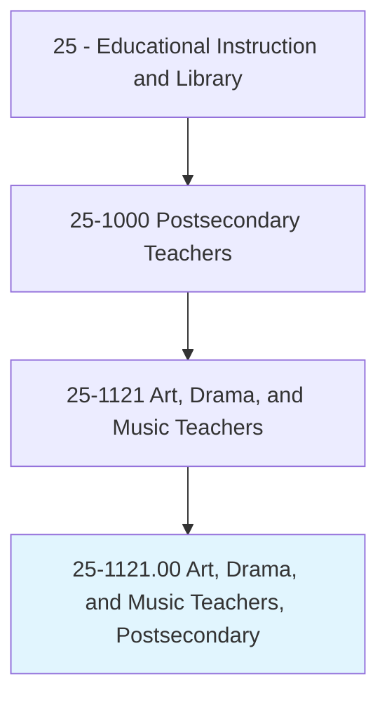
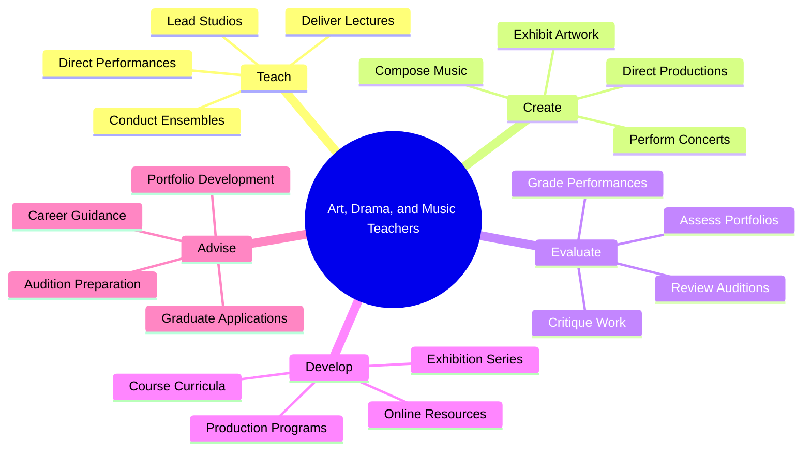
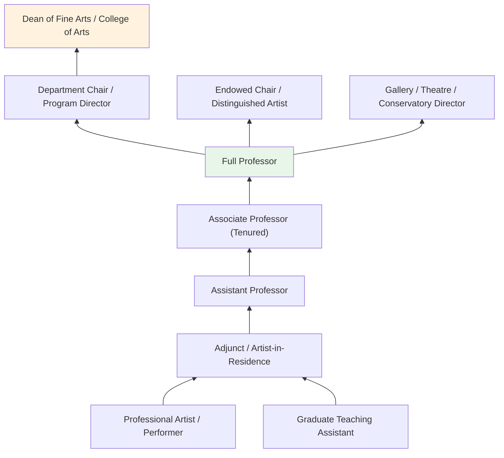
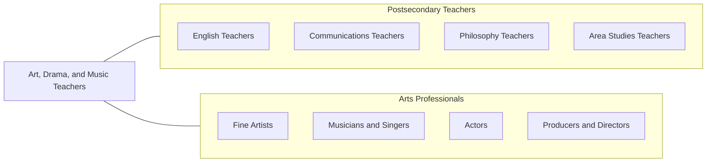

# Art, Drama, and Music Teachers, Postsecondary

> Teach courses in drama, music, and the arts including fine and applied art, such as painting and sculpture, or design and crafts. Includes both teachers primarily engaged in teaching and those who do a combination of teaching and research.

## Overview

Art, Drama, and Music Teachers in postsecondary education instruct students in the creative and performing arts at colleges, universities, and conservatories. They teach courses in studio art, art history, graphic design, sculpture, painting, theatre performance, directing, playwriting, music theory, composition, instrumental and vocal performance, music history, and digital media arts. These educators develop students' artistic technique, creative expression, critical aesthetic judgment, and professional practice skills.

Many arts faculty are active practitioners who exhibit in galleries, perform in concerts, direct theatrical productions, compose music, and create multimedia works alongside their teaching responsibilities. Their creative output serves as a form of scholarly activity equivalent to publication in other disciplines. They bring professional experience directly into the classroom, mentoring students through the development of artistic portfolios, senior recitals, thesis exhibitions, and capstone productions.

Arts education at the postsecondary level prepares students for careers as professional artists, performers, designers, educators, arts administrators, and creative professionals. Faculty also serve the broader institution by offering general education courses in art appreciation, music, and theatre that enrich the cultural literacy of all students.

## Classification Hierarchy

## Key Statistics

| Metric | Value |
|--------|-------|
| SOC Code | 25-1121.00 |
| Job Zone | 5 (Extensive Preparation) |
| Category | [Educational Instruction and Library](/occupations/Education/index) |
| Median Salary | $68,000 - $85,000 |
| Employment | ~90,000 |
| Projected Growth | 3-5% (Average) |
| Source | O*NET |

## Core Tasks

### teach.ArtsAndPerformance

Faculty deliver instruction in visual, performing, and media arts.

**Actions:**
- `deliver.Lectures.on.ArtHistory` - Teach visual culture, art movements, and critical theory
- `lead.StudioSessions.in.VisualArts` - Guide painting, drawing, sculpture, and digital art practice
- `conduct.Ensembles.for.MusicPerformance` - Direct orchestras, bands, choirs, and chamber groups
- `direct.TheatreProductions.with.Students` - Oversee acting, directing, design, and technical theatre

### evaluate.ArtisticWork

Faculty assess student creative output and development.

**Actions:**
- `critique.StudentArtwork.in.StudioReviews` - Provide constructive feedback on visual art pieces
- `evaluate.MusicalPerformance.in.Juries` - Assess technique, musicality, and interpretation
- `assess.TheatrePerformance.for.Production` - Evaluate acting, directing, and design work

## Skills & Competencies

### Technical Skills
- **Artistic Practice** - Expert (in primary medium: visual arts, music, or theatre)
- **Art/Music/Theatre History** - Advanced (contextual and theoretical knowledge)
- **Curriculum Design** - Advanced (NASAD, NASM, or NAST accreditation standards)
- **Performance/Exhibition** - Expert (professional-level creative practice)
- **Digital Arts** - Intermediate to Advanced (digital media, recording, design software)
- **Assessment** - Advanced (portfolio review, jury, critique methods)

### Soft Skills
- **Creativity** - Critical (artistic practice and innovative teaching)
- **Communication** - Critical (articulating aesthetic concepts, giving feedback)
- **Mentorship** - Essential (developing student artistry)
- **Patience** - Essential (nurturing creative development)
- **Collaboration** - Essential (ensemble work, production teams)
- **Cultural Awareness** - Important (diverse artistic traditions)

## Education & Certifications

| Requirement | Details |
|-------------|---------|
| Typical Education | MFA (terminal degree in arts), DMA (music), Ph.D. (art history, musicology, theatre studies) |
| Professional Portfolio | Significant exhibition, performance, or production record required |
| Work Experience | Professional artistic practice expected |
| On-the-Job Training | Faculty development; facility safety training |
| Common Certifications | CAA (College Art Association) membership; CMS/SCI (music); ATHE (theatre); discipline-specific |

## Career Progression

## Setting Variations

### Conservatories and Music Schools
Intensive performance training with individual instruction. Professional preparation for concert, opera, and recording careers.

### Art Schools and Colleges
Studio-intensive programs emphasizing artistic development. BFA and MFA programs with exhibition opportunities.

### Research Universities
Balance of artistic practice and scholarly research. Ph.D. programs in art history, musicology, and theatre studies.

### Liberal Arts Colleges
Broad arts education integrating performance, studio, and academic study. General education arts courses for all students.

### Community Colleges
Introductory arts courses and foundational training. Transfer preparation for four-year arts programs.

## Technology & Tools

| Category | Tools |
|----------|-------|
| Visual Arts | Adobe Creative Suite, Procreate, 3D modeling software, kilns, printing presses |
| Music | Digital audio workstations (Pro Tools, Logic, Ableton), notation software (Finale, Sibelius) |
| Theatre | Lighting design software (ETC Eos), sound design tools, CAD for scenic design |
| Learning Management Systems | Canvas, Blackboard, Moodle |
| Recording/Documentation | Professional cameras, video editing (Premiere, Final Cut), audio recording |
| Presentation | PowerPoint, digital projectors, gallery lighting |

## Related Occupations

## Industries

- [Educational Services - Colleges and Universities](/industries/Education/index) - Primary Employment
- [Arts, Entertainment, and Recreation](/industries/ArtsEntertainment) - Performance and Exhibition
- [Information](/industries/Information) - Media Production
- [Other Services](/industries/OtherServices) - Arts Organizations

## Departments

This occupation typically works in:
- [Department of Art / Visual Arts](/departments/Art)
- [School of Music / Conservatory](/departments/Music)
- [Department of Theatre and Dance](/departments/Theatre)
- [College of Fine Arts](/departments/FineArts)
- [Digital Media Arts Program](/departments/DigitalMedia)

---

*Source: O*NET 25-1121.00 - ONETOccupation*
