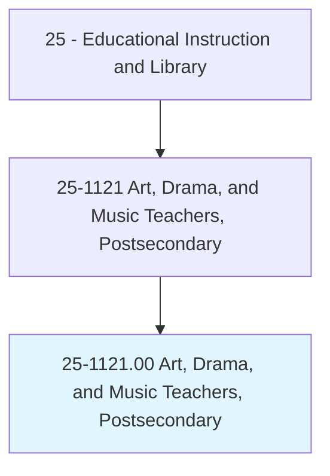
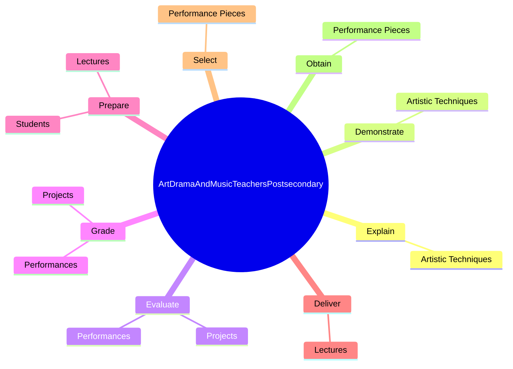
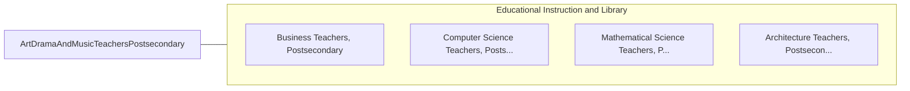

# Art, Drama, and Music Teachers, Postsecondary

> Teach courses in drama, music, and the arts including fine and applied art, such as painting and sculpture, or design and crafts. Includes both teachers primarily engaged in teaching and those who do a combination of teaching and research.

## Overview

Art, Drama, and Music Teachers, Postsecondary is an occupation within the Educational Instruction and Library category. Teach courses in drama, music, and the arts including fine and applied art, such as painting and sculpture, or design and crafts. 

## Classification Hierarchy

## Key Statistics

| Metric | Value |
|--------|-------|
| SOC Code | 25-1121.00 |
| Category | [Educational Instruction and Library](/occupations/Education/index) |
| Task Count | 27 |
| Source | O*NET |

## Core Tasks

### explain.ArtisticTechniques

Art, Drama, and Music Teachers, Postsecondary explain artistic techniques as part of their core responsibilities.

**Actions:**
- `explain.ArtisticTechniques`

### demonstrate.ArtisticTechniques

Art, Drama, and Music Teachers, Postsecondary demonstrate artistic techniques as part of their core responsibilities.

**Actions:**
- `demonstrate.ArtisticTechniques`

### evaluate.Performances

Art, Drama, and Music Teachers, Postsecondary evaluate performances as part of their core responsibilities.

**Actions:**
- `evaluate.Performances`
- `evaluate.Projects`

## Skills & Competencies

### Technical Skills
- **Curriculum Development** - Advanced
- **Instructional Design** - Advanced
- **Assessment** - Advanced

### Soft Skills
- **Communication** - Essential
- **Problem Solving** - Essential
- **Critical Thinking** - Important
- **Teamwork** - Important
- **Adaptability** - Important

## Related Occupations

## Industries

This occupation is found across multiple industries. See [Industries](/industries) for sector-specific employment data.

## Career Progression

---

*Source: O*NET 25-1121.00 - ONETOccupation*
