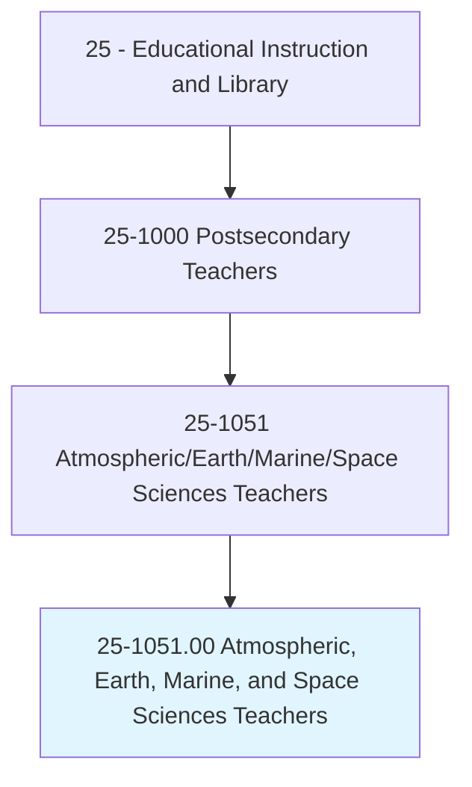
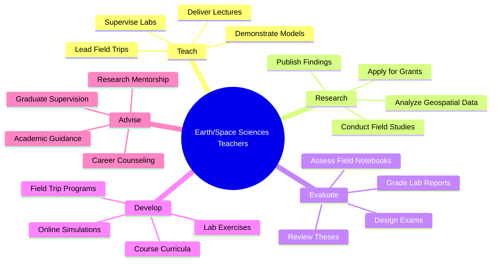
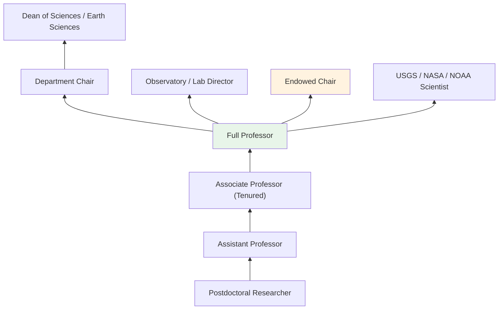
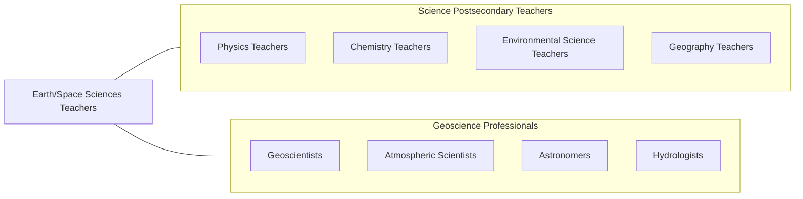

# Atmospheric, Earth, Marine, and Space Sciences Teachers, Postsecondary

> Teach courses in the physical sciences, except chemistry and physics. Includes both teachers primarily engaged in teaching and those who do a combination of teaching and research.

## Overview

Atmospheric, Earth, Marine, and Space Sciences Teachers in postsecondary education instruct students in the geosciences broadly defined, including geology, meteorology, oceanography, astronomy, planetary science, hydrology, and geophysics. They teach courses covering plate tectonics, mineralogy, paleontology, weather systems, climate dynamics, ocean circulation, stellar evolution, and Earth systems science. These educators integrate field observation, laboratory analysis, remote sensing, and computational modeling to help students understand the physical processes that shape Earth and the cosmos.

Many faculty conduct research on topics such as earthquake hazards, volcanic processes, climate change, extreme weather, sea-level rise, groundwater resources, Mars exploration, and exoplanet detection. They secure funding from NASA, NSF, NOAA, USGS, and DOE, and publish in journals such as Nature Geoscience, Journal of Geophysical Research, and Geophysical Research Letters. Their research addresses fundamental scientific questions while informing natural hazard mitigation, resource management, and space exploration.

Geoscience faculty serve a critical workforce pipeline role, as the field faces persistent shortages of qualified professionals. They prepare geologists, meteorologists, oceanographers, and planetary scientists for careers in energy, environmental consulting, government agencies, and academic research.

## Classification Hierarchy

## Key Statistics

| Metric | Value |
|--------|-------|
| SOC Code | 25-1051.00 |
| Job Zone | 5 (Extensive Preparation) |
| Category | [Educational Instruction and Library](/occupations/Education/index) |
| Median Salary | $85,000 - $110,000 |
| Employment | ~12,000 |
| Projected Growth | 5-8% (Average) |
| Source | O*NET |

## Core Tasks

### teach.GeoscienceCourses

Faculty deliver instruction across earth and space science disciplines.

**Actions:**
- `deliver.Lectures.on.Geology` - Teach mineralogy, petrology, structural geology, and Earth history
- `deliver.Lectures.on.Meteorology` - Instruct on atmospheric dynamics, weather forecasting, and climate science
- `lead.FieldTrips.to.GeologicalSites` - Guide hands-on field observations and mapping exercises

### conduct.GeoscienceResearch

Faculty pursue original research in earth, atmospheric, ocean, and space sciences.

**Actions:**
- `conduct.Research.on.SeismicHazards` - Study earthquake processes and hazard assessment
- `conduct.Research.on.ClimateVariability` - Investigate paleoclimate records and future projections
- `publish.Findings.in.GeoscienceJournals` - Contribute to peer-reviewed earth science literature

## Skills & Competencies

### Technical Skills
- **Geosciences** - Expert (geology, meteorology, oceanography, or astronomy)
- **Field Methods** - Expert (geological mapping, sampling, instrumentation)
- **GIS and Remote Sensing** - Advanced (ArcGIS, satellite imagery, LiDAR)
- **Data Analysis** - Advanced (MATLAB, Python, R, seismic analysis software)
- **Computational Modeling** - Advanced (climate models, geodynamic simulations)
- **Curriculum Design** - Advanced (geoscience education research)

### Soft Skills
- **Communication** - Critical (explaining Earth processes to diverse audiences)
- **Fieldwork Leadership** - Essential (outdoor safety, field instruction)
- **Collaboration** - Essential (multidisciplinary research teams, agency partnerships)
- **Mentorship** - Essential (guiding student researchers)
- **Curiosity** - Important (exploring fundamental questions about Earth and space)
- **Adaptability** - Important (field conditions, evolving science)

## Education & Certifications

| Requirement | Details |
|-------------|---------|
| Typical Education | Ph.D. in Geology, Atmospheric Science, Oceanography, Astronomy, or related field |
| Postdoctoral Training | Common for research university positions |
| Work Experience | Field and laboratory research experience required |
| On-the-Job Training | Faculty development; field safety training |
| Common Certifications | AGU/GSA membership; Professional Geologist (PG) license; AMS Certified Meteorologist |

## Career Progression

## Setting Variations

### Research Universities
Emphasis on externally funded research, doctoral programs, and access to major instrumentation (seismometers, telescopes, research vessels).

### Liberal Arts Colleges
Broad geoscience education with integrated field experiences. Close undergraduate research mentorship.

### Community Colleges
Introduction to Earth Science, geology, astronomy, and meteorology. General education and transfer courses.

### Government Research Labs
Affiliated positions at USGS, NOAA, NASA, or national laboratories combining research with student mentorship.

### Online Programs
Virtual geology and astronomy courses with simulations and virtual field trips. Growing enrollment.

## Technology & Tools

| Category | Tools |
|----------|-------|
| GIS & Remote Sensing | ArcGIS, QGIS, ENVI, Google Earth Engine |
| Computational | MATLAB, Python, Fortran, R |
| Field Equipment | GPS, rock hammers, compasses, magnetometers, seismographs |
| Telescope/Observational | Celestron, Meade, radio telescopes, CCD cameras |
| Climate/Weather Models | WRF, CESM, GFS model data |
| Learning Management Systems | Canvas, Blackboard, Moodle |

## Related Occupations

## Industries

- [Educational Services - Colleges and Universities](/industries/Education/index) - Primary Employment
- [Government](/industries/PublicAdministration) - USGS, NOAA, NASA, DOE
- [Mining, Oil, and Gas](/industries/Mining) - Energy Geoscience
- [Professional Services](/industries/Scientific) - Environmental and Geological Consulting

## Departments

This occupation typically works in:
- Department of Geology / Geosciences
- Department of Atmospheric Science / Meteorology
- Department of Astronomy
- School of Ocean and Earth Science

---

*Source: O*NET 25-1051.00 - ONETOccupation*
