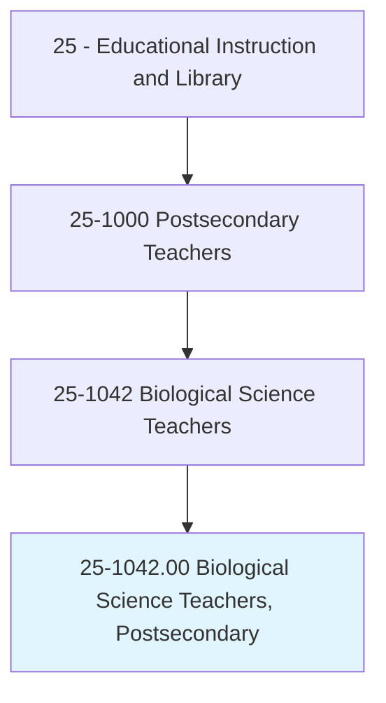
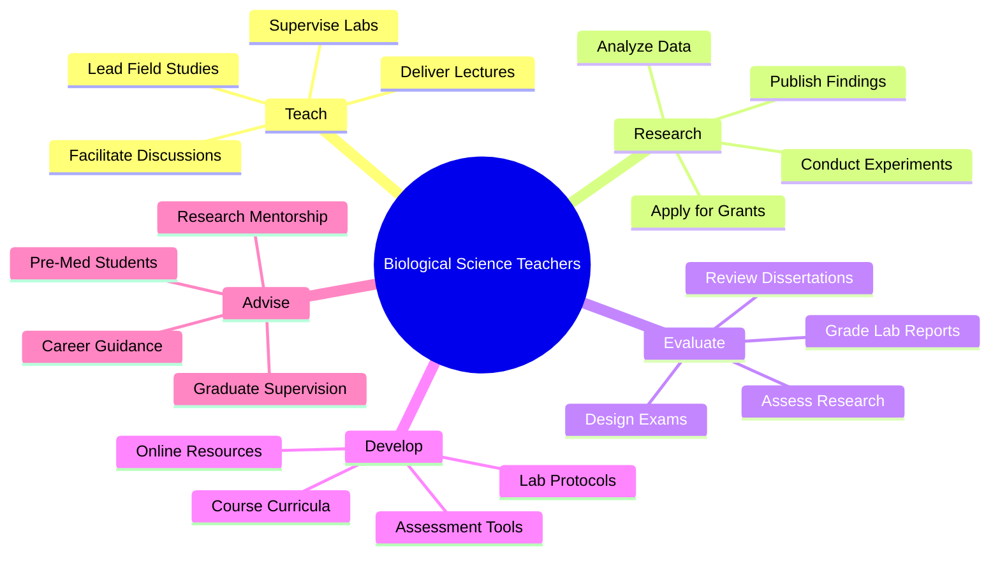
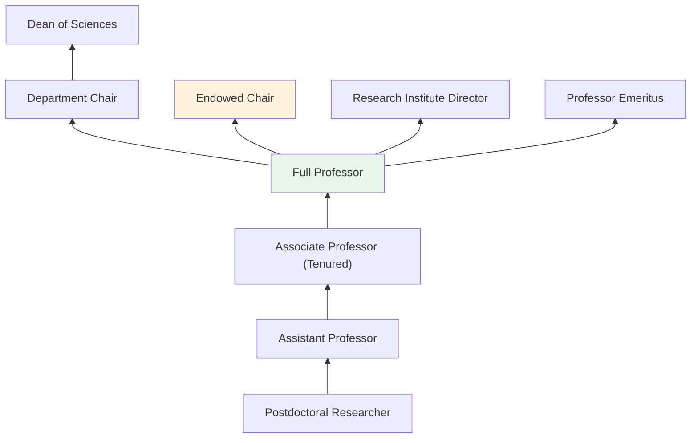
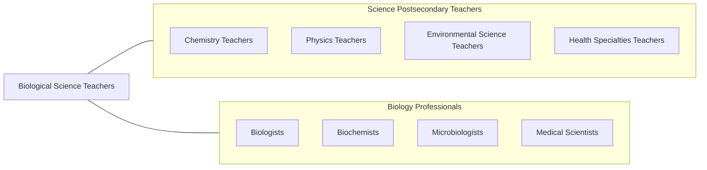

# Biological Science Teachers, Postsecondary

> Teach courses in biological sciences. Includes both teachers primarily engaged in teaching and those who do a combination of teaching and research.

## Overview

Biological Science Teachers in postsecondary education instruct students in the study of living organisms and life processes. They teach courses covering general biology, microbiology, genetics, cell biology, ecology, evolutionary biology, physiology, anatomy, biochemistry, and molecular biology. These educators combine lecture instruction with laboratory experiences, training students in scientific methodology, experimental techniques, and critical analysis of biological data.

Many biology professors conduct cutting-edge research in areas such as genomics, cancer biology, neurobiology, infectious disease, conservation biology, biotechnology, and developmental biology. They secure funding from NIH, NSF, and private foundations, supervise graduate student research, and publish in journals such as Cell, Nature, and PNAS. Their research advances fundamental understanding of life while often yielding practical applications in medicine, agriculture, and environmental management.

Biology is one of the largest STEM disciplines, with significant enrollment at all postsecondary levels. Faculty serve as gatekeepers for healthcare professions, teaching the prerequisite courses required for medical, dental, veterinary, and nursing programs. They play a vital role in STEM workforce development and public scientific literacy.

## Classification Hierarchy

## Key Statistics

| Metric | Value |
|--------|-------|
| SOC Code | 25-1042.00 |
| Job Zone | 5 (Extensive Preparation) |
| Category | [Educational Instruction and Library](/occupations/Education/index) |
| Median Salary | $82,000 - $110,000 |
| Employment | ~58,000 |
| Projected Growth | 6-10% (Faster than average) |
| Source | O*NET |

## Core Tasks

### teach.BiologicalSciences

Faculty deliver instruction across biology disciplines.

**Actions:**
- `deliver.Lectures.on.Genetics` - Teach molecular genetics, inheritance, and genomics
- `deliver.Lectures.on.CellBiology` - Instruct on cellular structure, function, and signaling
- `supervise.Laboratories.for.ExperimentalBiology` - Guide hands-on experimentation and microscopy

### conduct.BiologicalResearch

Faculty pursue original research advancing biological knowledge.

**Actions:**
- `conduct.Research.in.MolecularBiology` - Investigate gene expression, protein function, and cellular mechanisms
- `conduct.Research.in.Ecology` - Study biodiversity, ecosystem dynamics, and conservation
- `publish.Findings.in.BiologyJournals` - Contribute to peer-reviewed biological science literature

## Skills & Competencies

### Technical Skills
- **Biological Sciences** - Expert (molecular, cellular, organismal, ecological)
- **Laboratory Methods** - Expert (PCR, microscopy, cell culture, sequencing)
- **Research Design** - Advanced (experimental, observational, computational)
- **Data Analysis** - Advanced (R, Python, bioinformatics tools)
- **Curriculum Design** - Advanced (Vision and Change, AAAS guidelines)
- **Grant Writing** - Advanced (NIH, NSF proposal preparation)

### Soft Skills
- **Communication** - Critical (explaining complex biological concepts)
- **Mentorship** - Essential (guiding pre-med and graduate students)
- **Critical Thinking** - Essential (scientific reasoning)
- **Collaboration** - Essential (interdisciplinary research teams)
- **Patience** - Important (laboratory instruction)
- **Adaptability** - Important (rapidly advancing field)

## Education & Certifications

| Requirement | Details |
|-------------|---------|
| Typical Education | Ph.D. in Biological Sciences or related field |
| Postdoctoral Training | 1-3 years common for research university positions |
| Work Experience | Research experience required; teaching experience valued |
| On-the-Job Training | Faculty development; biosafety training |
| Common Certifications | AAAS membership; ASM membership; biosafety certifications; IACUC training |

## Career Progression

## Setting Variations

### Research Universities
Heavy emphasis on externally funded research. Doctoral student supervision. Lighter teaching loads with access to core research facilities.

### Liberal Arts Colleges
Focus on undergraduate teaching with student-faculty research. Broader course coverage.

### Community Colleges
Introductory biology and anatomy/physiology for health professions. Higher teaching loads.

### Medical Schools
Pre-clinical biological sciences for medical students. Integration with clinical curriculum.

### Online Programs
Virtual biology labs using simulations. Growing enrollment in general biology courses.

## Technology & Tools

| Category | Tools |
|----------|-------|
| Laboratory | PCR machines, spectrophotometers, microscopes, centrifuges, sequencers |
| Bioinformatics | BLAST, R/Bioconductor, Python/Biopython, NCBI databases |
| Learning Management Systems | Canvas, Blackboard, Moodle |
| Virtual Labs | Labster, BioInteractive, PhET |
| Research Databases | PubMed, GenBank, UniProt |
| Imaging | Confocal microscopy, flow cytometry, imaging software |

## Related Occupations

## Industries

- [Educational Services - Colleges and Universities](/industries/Education/index) - Primary Employment
- [Healthcare](/industries/Healthcare) - Medical Schools, Research Hospitals
- [Government](/industries/PublicAdministration) - NIH, CDC, USDA
- [Professional Services](/industries/Scientific) - Biotech Research

## Departments

This occupation typically works in:
- Department of Biology
- Department of Molecular and Cellular Biology
- School of Biological Sciences
- Department of Ecology and Evolutionary Biology

---

*Source: O*NET 25-1042.00 - ONETOccupation*
