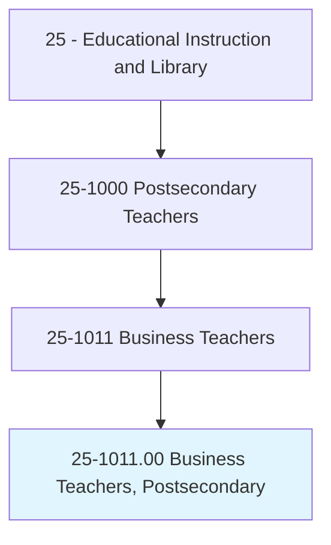
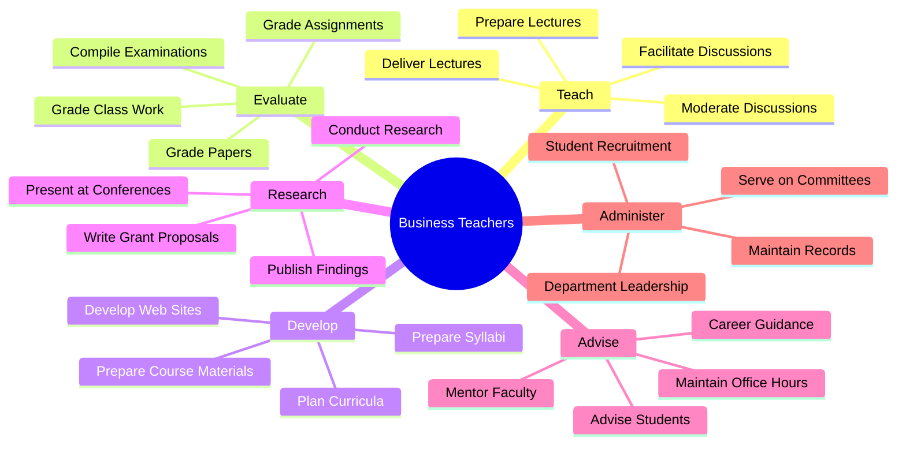
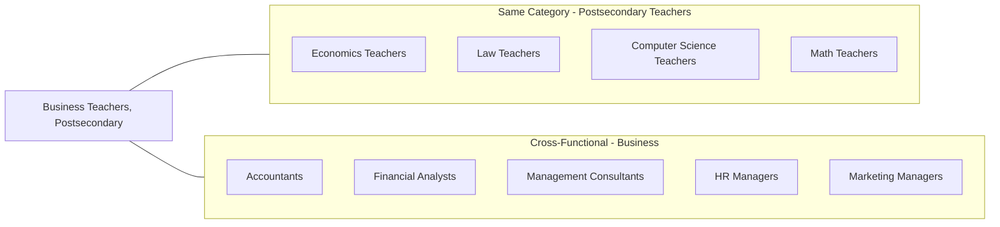
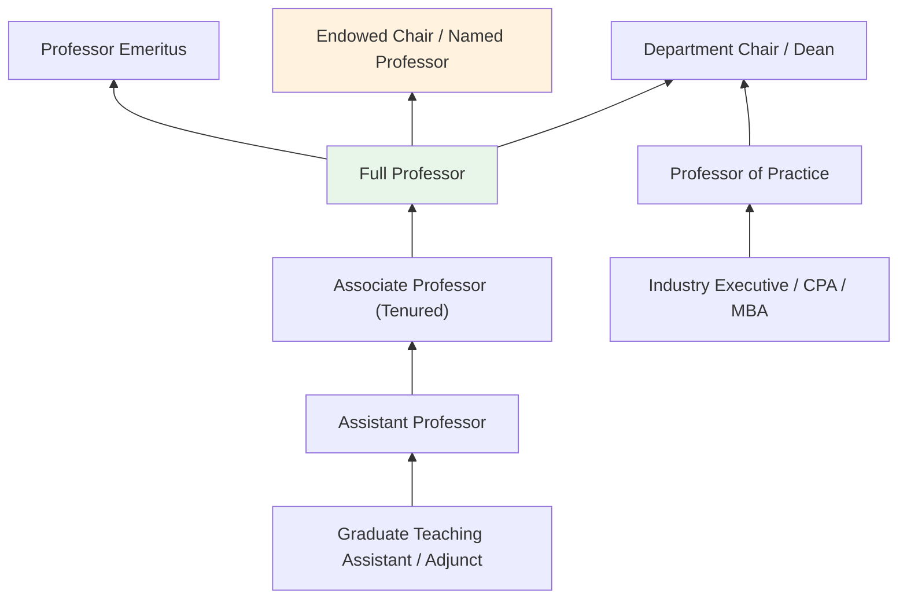

# Business Teachers, Postsecondary

> Teach courses in business administration and management, such as accounting, finance, human resources, labor and industrial relations, marketing, and operations research. Includes both teachers primarily engaged in teaching and those who do a combination of teaching and research.

## Overview

Business Teachers in postsecondary education are responsible for educating undergraduate and graduate students in the principles, theories, and practices of business administration. They work across diverse business disciplines including accounting, finance, marketing, management, human resources, operations, and entrepreneurship. These educators balance teaching responsibilities with scholarly research, publishing in academic journals, consulting for industry, and providing service to their institutions. Many bring significant industry experience to the classroom, bridging the gap between academic theory and real-world business practice.

## Classification Hierarchy



## Key Statistics

| Metric | Value |
|--------|-------|
| SOC Code | 25-1011.00 |
| Job Zone | 5 (Extensive Preparation) |
| Category | [Educational Instruction and Library](/occupations/Education) |
| Core Tasks | 20+ |
| Source | O*NET |

## Core Tasks



### prepare.Lectures

Business Teachers prepare comprehensive lecture content on business topics to effectively convey complex concepts to students at various academic levels.

**Actions:**
- `prepare.Lectures.to.undergraduate.StudentsOnTopics` - Develop undergraduate-level lectures covering foundational business concepts
- `prepare.Lectures.to.graduate.StudentsOnTopics` - Create advanced graduate-level lectures with deeper analytical content
- `prepare.Lectures.to.FinancialAccounting` - Prepare lectures on financial accounting principles and practices
- `prepare.Lectures.to.PrinciplesOfMarketing` - Develop marketing curriculum content
- `prepare.Lectures.to.OperationsManagement` - Create operations and supply chain management lectures

### deliver.Lectures

Business Teachers present instructional content to students through various pedagogical approaches including traditional lectures, case studies, and experiential learning.

**Actions:**
- `deliver.Lectures.to.undergraduate.StudentsOnTopics` - Present content to undergraduate business students
- `deliver.Lectures.to.graduate.StudentsOnTopics` - Deliver advanced instruction to MBA and graduate students
- `deliver.Lectures.to.FinancialAccounting` - Teach accounting principles and financial statement analysis
- `deliver.Lectures.to.PrinciplesOfMarketing` - Instruct students on marketing strategies and consumer behavior
- `deliver.Lectures.to.OperationsManagement` - Teach operations, logistics, and process optimization

### evaluate.StudentsClassWork

Business Teachers assess student learning through various evaluation methods including assignments, examinations, case analyses, and presentations.

**Actions:**
- `evaluate.StudentsClassWork` - Review and assess ongoing student work and participation
- `evaluate.Assignments` - Grade homework, projects, and case study analyses
- `evaluate.Papers` - Assess research papers, business plans, and written assignments
- `grade.Examinations.to.Others` - Administer and grade midterm and final examinations
- `compile.Examinations.to.Others` - Develop comprehensive assessments of student learning

### conduct.Research

Business Teachers engage in scholarly research to advance knowledge in their field and maintain academic currency.

**Actions:**
- `conduct.Research.in.ParticularField.of.Knowledge` - Pursue original research in business disciplines
- `conduct.Research.in.PublishFindings.in.ProfessionalJournals` - Submit research to peer-reviewed academic journals
- `conduct.Research.in.Books` - Author textbooks and scholarly monographs
- `conduct.Research.in.ElectronicMedia` - Publish research through digital channels and online platforms
- `write.GrantProposals.to.procure.ExternalResearchFunding` - Secure funding for research projects

### advise.Students

Business Teachers provide academic and career guidance to help students achieve their educational and professional goals.

**Actions:**
- `advise.Students.on.AcademicCurriculaCareerIssues` - Guide students on course selection and academic planning
- `advise.Students.on.VocationalCurriculaCareerIssues` - Counsel students on career paths and job market opportunities
- `maintain.RegularlyScheduledOfficeHours.to.advise.Students` - Hold office hours for student consultations
- `maintain.RegularlyScheduledOfficeHours.to.assist.Students` - Provide individual academic support and mentoring
- `act.AsAdvisers.to.StudentOrganizations` - Support student business clubs and organizations

### plan.Curricula

Business Teachers develop and refine academic programs to ensure relevance and educational effectiveness.

**Actions:**
- `plan.Curricula.of.Instruction` - Design program-level curriculum and learning outcomes
- `plan.CourseContent.of.Instruction` - Develop individual course objectives and content
- `plan.CourseMaterials.of.Instruction` - Select and organize teaching materials
- `revise.Curricula.of.Instruction` - Update curricula based on industry trends and assessment data
- `evaluate.Methods.of.Instruction` - Assess and improve pedagogical approaches

## Skills & Competencies

### Technical Skills
- **Business Acumen** - Expert (deep knowledge across business disciplines)
- **Research Methods** - Advanced (quantitative and qualitative research)
- **Financial Analysis** - Advanced
- **Data Analytics** - Intermediate to Advanced
- **Educational Technology** - Intermediate (LMS, simulation software, case tools)
- **Academic Writing** - Expert

### Soft Skills
- **Communication** - Critical (presenting complex business concepts clearly)
- **Leadership** - Essential (classroom management, student mentorship)
- **Critical Thinking** - Critical
- **Interpersonal Skills** - Essential
- **Time Management** - Essential (balancing teaching, research, service)

## Related Occupations



## Industry Variations

### Research Universities
Focus on scholarly research and doctoral education; significant grant writing and publication expectations; lighter teaching loads.

### Teaching-Focused Institutions
Emphasis on undergraduate instruction; higher course loads; student mentoring prioritized; applied research and case development.

### Business Schools (MBA Programs)
Executive education; case-based teaching methods; strong industry connections; consulting opportunities; emphasis on practical application.

### Community Colleges
Focus on foundational business courses; career-oriented programs; diverse student populations; industry certifications preparation.

### Online Education
Course development for asynchronous delivery; technology platform expertise; student engagement in virtual environments; flexible scheduling.

## Industries

- [Educational Services - Colleges and Universities](/industries/EducationalServices) - Primary Employment
- [Professional, Scientific, and Technical Services](/industries/ProfessionalServices) - Consulting
- [Finance and Insurance](/industries/FinanceInsurance) - Adjunct/Part-time Teaching
- [Management of Companies](/industries/Management) - Executive Education
- [Government](/industries/Government) - Public Universities

## Career Progression



## Education & Training

| Requirement | Details |
|-------------|---------|
| Typical Education | Ph.D. in Business Administration, Management, Finance, Marketing, or related field; DBA accepted at some institutions |
| Work Experience | Industry experience highly valued, especially for applied fields; research experience required for research universities |
| On-the-Job Training | Faculty development programs; teaching workshops; tenure track mentoring |
| Common Certifications | CPA (Accounting); CFA (Finance); SHRM (HR); discipline-specific professional certifications enhance credibility |

## Departments

This occupation typically works in:
- [Business School / College of Business](/departments/BusinessSchool)
- [Department of Accounting](/departments/Accounting)
- [Department of Finance](/departments/Finance)
- [Department of Marketing](/departments/Marketing)
- [Department of Management](/departments/Management)
- [Executive Education](/departments/ExecutiveEducation)

## GraphDL Semantic Structure

The core semantic patterns for Business Teachers follow this structure:

```
verb.Object.preposition.PrepObject

Primary Actions:
- prepare.Lectures.to.{Topic}
- deliver.Lectures.to.{Audience}
- evaluate.{WorkType}
- grade.{WorkType}
- conduct.Research.in.{Area}
- advise.Students.on.{Topic}
- plan.Curricula.of.Instruction
- maintain.{Records|OfficeHours}
- serve.{Committees}.with.{Policies}
```

---

*Source: O*NET 25-1011.00 - ONETOccupation*
