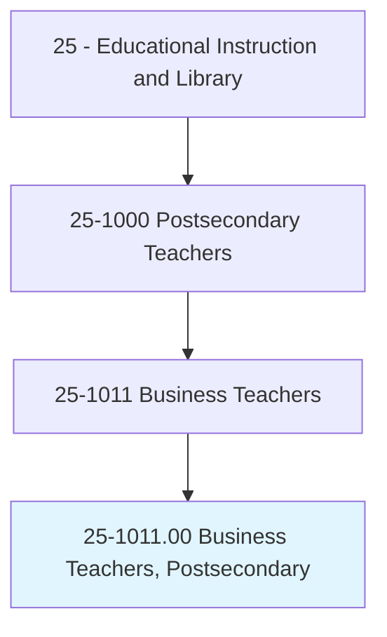
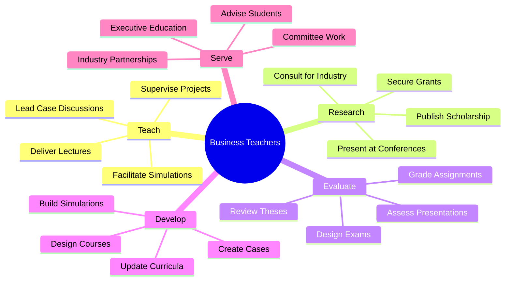
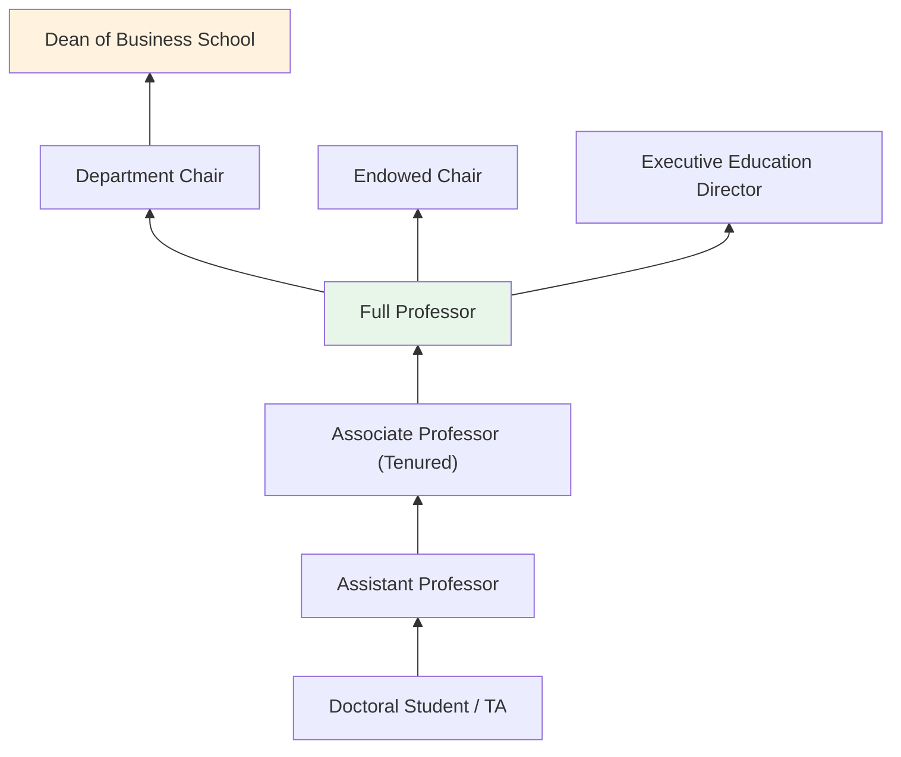
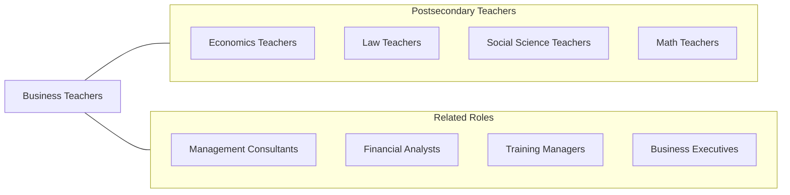

# Business Teachers, Postsecondary

> Teach courses in business administration and management, such as accounting, finance, human resources, labor and industrial relations, marketing, and operations research. Includes both teachers primarily engaged in teaching and those who do a combination of teaching and research.

## Overview

Business Teachers in postsecondary education instruct students in management, marketing, finance, accounting, operations, entrepreneurship, business analytics, international business, and organizational behavior at undergraduate and graduate levels. They teach in business schools, MBA programs, and community college business departments, preparing students for careers in the corporate world, consulting, entrepreneurship, and nonprofit management.

Faculty in business schools often bring a combination of academic credentials and industry experience. They teach through case method, simulations, team projects, and experiential learning, connecting theoretical frameworks to real-world business challenges. Many maintain active consulting relationships, serve on corporate boards, or engage in executive education, keeping their instruction current with business practice.

Research in business disciplines spans quantitative methods (finance, operations, analytics), behavioral studies (organizational behavior, marketing, strategy), and applied research (entrepreneurship, supply chain, innovation). Faculty publish in journals such as the Academy of Management Journal, Journal of Finance, Marketing Science, and Harvard Business Review. Business schools compete intensely for faculty talent, often offering compensation significantly above other academic disciplines.

## Classification Hierarchy

## Key Statistics

| Metric | Value |
|--------|-------|
| SOC Code | 25-1011.00 |
| Job Zone | 5 (Extensive Preparation) |
| Category | [Educational Instruction and Library](/occupations/Education/index) |
| Median Salary | $95,000 - $160,000 (varies widely by discipline and school ranking) |
| Employment | ~100,000 |
| Projected Growth | 4-6% (Average) |
| Source | O*NET |

## Core Tasks

### teach.BusinessCourses

Faculty deliver instruction across business disciplines.

**Actions:**
- `deliver.Lectures.on.BusinessConcepts` - Teach management, finance, marketing, and strategy frameworks
- `facilitate.CaseDiscussions.for.AnalyticalSkills` - Lead analysis of real-world business cases
- `supervise.TeamProjects.for.ExperientialLearning` - Guide students through consulting projects and simulations

### conduct.BusinessResearch

Faculty pursue scholarship advancing business knowledge.

**Actions:**
- `conduct.Research.in.BusinessDisciplines` - Investigate management, finance, marketing, and organizational phenomena
- `publish.Papers.in.TopJournals` - Contribute to A-level business journals
- `consult.ForOrganizations.on.BusinessChallenges` - Apply expertise to real-world corporate issues

## Skills & Competencies

### Technical Skills
- **Business Expertise** - Expert (specialized discipline: finance, marketing, management, accounting, etc.)
- **Research Methods** - Expert (quantitative, qualitative, experimental, archival)
- **Case Method Teaching** - Advanced (Socratic discussion, case writing)
- **Data Analytics** - Advanced (statistical software, econometrics, business analytics)
- **Curriculum Design** - Advanced (AACSB-aligned program development)
- **Executive Education** - Advanced (corporate training and development programs)

### Soft Skills
- **Communication** - Critical (engaging MBAs, executives, and undergraduates)
- **Analytical Thinking** - Critical (rigorous academic research)
- **Industry Awareness** - Essential (current with business trends and practices)
- **Leadership** - Important (department and program governance)
- **Networking** - Important (industry relationships and academic collaboration)
- **Mentorship** - Essential (doctoral student development)

## Education & Certifications

| Requirement | Details |
|-------------|---------|
| Typical Education | Ph.D. or DBA in business discipline (Management, Finance, Marketing, Accounting, etc.) |
| Alternative Entry | JD for business law; MBA + industry experience for practice-track positions |
| Work Experience | Industry experience valued, especially for clinical/practice faculty |
| Accreditation | AACSB accreditation standards govern faculty qualifications |
| Common Certifications | CPA for accounting faculty; CFA for finance faculty; discipline-specific credentials |

## Career Progression

## Setting Variations

### Research Universities (R1)
Top-tier business schools with doctoral programs. Heavy research expectations. High compensation.

### Regional Universities
Teaching-focused with some research. MBA and undergraduate programs. Moderate teaching loads.

### Community Colleges
Introductory business courses for transfer and applied degrees. Teaching-only positions.

### Online Programs
Growing sector with asynchronous and synchronous MBA and business programs.

### Executive Education
Non-degree programs for working professionals. Custom corporate programs.

## Technology & Tools

| Category | Tools |
|----------|-------|
| Learning Management | Canvas, Blackboard, Brightspace |
| Simulations | Capsim, Marketplace, Harvard Simulations |
| Data Analysis | Stata, R, Python, SAS, SPSS, Excel |
| Case Databases | Harvard Business Publishing, Ivey, Darden |
| Financial Data | Bloomberg Terminal, WRDS, Capital IQ |
| Communication | Zoom, Microsoft Teams, Slack |

## Related Occupations

## Industries

- [Educational Services - Colleges and Universities](/industries/Education/index) - Primary Employment
- [Professional Services](/industries/Scientific) - Consulting and Executive Education
- [Finance and Insurance](/industries/Finance) - Research Partnerships
- [Management of Companies](/industries/Management) - Corporate Universities

## Departments

This occupation typically works in:
- Department of Management
- [Department of Finance](/departments/Finance)
- [Department of Marketing](/departments/Marketing)
- School of Business

---

*Source: O*NET 25-1011.00 - ONETOccupation*
